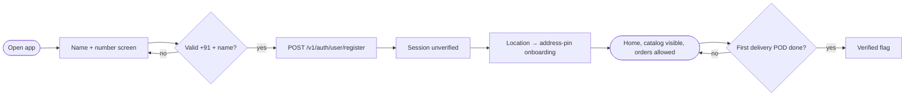
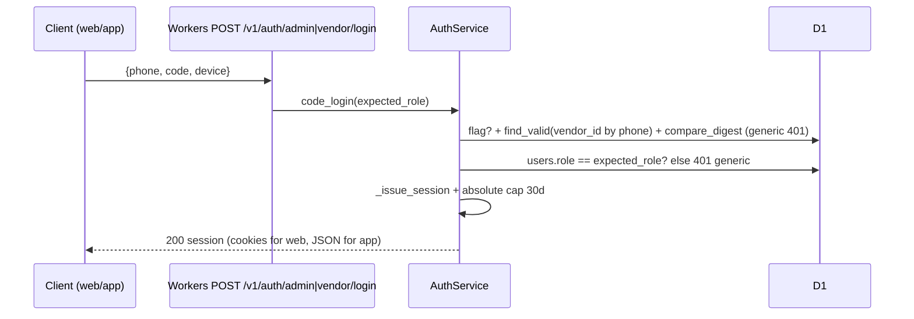
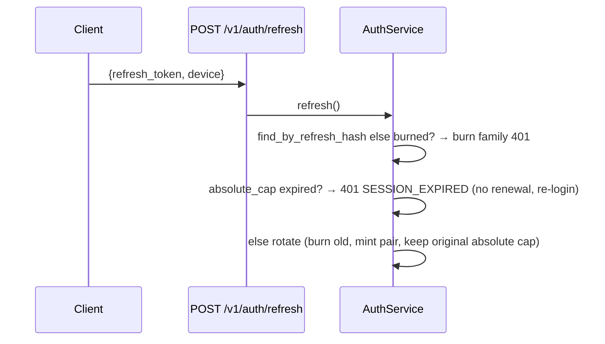

# 028 Access-Code-Only Auth, Zero Firebase — Feature Spec

- **Date**: 2026-10-04
- **Branch (planned, NOT created)**: `028-access-code-auth` from `main` tip — created only after explicit approval. (027 unmerged; this spec assumes 027's `vendor_access_codes` + `POST /v1/auth/vendor/login` exist — rebase plan in §7.)
- **Status**: DRAFT — awaiting explicit user approval (no code written)
- **Scope (approved)**: auth-first. Firebase removal + access-code auth + name+number onboarding + absolute 30-day sessions. Out: dispatch mid-pipeline, deterministic OTP, webhook fail-closed, N+1/indexes, suspend-gate fixes (queued as 029).
- **Inputs**: 028 audit (5 tracks, session report 2026-10-04); `workers/api/src/app/services/auth_service.py`; `workers/api/src/app/api/v1/auth.py`; `workers/api/src/app/db/migrations/009_demo.sql`; `013_vendor_access.sql` (027); `apps/admin_app/src/server/admin-session.ts` + `admin-login-form.tsx`; `apps/user_app/lib/{main,core/auth_impls,features/auth/*}`; `apps/vendor_app/lib/{main,core/auth_impls,features/auth/*}`
- **Skills loaded + one rule applied each**:
  - `ssdlc` → STRIDE + "authz in service layer": every matrix row names the backend enforcer; no-ownership-proof onboarding gets explicit threat row (T3) with mitigation, not hand-waving.
  - `sitemap` → "no page that isn't on the map": §1 lists every auth route kept/removed.
  - `user-flows` → all branches drawn (401/403/409/429/expired/revoked).
  - `design-patterns` → minimum-code: reuse `_issue_session`, `VendorAccessRepo`, BFF cookie pattern; new code only where no seam exists.
  - `ui-checklist` → Verifying-Account + Login-page checklists drive removal map (§4) and new-screen states (§6).
- **Decisions locked in clarifications**: users doorstep-verified (flagged until first delivery) · absolute 30-day session cap · new admin code endpoint (not demo-door rename) · auth-first scope.

---

## 0. Boundaries

| # | Boundary | Enforcer |
|---|----------|----------|
| B1 | No Firebase anywhere in login: no `firebase_auth`/`firebase_core` verify path in either Flutter app, no `signInWithPhoneNumber`, no `verify_id_token` acceptance on new endpoints | Code deletion (both apps) + new endpoints accept only code/name-number; old OTP endpoints remain server-side but unwired (removal of server OTP in 029, not here) |
| B2 | No entry without an admin-issued code — vendors AND admins. Users enter via name+number but stay `unverified` (flagged) until first successful delivery | `users.kyc_status='unverified'` default on code-less register; vendor/admin logins assert code row + role |
| B3 | Sessions: access 30m + rotating refresh with ABSOLUTE 30-day cap from first login; day 30 forces re-login, no sliding extension | `sessions.refresh_expires_at` + absolute `session_expires_at` (new col, 014) checked in `refresh()`; reuse still burns family |
| B4 | Refresh tokens are opaque server sessions (already are — never were JWT/Firebase); no new token format, no Firebase linkage anywhere | No change: `secrets.token_urlsafe(32)` + sha256 storage stays |
| B5 | Vendor Flutter app login = same door as vendor web: phone + admin-issued code → `POST /v1/auth/vendor/login` | Shared endpoint; app stores pair in SecureSessionStore (existing) |
| B6 | Admin web login = phone + admin-issued code → NEW `POST /v1/auth/admin/login` (role=='admin' assert); OTP form deleted | New endpoint + generalized codes table; OTP BFF fns + Firebase web code deleted |
| B7 | Push notifications die with FCM removal (no alternative in scope); first-run notify step becomes a silent skip with honest copy | `first_run_screen` notify step removed; no fake "notifications on" state |

---

## 1. Sitemap (auth routes kept / removed / added)

```
/ — admin_app —
/auth/v1/login            KEEP route, REWRITE form: phone + access-code only (OTP branches deleted)
/vendor/login             KEEP (027, phone+code, unchanged)
/vendor/*                unchanged (sessions now 30-day absolute, transparent)
/dashboard/*             unchanged (guard unchanged; logout WIRING fixed as drive-by? NO — out of scope, stays dead. Noted.)

/ — backend —
POST /v1/auth/vendor/login   KEEP (027)
POST /v1/auth/admin/login    NEW {phone, code, device} → role=='admin' assert → _issue_session
POST /v1/auth/user/register  NEW {name, phone, device} → upsert role='user', kyc_status='unverified' → _issue_session (absolute-cap session)
POST /v1/auth/otp/start|verify, /v1/auth/demo   KEEP server-side (unwired by clients; removal in 029)
/v1/auth/refresh             EXTEND: enforce absolute cap (401 EXPIRED at day 30, no renewal)
/v1/auth/logout, /me         unchanged

/ — flutter —
user: Splash → NameNumberScreen (name+number) → home/guest-shell → first-run (locate → address-pin; notify step REMOVED)
vendor: Splash → VendorCodeScreen (phone+code) → shell (unchanged after)
```

## 2. User flows + sequences

### F-register — user name+number onboarding (doorstep-verified)



```mermaid
sequenceDiagram
    participant U as User app
    participant W as Workers POST /v1/auth/user/register
    participant S as AuthService
    participant D as D1
    U->>W: {name, phone, device:{id}}
    W->>S: user_register()
    S->>D: rate-limit phone+IP (mirror OTP_START limits)
    S->>D: normalize phone; find_by_phone?
    alt exists, role=user
        S->>D: update name iff blank (never overwrite a set name)
    else exists, role=vendor/admin
        S-->>U: 422 ROLE_RESERVED (number owned by staff account)
    else new
        S->>D: create user role=user kyc_status=unverified
    end
    S->>S: _issue_session + absolute_cap = now+30d
    S-->>U: 200 {access_token, refresh_token, role:user, verified:false}
    Note over U,D: verified flips on first POD (029 hook; until then flag only — order/ledger work normally)
```

Threat row T3 (ssdlc): attacker registers victim's number → sees victim's FUTURE orders? No — reads are owner-scoped to the session's user_id; attacker gets a NEW user_id (or their own), never the victim's rows. Real exposure: attacker squats victim's number → victim later registers → 422/merge conflict (availability + support load, not data leak). Mitigations: per-phone register rate limit, device binding + `new_device_alert` (exists), doorstep verification flag, admin merge path (029). Accepted explicitly per clarification.

### F-admin/vendor code login (shared shape)



### F-refresh with absolute cap



## 3. Architecture

```mermaid
graph TD
    subgraph Flutter (both, Firebase deleted)
        UA[NameNumberScreen] --> UR[POST /v1/auth/user/register]
        VA[VendorCodeScreen] --> VL[POST /v1/auth/vendor/login]
        UR --> SS[SecureSessionStore (unchanged keys)]
        VL --> SS
    end
    subgraph Admin web (OTP deleted)
        AL[Code-only login form] --> BL[loginCodeServer → POST /v1/auth/admin/login]
    end
    subgraph Workers
        UR --> US[AuthService.user_register]
        VL --> CS[AuthService.code_login vendor]
        BL --> CS2[AuthService.code_login admin]
        US --> IS[_issue_session + absolute cap]
        CS --> IS
        CS2 --> IS
        IS --> GAR[Generalized access_codes table 014]
    end
```

Patterns: **Adapter** (BFF unchanged shape), **DTO** (register/code/login shapes), **State Machine** (code active→expired/revoked; user unverified→verified; session capped). No new packages anywhere.

## 4. Removal map (ui-checklist Verifying-Account applied in reverse)

Backend: none (OTP endpoints stay, unwired; deletion is 029).
Admin web: delete OTP branches in `admin-login-form.tsx` (:10 InputOTP imports, :23-49 Firebase decls, :92-220 startOtp/verifyOtp/copyError, :270-351 phone/OTP branches+toggle+recaptcha div); delete `loginStartServer`/`loginVerifyServer` (keep apiUrl/COOKIE_FLAGS/refresh/store/has/logout); delete `auth/-components/login-form.tsx` (already orphan); update `.env.example` + wrangler naming-trap comment; add `loginCodeServer` (rename of `loginDemoServer` → `POST /v1/auth/admin/login`).
User app: delete `FirebasePhoneVerifier`+`StubPhoneVerifier` (`core/auth_impls.dart:135-206`), `firebase_core` init (fail-fast `main.dart:36-38` — crash source), `verifier:` wiring, `PhoneScreen`+`OtpScreen`, `AuthGate.codeSent/verifying` branch, `sendOtp/confirm/resend/channel/attempts` controller surface → `registerNameNumber`; delete `firebase_*` deps + `google-services.json` + gradle plugin lines; remove FCM (`firebase_messaging`, `user_shell:93-103`, first-run notify step); rewrite `auth_validation_test` (keep validation, drop channel/verifier cases).
Vendor app: same minus FCM (already absent); minus first-run (none); gradle plugin lines already absent — just delete json-absent code + verifier + screens → `VendorCodeScreen` calling existing `demoLogin`-shaped seam pointed at `/v1/auth/vendor/login` (027 endpoint already live).
Tests: backend new `tests/test_access_code_auth.py` (register matrix, admin login matrix, absolute-cap expiry, role-reserved 422, rate limits); Flutter validation tests rewritten.

## 5. Permission matrix delta (extends 027 §5)

| Action | Admin | Vendor | User | Enforcer |
|---|---|---|---|---|
| Login phone+code | allow (admin code) | allow (vendor code) | deny (no code path) | `code_login(expected_role)` + role assert; generic 401 |
| Register name+number | n/a | n/a | allow → `unverified` | `user_register`; 422 if number is staff role |
| Refresh past day 30 | deny (401) | deny | deny | absolute-cap check in `refresh()` before rotate |
| Old OTP endpoints | unwired | unwired | unwired | clients deleted; server removal in 029 |
| Unverified user orders/reads | n/a | n/a | allow (flag only) | owner-scope unchanged; `verified` is display + future gating, not a read gate |

## 6. Pre-code checklist

- [ ] STRIDE: T3 squat accepted + mitigations (rate limit, device bind, admin merge 029); spoofing (codes 96-bit, hashes only); tampering (TLS, compare_digest); repudiation (audit code issue/use); disclosure (masked list, generic 401); DoS (phone+IP limits on register, device limits on login); elevation (role assert server-side, ROLE_RESERVED 422).
- [ ] IDOR/scope tests: register never returns another user's rows; code of role A on door B → 401; refresh at day 30+1s → 401; reuse after cap → family burn.
- [ ] Migration `014_access_codes_generalize.sql`: generalize `vendor_access_codes` (nullable vendor link or rename to `access_codes` with `expected_role` col) + `sessions.session_expires_at` absolute cap + backfill existing rows (cap = refresh_expires_at or created+30d, whichever earlier) + `user_access_enabled`? No — admin door reuses `vendor_access_enabled`? Cleaner: `access_code_login_enabled` single flag. Decide at build; record in ADR.
- [ ] States per new screen: idle/sending/invalid-generic/rate-limited/offline (code screens); name/number validation inline; unverified banner copy ("pehli delivery par verify hoga").
- [ ] a11y + reduced-motion: labels, focus, aria-live; no new animation.
- [ ] Verify: backend pytest green (new test file); Flutter `flutter test` green rewritten files (run by implementer — Flutter has test commands, unlike admin web); admin `npm run check` ONLY if asked; both `google-services.json` gone; `firebase_*` absent from both pubspecs.
- [ ] Context sync: tracker + flow + decision (ADR-074).

## 7. Rebase plan (027 unmerged)

027 merged first preferred (this spec reuses `vendor_access_codes`, `vendor_login`, `_issue_session`, `VendorAccessRepo`). If 027 is revised, 014 must follow the final 013 shape. Fallback: implement 013+014 together on the 028 branch (note duplication risk — prefer merge-then-branch).
