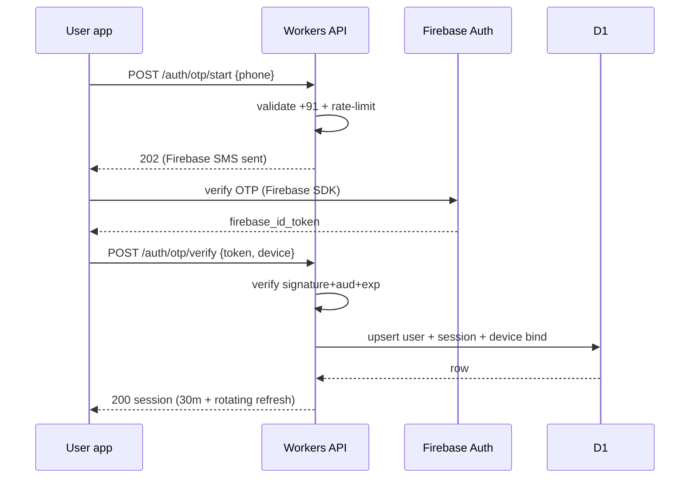
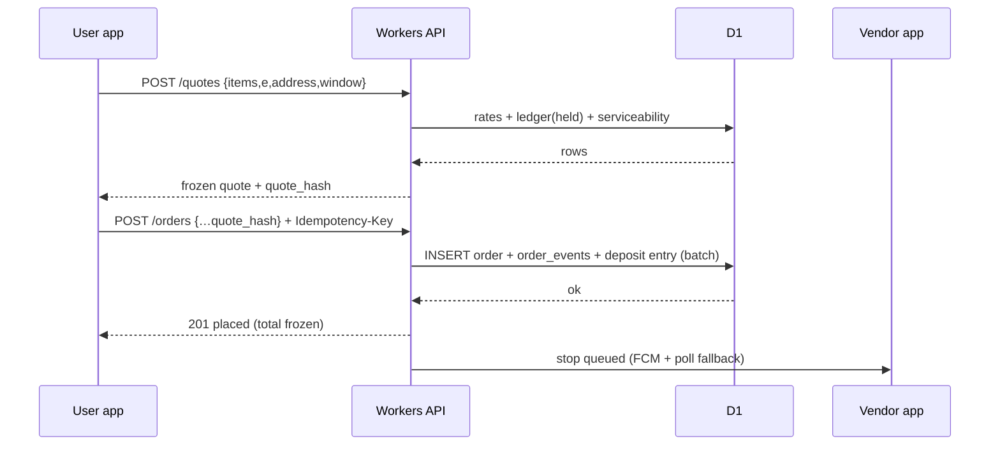

# Shodasha Mineral Waters — Backend API Contract v1 (proposed)

> Skills: `design-patterns` (module map + request flow + named patterns), `user-flows` (sequences + route map), `ssdlc` (STRIDE/OWASP gates), `tech-selection` (stack rationale).
> Stack: **FastAPI (Python) on Cloudflare Workers** + **D1 (SQLite)** + **Firebase Auth phone OTP / FCM push**. Clients: 2× Flutter Android (user, vendor) + Next.js Super Admin web.
> Inputs: `Feature_docs/synthesis/feature-requirements.md` (FR-01..37), `user-flows.md` (7 flows), `pricing-deposit-model.md`, `vendor-requirements.md` (VR-01..14), `security/security-threat-model-and-edge-cases.md` (SEC/EC series).
> Scope locks (UNVALIDATED until local survey): Refill Rs 28 · Jar+Container Rs 30 · deposit Rs 150/jar · cap Rs 3 · 30-min window 8AM–8PM ex-Sun/holidays · hold-block >3 · COD cap Rs 2,000 (tunable).
> Status: **spec — needs your approval before any `workers/api/` code.**

## 0. Conventions

- Base: `https://api.shodasha.in/v1` (prod) · `https://api.staging.shodasha.in/v1` · local `wrangler dev`.
- Auth: `Authorization: Bearer <session_token>` (Flutter, Secure Storage) · HttpOnly cookie `sh_session` (admin web). OTP verified by **Firebase Auth**; Workers verifies the Firebase ID token (`aud` = project, `exp`) then mints its own session (D1 `sessions`, access 30 min + rotating 7-day refresh).
- Mandatory headers on writes: `Idempotency-Key: <uuid>` (orders, payments, triples, refunds) · `X-Device-Id` (fraud graph, SEC-F01) · `X-Trace-Id` echoed in errors/logs.
- Error envelope (always): `{ "error": { "code": "OVER_LIMIT", "message": "<generic, Hindi-ready>", "details": {…field errors…}, "trace_id": "…" } }`. No stack traces, no SQL, no secrets to clients (SEC-C).
- Pagination: cursor `?limit=&cursor=` → `{ data:[…], next_cursor }`. Clocks: ISO-8601 UTC. Money: integer paise.
- Rate limits (edge, per Workers): OTP start 5/phone/hr + 20/IP/hr · OTP verify 5/code · Play Integrity verdict required on start+verify (SEC-F03 extended to auth — C13) · orders 30/user/day · quotes 60/user/hr · catalog/windows/serviceability 120/IP/min · refresh 30/user/hr · upi-intent 20/user/hr · vendor sync 120/vendor/hr · complaints 10/user/day · complaint-verify/pod per-stop caps (abuse) · admin reads 600/min (per-admin, GPS drill-down audited). `429 + Retry-After` (SEC-F05).
- Versioning: breaking change ⇒ `/v2`, never silent field repurposing.
- AuthZ on every request (C2): services join `users.suspended/role` per call — never trust cached role; suspend takes effect on the next request, bounded by the 30-min access TTL.
- Idempotency scope (C6): keys are namespaced `UNIQUE(user_id, endpoint, key)`; replay with different payload → `422 PAYLOAD_MISMATCH` (never another user's order). Retention: orders/triples 72 h, payments/refunds 30 d, then purged (C-findings).
- Quote binding (C5): `quote_hash` covers items+e+address+window+total+rate_version, TTL 15 min; mismatch or expired or rate_version moved on → `409 STALE_QUOTE` (re-quote).
- Admin web CSRF (C9): cookie `sh_session` is `Secure + SameSite=Lax`; every admin mutation additionally requires `X-CSRF-Token` (per-session, rotated on login).
- Actor binding: `actor_id/role` in all event/audit rows always := session values, never client-supplied (H1).

## 1. Module map (design-patterns: Layered + Repository + DTO + State Machine + Adapter + Strategy)

```
Client (Flutter/Next)
  → routes/ (thin: parse, validate Pydantic DTO, map errors)      [Layered]
  → services/ (business rules ONLY here: quote lock, deposit math,
               state machine, hold-block, RBAC checks)            [Service Layer + State Machine]
  → repositories/ (D1 access, parameterized queries only)         [Repository]
  → D1 (env.DB binding, batched writes)
Adapters (swappable): firebase_auth.py, fcm.py, upi_provider.py   [Adapter]
Payments: UpiStrategy / CodStrategy                               [Strategy]
Side effects (push, WhatsApp bill trigger, reminders): event bus  [Observer]
```

Patterns named per skill rule; DTOs keep wire contract separate from D1 rows. Controllers never touch D1; services never trust client-sent totals/roles.

## 2. D1 schema (SQLite, single writer, batched reconciliation writes)

```sql
users(id TEXT PK, phone TEXT UNIQUE, firebase_uid TEXT UNIQUE, name TEXT,
      role TEXT CHECK(role IN ('user','vendor','admin')), language TEXT DEFAULT 'hi',
      kyc_status TEXT DEFAULT 'none', -- none|pending|verified|rejected (vendors; Finder-A17)
      suspended INTEGER DEFAULT 0, created_at TEXT);
sessions(id TEXT PK, user_id TEXT REFERENCES users, token_hash TEXT UNIQUE,
         refresh_hash TEXT UNIQUE, role TEXT, device_fp TEXT,
         expires_at TEXT, revoked_at TEXT);
addresses(id TEXT PK, user_id TEXT REFERENCES users, type TEXT CHECK(type IN ('home','office')),
          label TEXT, lat REAL, lng REAL, place_id TEXT, formatted TEXT, landmark TEXT,
          pincode TEXT, lift_flag INTEGER, serviceable INTEGER, created_at TEXT);
orders(id TEXT PK, user_id TEXT REFERENCES users, address_id TEXT REFERENCES addresses,
       items TEXT, -- JSON [{sku:'refill'|'container', qty}]
       n INTEGER, e INTEGER, m INTEGER DEFAULT 0, water_bill INTEGER, deposit_due INTEGER,
       cap_charge INTEGER DEFAULT 0, total INTEGER,
       payment_mode TEXT CHECK(payment_mode IN ('upi','cod')),
       payment_status TEXT CHECK(payment_status IN ('unpaid','link_sent','paid_upi','paid_cash','partial_dues')),
       state TEXT, window_start TEXT, window_end TEXT,
       idempotency_key TEXT, quote_hash TEXT, quote_rate_version INTEGER, created_at TEXT,
       UNIQUE(user_id, scoped_key)); -- scoped_key = endpoint + ':' + key (C6); orders/triples retained 72h, payments/refunds 30d, then purged
order_events(id TEXT PK, order_id TEXT REFERENCES orders, from_state TEXT, to_state TEXT,
             actor_id TEXT, actor_role TEXT, reason TEXT, created_at TEXT);
payments(id TEXT PK, order_id TEXT REFERENCES orders, method TEXT, amount INTEGER,
         provider_ref TEXT UNIQUE, status TEXT, verified_at TEXT);
ledger(customer_id TEXT PRIMARY KEY REFERENCES users, held INTEGER DEFAULT 0,
       deposit_paid INTEGER DEFAULT 0, deposit_refunded INTEGER DEFAULT 0, dues INTEGER DEFAULT 0,
       wallet_balance INTEGER DEFAULT 0, rate_override TEXT,
       -- wallet_balance + rate_override/dealer-tier: v2-reserved, MUST stay 0/NULL in v1 (FR-36, Finder-A9)
       );
ledger_events(id TEXT PK, customer_id TEXT, kind TEXT, d_held INTEGER, d_deposit INTEGER,
              d_dues INTEGER, ref_type TEXT, ref_id TEXT, actor_id TEXT, reason TEXT, created_at TEXT);
subscriptions(id TEXT PK, user_id TEXT REFERENCES users, address_id TEXT REFERENCES addresses,
              qty INTEGER, sku_mix TEXT, window TEXT, next_run TEXT,
              schedule_type TEXT, recurrence TEXT, payment_method TEXT, -- daily|alternate|weekly|custom + detail; Finder-A10
              tier TEXT, discount_pct INTEGER, perks TEXT, -- v2-reserved, NULL in v1 (Finder-A8)
              status TEXT CHECK(status IN ('active','paused')), hold_from TEXT, hold_to TEXT);
skips(id TEXT PK, sub_id TEXT REFERENCES subscriptions, date TEXT, late INTEGER DEFAULT 0);
returns(id TEXT PK, user_id TEXT REFERENCES users, qty INTEGER, address_id TEXT,
        status TEXT CHECK(status IN ('requested','picked','refunded','rejected')),
        sla_due TEXT, created_at TEXT);
complaints(id TEXT PK, order_id TEXT REFERENCES orders, user_id TEXT REFERENCES users,
           reason_code TEXT, -- water_quality|damaged_jar|wrong_item|short_delivery|late_delivery|deposit_dispute|cap_dispute|duplicate_app_order|not_needed_today|vendor_behavior|other
           text TEXT, photos TEXT, -- photos: v2 only (no object storage in v1); MUST be NULL in v1
           vendor_agree INTEGER, vendor_note TEXT, -- vendor verification at door/pickup (§14.3)
           status TEXT, created_at TEXT, resolved_at TEXT);
device_tokens(user_id TEXT, device_id TEXT, token TEXT, platform TEXT, updated_at TEXT,
                PRIMARY KEY(user_id, device_id)); -- scoped per device; logout/deletes touch own device only (C8)
routes(id TEXT PK, date TEXT, vendor_id TEXT REFERENCES users, zone TEXT, status TEXT);
stops(id TEXT PK, route_id TEXT REFERENCES routes, order_id TEXT REFERENCES orders,
      return_id TEXT, -- pickup stops for returns (Finder-A12); exactly one of order_id/return_id set
      customer_id TEXT REFERENCES users, seq INTEGER, fulls_exp INTEGER, empties_exp INTEGER,
      version INTEGER DEFAULT 1, -- fencing: reassign bumps version; triple/PoD on stale version → 409 STALE_STOP (C14)
      triple TEXT, -- JSON {fulls_given, empties_back, cash, upi, caps_missing, tendered, change_given, seal_ok; photo_ref = v2}
      -- invariant when tendered+change present: tendered − change_given = cash (C12)
      status TEXT CHECK(status IN ('pending','done','skipped','failed')), synced_at TEXT);
config(key TEXT PRIMARY KEY, value TEXT, effective_from TEXT, updated_by TEXT, updated_at TEXT);
-- rates keyed with effective_from: mid-day changes apply to new quotes only (Finder-C10)
audit_log(id TEXT PK, actor_id TEXT, actor_role TEXT, action TEXT, entity TEXT,
          entity_id TEXT, before TEXT, after TEXT, trace_id TEXT, created_at TEXT);
-- retention: money/role/state + exact-GPS reads 1 yr; operational reads 90 d; then purge (Finder-C8)
ratings(order_id TEXT PRIMARY KEY REFERENCES orders, user_id TEXT REFERENCES users,
        stars INTEGER, created_at TEXT); -- once per delivered order; ≤3 offers complaint shortcut (Finder-A15)
leads(id TEXT PK, phone TEXT, pincode TEXT, lat REAL, lng REAL, source TEXT, created_at TEXT);
-- unserviceable-pincode + out-of-zone captures (Finder-A21)
depot_stock(depot_id TEXT PRIMARY KEY, fulls INTEGER DEFAULT 0, empties INTEGER DEFAULT 0, updated_at TEXT);
-- day-level physical counts; loading-sheet confirm decrements; reconciles jars-out (Finder-A22)
refunds(id TEXT PK, order_id TEXT REFERENCES orders, payment_id TEXT REFERENCES payments,
        amount INTEGER, method TEXT, status TEXT CHECK(status IN ('pending','claimed','done','failed')),
        UNIQUE(payment_id), -- no double refund, ever (C3/C15)
        claimed_by TEXT, claimed_at TEXT, attempts INTEGER DEFAULT 0, created_at TEXT, done_at TEXT);
```

Order `state` machine (server-enforced, 409 on illegal): `placed→accepted|rejected|cancelled →picked→packed→assigned→dispatched→delivered|failed→(dispatched|cancelled)`. Payment is a **separate field**, never a state (FR-top).

## 3. View-restriction matrix (who sees what — enforced in services, not UI)

| Data | anon | user | vendor | admin |
|------|------|------|--------|-------|
| Catalog / windows / hours / `config/public` | full | full | full | full |
| Own profile + own addresses + own orders/ledger (read-only held/deposit/dues) | — | own only | — | all |
| Assigned stops: customer name/phone/exact GPS + qty/empties/cash-due | — | — | active-route only | all |
| Other customers' PII, exact GPS history, margins | — | never | never | zone-default, exact audited |
| `sessions`, OTP rows, token hashes | never | never | never | never |
| `audit_log`, money/deposit edits, exports | — | — | — | full (every read of exact GPS logged) |
| `config` (rates, caps, COD cap, hold limit) | read public subset | read public subset | read public subset | read + write (audited) |

IDOR rule: `/orders/{id}` and `/ledger/{customer}` check owner/assignee/admin; wrong-owner returns same shape as not-found (no oracle, SEC-C).

## 4. Endpoints

### 4.1 Auth (Firebase OTP → session)

| Method + path | Role | Request | Success | Errors | Trace |
|---|---|---|---|---|---|
| POST `/auth/otp/start` | anon | `{phone}` (+91 validated, SEC-A03) | `202 {sent_to_masked, resend_after_s}` (Firebase sends SMS) | 400 bad phone · 429 resend/pump (SEC-A02) | UR/FR-10 |
| POST `/auth/otp/verify` | anon | `{firebase_id_token, device:{id, integrity}}` (integrity verdict enforced, C13) | `200 {access_token, refresh_token, role, restrictions?, new_device_alert?}`; Worker verifies signature+aud+exp (SEC-A08), upserts user, binds device (SEC-F01: ≤3 accounts/device/30d else `review`). Suspend mints a session that can only read + pay-dues/appeal (user) or read notice (vendor) — all other writes blocked per-request (C1/C2, §14.1) | 401 bad/expired token · 409 device-cap → review queue | SEC-A05/A08/F01 |
| POST `/auth/refresh` | bearer(refresh) | `{device:{id}}` — must match bound `device_fp` | `200` rotation; **reuse of a burned token → revoke whole family + force re-OTP + push alert** (C7) | 401 reused/revoked | SEC-A06 |
| POST `/auth/logout` | bearer | `{revoke_all?, device_id}` — deletes only that device's FCM token unless `revoke_all` (C8) | `200` | — | — |
| PATCH `/auth/me` | bearer | `{language, name}` (language toggle persistence — Finder-A24) | `200 {user}` | 400 | UR-12 |
| GET `/auth/me` | bearer | — | `200 {user, addresses_count, ledger_summary}` | 401 | — |

### 4.2 Catalog / quote (public — never wall prices behind login, FR-10)

| Method + path | Request | Success |
|---|---|---|
| GET `/catalog` | — | `{skus:[{id:'refill',price_paise:2800},{id:'container',price_paise:3000}], deposit_per_jar:15000, cap_charge:300, hours, holidays}` |
| GET `/windows?date=&pincode=` | date, pincode | `{windows:[{start,end,capacity_left}], serviceable:true}` / `serviceable:false + lead_capture` |
| GET `/serviceability?pincode=` | — | `{serviceable, zone}` |
| POST `/quotes` (auth) | `{items, e, address_id, window}` | `{water_bill, deposit_due=(N−E)×150, cap_note, total, quote_hash, expires_at}` — server-computed; client totals ignored (SEC-P) |

### 4.3 Addresses

`GET /addresses` · `POST /addresses` `{type home|office, lat, lng, accuracy_m, place_id, formatted, landmark, pincode, lift_flag}` (GPS sanity: reject (0,0)/accuracy>100m → force map-pin, EC-G; `place_id` re-verified server-side via Google API, mismatch → 422; zone keyed on verified pincode, GPS polygon fallback — C10) · `PATCH /addresses/{id}` (blocked after dispatch → 409 + message, flow note #3) · `DELETE /addresses/{id}` (blocked if active orders/subs).

### 4.4 Orders (idempotent, quote-locked)

| Method + path | Request | Success | Key errors |
|---|---|---|---|
| POST `/orders` | `{items, e, address_id, window_start, quote_hash}` + `Idempotency-Key` | `201 {order (state:placed, total frozen)}` | 400 validation · 409 stale quote (re-quote) · 422 OVER_LIMIT home>5 confirm-required / >10 tanker-stop (EC-O02/O03) · 422 HOLD_BLOCKED held>3 (VR-12) · 409 IDEMPOTENT_REPLAY → returns original order |
| GET `/orders?cursor=` | — | paginated own orders | — |
| GET `/orders/{id}` | — | order + 4-step tracker + window + rider (on assign) + bill | 404-not-yours |
| GET `/orders/{id}/tracking` | — | `{state, window, rider{name,call}, events}` (no live dot v1) | — |
| POST `/orders/{id}/cancel` | `{reason}` + `Idempotency-Key` (C3) | `200 cancelled` pre-dispatch; post-dispatch → `409 NEED_DISPATCH_OVERRIDE` + vendor-callback ticket (EC-S05); double-cancel → `409 ALREADY_CANCELLED` + same outcome (UNIQUE(payment_id) refund, §10) | 409 illegal transition |
| POST `/orders/{id}/reschedule` | `{window_start}` — pre-dispatch only (Finder-A11: one-time "don't send today") | `200 {order, new_window}`; post-dispatch → call-to-cancel path | 409 illegal transition |

### 4.5 Subscriptions / pause / skip (EC-S)

`POST /subscriptions {address_id, qty, sku_mix, window}` · `GET /subscriptions` · `POST /subscriptions/{id}/pause {hold_from, hold_to}` → excluded from routing, FCM confirm · `POST /subscriptions/{id}/resume {preferred_date}` (≥24h guard → 422 + next valid date) · `POST /subscriptions/{id}/skips {date}` (before cutoff; after → `late_skip` + vendor call CTA) · auto-resume fires server-side on `hold_to`.

### 4.6 Payments (Strategy: UPI vs COD; quote never repriced)

| Method + path | Flow |
|---|---|
| POST `/payments/upi-intent` `{order_id}` + idempotency | returns UPI intent payload/link; `payment_status=link_sent` |
| POST `/webhooks/upi` (signed, HMAC + ±5 min window + nonce replay-cache) | duplicate `provider_ref`/event delivery → `200` no-op, never a second credit (C16) | provider callback → verify amount+payee server-side → `paid_upi`, reconcile dues, FCM receipt. Unverified = 401, never applied (SEC-P) |
| POST `/orders/{id}/cod-confirm` | `payment_status=unpaid→(COD due at door)`; bill shows dues until vendor sync flips `paid_cash/partial_dues` |
| GET `/billing/dues` | `{dues, lines[], pay_link}` — partials carried, never zeroed (VR-08) |
| GET `/invoices/{order_id}` | shareable bill (WhatsApp-ready arithmetic + own-bank UPI QR ref) |

### 4.7 Vendor ops (role=vendor, offline-tolerant)

| Method + path | Notes |
|---|---|
| POST `/vendor/duty {on}` | opens shift; route assigned on login |
| GET `/vendor/routes/today` | sequenced stops + loading sheet (take-X/expect-Y) + SKIP list (paused/late) |
| GET `/vendor/stops/{id}` | exact GPS + lift/gate note + qty/empties-expected + cash-due |
| POST `/vendor/stops/{id}/triple` + stop idempotency (scoped key) | `{fulls_given, empties_back, cash, upi, caps_missing, tendered?, change_given?, version}` — stale `version` (reassigned/pulled stop) → `409 STALE_STOP` (C14); `tendered−change=cash` enforced when both present (C12) | one atomic commit → ledger mutation (never-negative guard → 422) |
| POST `/vendor/stops/{id}/pod` | `{delivery_otp, empties_count, cash, seal_ok}` → `dispatched→delivered` only with valid OTP + counts (photo joins in v2 with object storage; v1 = OTP+counts+cash — overrides FR-20 "photo required") |
| POST `/vendor/sync` | batch queued triples/PoDs with per-stop `version`; stale-version entries rejected `409 STALE_STOP` (C14); server-wins on ledger (VR-02) |
| GET `/vendor/earnings?shift=` | per-shift cash/UPI totals + hold-block surfacing |
| POST `/orders/{order_id}/rating` | `{stars}` — once per delivered order; ≤3 auto-offers complaint shortcut with order pre-attached (Finder-A15: UR-19/FR-13) |

### 4.8 Jars / ledger

`GET /ledger/me` (read-only held/deposit/dues + history) · `POST /returns {qty, address_id}` → 10-working-day SLA + request id (E) · admin `POST /returns/{id}/assign {route_id|vendor_id}` queues a pickup stop (`stops.return_id`, Finder-A12) · vendor `POST /returns/{id}/pickup {empties_collected, caps_missing}` · admin `POST /returns/{id}/refund {method upi/manual}` (claim lock: single claimant, audited, idempotent — C15).

### 4.9 Complaints (3-day window, E2)

`POST /complaints {order_id, reason_code, text (≤500 chars)}` (≤3 days → else 422 + help path; 24h for `water_quality`; photos = v2) · `GET /complaints` (status open→progress→resolved; disagreements show "under review") · vendor `POST /complaints/{id}/verify {agree, note}` (door/pickup, §14.3) · admin `POST /admin/complaints/{id}/resolve {action: refund|redelivery|note}` (48h SLA on disagreements).

### 4.10 Devices / notifications

`POST /devices {device_id, fcm_token, platform}` (upsert per user+device) · `DELETE /devices {device_id}` (own device only) · user tracking poll cadence when FCM dead: 60 s backoff (Finder-C7) · FCM events (server-targeted only): order_confirmed, dispatched, arriving_window, delivered_receipt, pause_confirm, resume_reminder, dues_reminder, dispute_update, return_pickup.

### 4.11 Admin (role=admin, every write → `audit_log`)

Orders queue (`GET /admin/orders?state=`), accept/reject/assign (`POST /admin/orders/{id}/assign {vendor_id}`), reassign-at-price (price frozen, bumps stop `version` — C14), cancel-override; vendors: create (`POST /admin/vendors {phone, name, zone_id, kyc_note}` → `kyc_status=pending`, role granted only on verify — Finder-A17), capacity (`PATCH /admin/vendors/{id}/capacity {max_stops, max_jars, per_stop_fee}` — Finder-A18), duty status; routes: generate (`POST /admin/routes/generate {date, zone}` from schedules + returns — Finder-A25, consumes `depot_stock` — Finder-A22); users/vendors list/suspend; ledger adjust (`POST /admin/ledger/{customer}/adjust {d_held,d_deposit,d_dues,reason}` — before/after logged, VR-11); invoices send (`POST /admin/invoices/{id}/send-whatsapp` via configured WhatsApp provider adapter: templates + opt-out + DLT — Finder-A13/C1); quality report (`GET /quality-report` → external lab URL from config, no hosting in v1 — Finder-A14); day-close (`GET /admin/reconciliation?route=&date=` cash+UPI vs pending vs jars-out vs deposit-liability); returns + disputes + dunning + custody queues; config (`PATCH /admin/config` with `effective_from` for rates — Finder-C10); `GET /admin/audit?entity=`; analytics (`GET /admin/metrics`: on-time adherence, repeat rate, reorder time, deposit disputes, UPI-vs-COD split).
First-admin seed (fresh D1 has zero admins — Finder-A16): one-time `wrangler` secret bootstraps the initial admin phone; seed endpoint disabled after first admin exists (or `seed_enabled=false` in config).

## 5. Sequences (user-flows: happy + branch coverage)





## 6. Error catalog (generic to client, detailed server-side)

`VALIDATION(400)` · `UNAUTH(401)` · `FORBIDDEN(403)` · `NOT_FOUND(404, same shape for not-yours)` · `STATE_CONFLICT(409: illegal transition, already-paid replay→returns original)` · `STALE_QUOTE(409)` · `OVER_LIMIT(422: EC-O02/O03 + tanker CTA)` · `HOLD_BLOCKED(422: VR-12 + pay path)` · `OTP_EXPIRED/MAX_ATTEMPTS(422)` · `DISPUTE_EXPIRED(422)` · `RATE_LIMITED(429)` · `UPSTREAM_FAIL(502: Firebase/UPI, retry-safe via idempotency)` · `SERVER(500: trace only)`.

## 7. Production notes

- FastAPI-on-Workers risk (ADR-012): pure-Python deps only; if ASGI adapter blocks, fallback Flask-style handlers or Hono port — contract above is runtime-agnostic.
- Testing: unit (deposit math, machine guards, RBAC matrix) · integration (repos, idempotent replays, offline batch) · E2E staging (OTP→order→triple→PoD→reconcile) · abuse cases from security spec.
- Observability: trace ids end-to-end, redacted structured logs, admin abuse dashboard (OTP fails, 429s, over-limit blocks, unacked stops).

## 8. Open items (need your answers before scaffold)

1. FastAPI-on-Workers spike: ASGI adapter vs minimal handlers — 1-day spike decides.
2. Tunables: COD cap (Rs 2,000?), skip cutoff time, hold-limit default (3?).
3. UPI provider (callback format for webhook verification) + Firebase project ids.
4. Payout model: per-stop fee vs fixed salary (outside system)? Visit fee on late cancel — yes or never? GPS distance: soft-flag (recommended) vs hard-block?

## 9. Multi-vendor ↔ multi-user linkage: zones, assignment, capacity (added 2026-09-29 — the gap you caught)

Honest audit: v1 modelled isolation (RBAC + IDOR) and the ledger, but **not** how a user finds their vendor, not vendor capacity, not cancellation money. This section closes that. Rule of the whole design: **users and vendors never address each other — the zone router introduces them, per order, per shift.**

### 9.1 Zones (admin-owned geography)

```sql
zones(id TEXT PK, name TEXT, pincodes TEXT, polygon TEXT, active INTEGER DEFAULT 1);
vendor_zones(vendor_id TEXT REFERENCES users, zone_id TEXT REFERENCES zones,
             priority INTEGER DEFAULT 0, PRIMARY KEY(vendor_id, zone_id));
vendor_profile(user_id TEXT PRIMARY KEY REFERENCES users,
               max_stops_per_shift INTEGER DEFAULT 25, max_jars_per_shift INTEGER DEFAULT 60,
               per_stop_fee INTEGER DEFAULT 0, active INTEGER DEFAULT 1);
shifts(id TEXT PK, vendor_id TEXT REFERENCES users, date TEXT, duty_on TEXT, duty_off TEXT,
       cash_collected INTEGER DEFAULT 0, cash_handed_over INTEGER DEFAULT 0,
       handover_confirmed_by TEXT, status TEXT);
```

- A zone = pincode cluster (+ optional GPS polygon later). Admin creates zones, assigns vendors with priority, tunes per-vendor caps **up/down anytime** (`PATCH /admin/vendors/{id}/capacity`) — your "increase/decrease per vendor" is a first-class operation, not a code change.
- Order → zone by pincode (GPS polygon fallback); unknown zone → stays `placed` + `needs_dispatch` flag → admin SLA queue, user sees "assigning rider…" (never a silent stall).

### 9.2 Assignment algorithm (deterministic, auditable)

1. Candidates = vendors in zone ∩ `vendor_profile.active` ∩ on duty ∩ `stops_today < max_stops` ∩ `jars_allocated < max_jars`.
2. Pick least-loaded (stops, then jars); tie → lower priority number → earlier `duty_on`. **The read-check-assign runs in one D1 transaction** (single-writer serializes concurrent orders — C4); capacity re-checked at commit, loser gets next candidate, never silent overload.
3. No candidate → unassigned queue + escalating alerts (re-push → admin call → re-zone). Never auto-assign outside the zone.
4. Admin override assign/reassign any time pre-delivery; **reassignment keeps the quoted price**; every (re)assignment writes `order_events` with actor + reason.
5. Vendor off-duty mid-shift → their pending stops auto-return to the zone pool and re-run the algorithm; vendor gets an FCM "shift closed, N stops moved".

### 9.3 Isolation guarantees (server-side, both directions)

- Vendor query path is always `stops WHERE route.vendor = session.user AND route.date = today` — there is no endpoint that lists other vendors' stops or the customer directory. Exact customer GPS/phone visible **only on active assigned stops**.
- User path is always `orders WHERE user = session.user`; the only vendor data ever returned is `{rider_name, call_number, window}` on their own active order.
- Rate cards, other zones' loads, margins, other users' dues: 404-shaped responses, never "forbidden" oracles.

## 10. Cancellation settlement: billing accurate to the paise (added — never over, never under)

Settlement depends on **state × money-moved**, computed from events, never by editing a stored total:

| State at cancel | Money moved? | Outcome (all idempotent) |
|---|---|---|
| `placed`, unpaid/COD | no | Void: cancel + compensating `ledger_events` reverse the deposit entry. Bill = 0. |
| `placed`/`accepted`/`picked`/`packed`, paid UPI | yes | Void + auto-create `refunds` row (`pending` → manual UPI v1, 3-working-day SLA, FCM + bill credit line). |
| `accepted`/`picked`/`packed`, unpaid | no | Free cancel, stock reservation released, same void path. |
| `assigned`/`dispatched` | maybe | **No self-cancel.** App shows "Call to cancel" CTA. Dispatcher override cancel → settlement per rows above + stop pulled from route + vendor FCM. **No visit fee in v1** (deliberate — visit fees cause more disputes than revenue; revisit with data). |
| `delivered` | — | No cancel at all → complaint/dispute path (3-day window). |
| `failed` | — | Reattempt or cancel-and-release (existing machine). |

Refunds use the canonical `refunds` table (§2: `UNIQUE(payment_id)`, claim lock `claimed_by/claimed_at`, `pending→claimed→done|failed`). Cancel runs in one transaction: state check + void + compensating ledger rows + refund insert (C3). Cancel itself requires `Idempotency-Key` (scoped, §0).

- Double-cancel / double-tap → `409 ALREADY_CANCELLED` returning the **same** outcome; refund row is UNIQUE per payment (no double refund, ever).
- Every cancel writes `order_events` + compensating `ledger_events` + (refund row iff money moved). The bill screen recomputes from these rows — that is what makes "can't charge more, can't charge less" structurally true rather than carefully true.

## 11. Money model: three purses + vendor custody + payouts (added)

1. **User purse** — `dues` (owes agency) + `deposit_balance` (agency owes user) + payments made. One screen, one arithmetic, WhatsApp-shareable.
2. **Vendor custody** (not ownership) — `in_hand = cash_collected − cash_handed_over`. Cash at the door is agency money in the vendor's pocket. Shift close requires handover confirm by admin; nonzero overnight → discrepancy flag; configurable block on new routes until resolved (tunable: block vs warn).
3. **Agency books** — revenue (water + cap charges) vs **deposit liability** (refunds owed — deposits are NOT revenue, separate day-close line) vs dues receivable vs refunds payable.
4. **Vendor earnings (answers "vendor billing amount")** — per-stop fee accrues per `done` stop (`per_stop_fee` from profile, tunable per vendor). **GPS-flagged stops (C11) accrue but are held out of payouts until admin clears the flag** — the fee survives honest drift, fraud never cashes. COD accuracy closes the loop from the other side: the user's delivery receipt shows the recorded amount with a 1-tap "wrong amount" dispute (C12) — vendor-reported cash is always customer-visible.

```sql
payouts(id TEXT PK, vendor_id TEXT REFERENCES users, period TEXT, stops_done INTEGER,
        gross_fee INTEGER, deductions INTEGER DEFAULT 0, net INTEGER,
        status TEXT, approved_by TEXT);
```

Admin approves → payout moves to paid (UPI/manual v1). Salary-model vendors simply get `per_stop_fee = 0` and payouts stay empty — both models coexist.

- All money math in **integer paise** (no float rounding drift). Config rate changes carry `effective_from` — mid-day changes apply to new quotes only (quote lock holds).
- COD `tendered`/`change_given` are optional fields on the triple JSON (record what happened; collected amount is what posts).

## 12. Frontend behavior per surface (what each screen does when the backend acts)

- **User**: cancel button enabled only pre-dispatch (state-driven, server is the authority — client state is a hint); post-dispatch shows call-to-cancel. Reassignment swaps the rider card (push + 30s poll fallback, no app restart). Bill lists refund-pending lines and dues banner; dues over cap blocks new COD with the pay-dues path (never a dead end).
- **Vendor**: queue live-updates (assigned push, pulled-away toast with reason, SKIP list greyed). Capacity meter (`18/25 stops`) and custody meter (`Rs X in hand`) always visible. Offline pending count badge; sync conflicts resolve per-stop idempotency, surfaced not hidden. PoD records GPS; >200 m from stop pin → **soft flag for admin review, delivery still completes** (hard-blocks fail real deliveries in GPS-drift lanes).
- **Admin**: zone board (load bars per vendor, unassigned SLA queue), rebalance tool (move stops, price frozen), discrepancy queue, refund queue with SLA aging, day-close checklist (cash+UPI vs pending vs jars-out vs deposit-liability delta), full audit trail.

## 14. Super-admin enforcement: block / suspend / quality / vendor replacement (added 2026-09-29 — trust & safety)

Research grounding (Sep 2026): BIS publishes **product-recall orders** against licensed packaged-water makers for failed batches (e.g. bromate over-limit — health/chemical hazard), so batch-level quality response is a legal reality, not paranoia (IS 14543). Delivery-fraud patterns are documented in Indian cases: mid-route product swaps by insiders, fake "delivery boys" collecting UPI before the genuine delivery arrives, COD impersonation rings. The water equivalents — fake jars, swapped seals, unremitted cash, fake collectors — are designed against below.

### 14.1 Suspension model (both directions, graduated, never a dead end)

```sql
-- delta on users:
ALTER TABLE users ADD COLUMN suspended INTEGER DEFAULT 0;
ALTER TABLE users ADD COLUMN suspended_reason TEXT;
ALTER TABLE users ADD COLUMN suspended_by TEXT;
ALTER TABLE users ADD COLUMN suspended_at TEXT;
-- strikes + quality:
CREATE TABLE strikes(id TEXT PK, subject_id TEXT REFERENCES users, kind TEXT,
  -- kind: quality | fake_delivery | cash | behavior | payment_default | abuse
  severity INTEGER, ref_type TEXT, ref_id TEXT, note TEXT,
  created_by TEXT, cleared_by TEXT, cleared_at TEXT, created_at TEXT);
CREATE TABLE quality_incidents(id TEXT PK, order_id TEXT REFERENCES orders,
  vendor_id TEXT REFERENCES users, batch_code TEXT,
  reason_code TEXT, description TEXT, -- v1: words, not photos (no object storage)
  vendor_check TEXT, vendor_agree INTEGER, vendor_note TEXT, -- door/pickup verification (§14.3)
  status TEXT CHECK(status IN ('open','confirmed','rejected')),
  resolution TEXT, created_at TEXT);
```

- Ladder: `warn → restrict → suspend → terminate`. Restrict examples: user → COD blocked (prepaid/UPI only); vendor → new assigns paused, finishes in-flight.
- **Suspend revokes all sessions immediately** (kill active tokens — a "blocked" vendor with a live Bearer token is not blocked). Vendor suspend additionally calls Firebase `disableUser` so no fresh ID token can mint (C1). Every subsequent request re-checks `users.suspended` per §0 — the 30-min Bearer never outlives the block (C2).
- Suspended user: login works, ordering blocked with Hindi reason + pay-dues/appeal path (account + history preserved — never delete). Suspended vendor: sees notice + appeal contact only, no routes.
- Appeal = support ticket path; unsuspend is audited. Strikes auto-flag at thresholds (vendor: 3 active; user: 3 payment defaults) but **removal/detachment is human-confirmed**, never automatic (auto-removal is itself an abuse vector).

### 14.2 Money recovery (the "midway they don't want it" matrix)

- **Subscription cancel** → future runs stop; delivered dues stay; held jars must return within 10 working days else **deposit offset**: `forfeit = min(deposit_balance, held × 150)`, remainder refunded, any shortfall → dues (receivable, dunning ladder below). Prepaid tiers (v2): pro-rata refund row.
- **User dues ladder**: friendly Hindi reminders → COD-only block → suspend-ordering (pay-dues CTA) → audited **write-off** (`POST /admin/dues/{customer}/write-off {reason}`) for unrecoverable. Written-off dues stay visible as history; reactivation requires settling.
- **Vendor custody recovery**: block new routes → deduct from `payouts` → remaining recorded as vendor receivable (`payouts.deductions` + audit) → offline/legal process. **Zone detachment is guarded: custody must be zero first** — the system refuses detach with open cash (forces handover, no silent walkaway).

### 14.3 Quality incidents, return policy, vendor replacement (v1: words + vendor eyes, NO photos — no object storage)

- **Reason-code catalog** (not free-text chaos; `other` + 500-char text always available): `water_quality` (taste/smell/particles) · `damaged_jar` (crack/leak) · `wrong_item` · `short_delivery` · `late_delivery` · `deposit_dispute` · `cap_dispute` · `duplicate_app_order` (app glitch/double-tap nullification) · `not_needed_today` · `vendor_behavior` · `other`.
- **Quality window**: 24 h from delivery (shorter than the 3-day general dispute). Filing needs reason_code + text only. Confirm → **free redelivery or full refund + free pickup of the bad jar** (customer never pays for our bad water).
- **Sealed-vs-opened rule** (the hygiene line a senior engineer insists on): seal intact → full water-bill reversal + free pickup. Seal opened → no return; only the quality path (free redelivery/refund if confirmed). Vendor checks the seal at the door — that check IS the verification.
- **Vendor verification protocol** (how the vendor "verifies" without photos): quantity/deposit/cap disputes resolve from system records instantly (ledger + triple — no judgment needed). Quality claims create a vendor task: at the door or scheduled pickup the vendor records `{agree, check: seal/smell/visual, note}`. Agree → redelivery/refund auto-issues. **Disagree → both statements frozen + admin triage decides in 48 h**; user sees "under review," never silence. Admin decision + reason shown to the user.
- **Abuse guard**: ≥3 vendor-disputed-then-admin-rejected claims in 90 days → user `abuse` strike + warning (strikes table); pattern → restrict. Genuine reporters never punished for one rejected claim.
- Each confirmed incident = vendor strike (severity by reason; `illness_claim`-class = immediate `under_review`, new assigns paused, in-flight completes or reassigns).
- **Batch rule**: ≥3 confirmed incidents for one vendor in 7 days → auto `under_review` + admin investigation; BIS-recall analogue at our scale: **batch hold** (stop dispatching that vendor's stock) + FCM/WhatsApp notice to affected users. Jar `batch_code` recorded at PoD for traceability.
- `not_needed_today` pre-delivery converts to skip (before cutoff) — it is not a complaint. `duplicate_app_order` auto-checks idempotency keys first (usually resolves itself with "you were charged once — receipt").
- **Vendor replacement per zone**: detach (`POST /admin/zones/{z}/vendors/{v}/detach {effective, reason}` — custody-zero guard) → attach new vendor → pending stops re-run assignment; completed history stays with the old vendor (evidence preserved). Users in the zone see nothing except possibly a new rider name.

### 14.4 Anti-impersonation & anti-swap controls (from the case files)

- Per-order customer OTP (vendor cannot complete without the code on the customer's phone) + rider ID card (name/ID shown pre-delivery; avatar joins v2) + "verify before you pay" UX copy.
- **UPI payee lock**: collections accepted only to the agency's QR/account (`payments` verifies payee server-side); vendor personal UPI IDs are banned and rejected at verify. Cash allowed. This single rule kills the fake-collector pattern.
- **Seal check**: `seal_ok` boolean in the triple + customer "seal intact?" 1-tap confirm on the delivery receipt screen (photo evidence joins in v2 with object storage). Broken-seal-at-door → reject + quality incident, not a completed delivery. Jar labels carry maker + licence no. (BIS marking rule).

### 14.5 New endpoints (admin trust board)

`POST /admin/users/{id}/suspend|unsuspend|restrict` (revokes sessions) · `GET /admin/strikes` + `POST /admin/strikes/{id}/clear` · quality: `GET /admin/quality` + `POST /quality/{id}/vendor-check {agree, check, note}` (vendor, at door/pickup) + `POST /admin/quality/{id}/confirm|reject {resolution}` + `POST /admin/vendors/{id}/review-hold|release` · `POST /admin/zones/{z}/vendors attach|detach` · `POST /admin/dues/{customer}/write-off` · `GET /admin/custody` (all nonzero vendor hands) · `GET /admin/dunning` (dues aging ladder).

## 15. Real-world edge register (delta — beyond the security spec's EC series)

- Wrong-house delivery → prevented by **per-order customer OTP** (vendor can't complete without the code on the customer's phone).
- "Marked delivered, never arrived" → evidence chain decides: OTP + timestamp + GPS pin + seal flag (photo joins in v2 with object storage).
- Other-brand / capless empties → accepted-with-reason or rejected-with-reason at handover; deposit math uses accepted count only.
- Cash collected, never remitted → custody meter + shift-close block + discrepancy queue (process, not trust).
- UPI paid → then cancelled → refund queue (never "adjust in next bill" silently; explicit line item).
- Double order (double tap) → idempotency returns the original order, no second charge.
- Price/config changed mid-day → existing quotes frozen; new quotes use new rates.
- Subscription fires while user on hold → scheduler skips held accounts (hold wins over schedule).
- Scheduler vs skip-today → skip wins for the date; pause-all wins over everything.
- Dead SIM / new phone → re-OTP, revoke old sessions, new-device alert (SEC-A05).
- Vendor clock skew → server timestamps authoritative; client time informational.
- Sunday/holiday booking attempt → window API excludes those days; scheduler never generates them.
