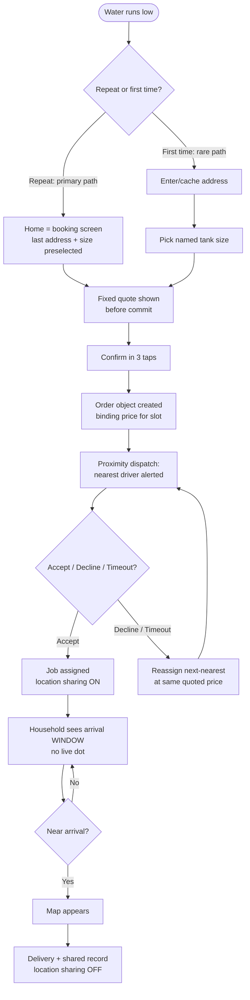

# A1 — Aquahaulers Water Delivery App Design Case Study

**Meta**
- URL: https://designwithsampath.com/work/aquahaulers-app
- Date read: 29 Sep 2026
- Access status: OK (full page fetched via webfetch, markdown)
- Author/role: Sampath Vadlapudi, sole Product Designer, working directly with founder
- Year/timeline: 2023, 7 weeks, brief → dev-ready handoff
- Type: Design case study (research + flows + design system + prototype + specs). NOT a live product.
- Evidence grade: High for UX reasoning, zero production metrics (explicitly stated — work ended at handoff)

## TL;DR

Aquahaulers is a **two-sided tanker-delivery marketplace** (households book verified tankers at fixed prices; drivers get proximity-routed jobs without phone calls). The core problem it replaces is the **phone-call booking system**: verbal negotiable prices, no confirmation, no arrival window, dispatch-by-call while driving, paper addresses, no delivery record. The signature structural decisions: (1) **two separate research tracks and two separate apps** (consumer booking app + driver job app) over one shared backend/order object/pricing model — "one product with two logins would have been mediocre at both ends"; (2) **reorder is the real use case** — first-time flow as primary path optimises the rare case; (3) **fixed quote before commit**, binding per slot, surge pre-booking only, reassignment at quoted price (never reprice); (4) **arrival window, not live dot** — watching a truck crawl for 40 min feels slower than not knowing; map appears only near arrival; (5) **driver alerts symmetric accept/decline** with timeout reassignment — accepting must be cheaper than ignoring. Maps to PaniBox findings **F1 (repeat order), F3 (reliability/certainty), F4 (window beats dot)**. Operator console deliberately scoped out as a third product.

## Features (exhaustive)

### Consumer (household/caretaker) app
- Home screen IS the booking screen — no dashboard (opened 3–4×/month, one intent)
- Cached addresses, last-used preselected
- Tank sizes as small named set (NOT free volume/number field — the number field was removed mid-project because it made fixed quotes impossible)
- Deterministic price computed from address + size, shown BEFORE confirmation/commit
- No account required to see a price (registration-before-quote = demanding trust first)
- Three-tap repeat path ("the same as last time"): preselected address + size → quote → confirm
- Fixed quote binding for the slot quoted in
- Surge changes quote before booking, never after
- Failed fulfilment → order reassigned at quoted price, never repriced (repricing = reintroducing the negotiation the product exists to remove)
- Arrival window shown (not live dot)
- Map appears only near arrival (when knowing changes what you do)
- Location sharing active-job only, never continuous
- Delivery record visible to household (proof delivery happened — settles disputes)
- Confirmation as record (order exists as object, not someone's memory)
- Reliability signals: verified tanker/supplier distinction (vs. learning reliability only by being let down)

### Driver (tanker driver) app
- One screen IS the app: current job OR next alert; earnings/history behind second tab (early dashboard-first version killed — "a driver opening the app is working")
- Proximity alerts showing only: distance, volume, payout — nothing else
- Accept and Decline same size, equally reachable (ignoring must never be the cheapest option)
- Unanswered alert times out → reassigned to next-nearest driver (never sits on screen)
- Jobs routed by proximity, not call order
- Addresses digital (no verbal relay → paper → misread chain)
- Delivery record visible to driver too (location sharing accepted where it produces a record settling disputes in their favour; resisted as surveillance otherwise)
- Targets well past 48dp minimum; primary action one button hittable without careful look
- High-contrast sunlight-legible design: heavier weights, larger minimums, no colour-only signals
- No paragraph-length reading anywhere; nothing needing two hands
- Android-only (that is what drivers carried; iOS build = cost with no return)

### Operator (desk) — scoped, NOT designed
- Described need: view of every tanker location + unassigned jobs; serves customers who ring anyway
- Explicitly left out: "a third product with a third set of questions; squeezing it into seven weeks would have compromised the two that mattered" → status OPEN

### Shared platform
- One backend, one order object, one pricing model
- One order, two vocabularies: "delivery" (household) vs "job" (driver)
- One component library, two densities (driver build = consumer build "with the air let in"); same tokens/components, two spacing scales
- Design tokens: deep cerulean accent over structural slate blues (palette as trust/water signal); two contrast standards (normal consumer / windscreen-sunlight driver); two target-size standards

## How features interact

- `cached address + named size → deterministic quote → quote-before-commit → binding fixed price → (surge only pre-booking) → confirm → order object created`
- `order object → dispatch: proximity ranking → alert (distance/volume/payout) → accept | decline | timeout → assigned | next-nearest`
- `active job → location sharing ON → household sees window (no dot) → near arrival: map appears → delivery → shared record → location sharing OFF`
- `failed fulfilment at quoted price → reassign at SAME price (never reprice) → record reflects continuity`
- Failure-mode chain the design kills: verbal price → memory-only order → day lost waiting → verbal address → paper misread → word-against-word dispute. Every link gets a replacement: fixed quote → order object → window → digital address → shared record.

## User flow (mermaid)

## User requirements (household side)

- Certainty before commitment: price + arrival window upfront, record afterwards
- No negotiation: fixed number, not a conversation (price-as-proxy finding: fixed matters more than lower)
- Speed beats transparency plumbing: must be faster than dialling, or transparency never gets a chance
- No registration wall before quote
- Waiting cost dominates money cost: someone loses a day without a window
- Reliability distinguishable BEFORE being let down (verified supplier signal)
- Indoor, unhurried, own phone, usually reordering when tank already low

## Vendor / supplier requirements (driver side)

- Work routed without taking a phone call in a moving vehicle
- Alert answerable cheaper than ignorable (symmetric accept/decline + timeout)
- Three data points only: distance, volume, payout
- Arm's-length sunlight legibility; one-hand operation; no reading paragraphs
- Location sharing ONLY justified by dispute-settling record visible to driver
- Digital addresses (kills verbal→paper→misread chain)
- Android (device reality)

## Pricing / business rules

- Quote = f(cached address, named size); deterministic and computable pre-commit
- Quote binding for quoted slot; surge pre-booking only, never post-booking
- Reassignment preserves quoted price; repricing prohibited by design rule
- Named sizes (not free volume) are the precondition that makes fixed pricing possible
- No production pricing numbers published (design study, not live marketplace); operator capacity +40% is a modelled design target, NOT a measurement

## UX lessons (esp. for Shodasha)

1. **Reorder = real use case.** "Almost nobody chooses a supplier from scratch each time. Designing the first-time flow as the primary path would have optimised the rare case." → Shodasha home must be the repeat machine (BOOK NOW + preselected last settings); under-30s reorder is a design TARGET (unstated as measurement — do not quote as benchmark).
2. **Price is a proxy.** Households open with price; what they want is price-not-as-conversation. A fixed shown price beats a lower negotiable one. → Quote lock before confirm; "no hidden charges."
3. **Window beats dot.** V1 live map made delivery feel slower (40-min crawl watching). Final: window always, map only near arrival; "a moving dot invites watching, a window does not." → 30-min window + rider name/call, no live dot (F4).
4. **Waiting costs more than money.** A lost day is the invisible cost of call-based booking. → Window is the product, not a nicety.
5. **Remove inputs to enable guarantees.** Killing the free volume field is what made fixed quotes possible. → Shodasha: 2 fixed SKUs (Refill Rs 28 / Jar+Container Rs 30) with steppers, not free quantity entry.
6. **No quote wall.** Price without account; trust follows transparency, not precedes it. → Shodasha: guest price visibility; OTP only at booking/commit.
7. **Accept cheaper than decline.** Dispatch model lives or dies on symmetric alert cost. → Vendor app: one-tap accept/decline parity, timeout reassign.
8. **Tracked vs believed.** Drivers accepted location sharing ONLY as dispute evidence, not surveillance; sharing scoped to active job. → Vendor app GPS active-job only; record visible to rider too.
9. **Two apps, one marketplace.** Opposite optimisation (min taps vs max target size) cannot share an interface. → Shodasha 3-surface split validated (user vs vendor vs admin).
10. **Test the belief, not just the UI.** Author's own untested list: is decline genuinely as cheap as accept? Is the window believed? (An unbelieved window converts unknown into broken promise.) Is driver screen legible in a real cab? → Shodasha field-test list.

## Shodasha implication

- **User app (Flutter Android):** home = booking screen (no dashboard); last quantity/address/window preselected; 2 named SKUs + steppers on product cards; quote lock shown before confirm; surge/price changes pre-booking only; 30-min arrival window + rider name/call button; map only near arrival (or never in MVP); 4-step tracker; firm confirmation (order ID/time/amount); pause link; WhatsApp help. (F1, F3, F4)
- **Vendor app (Flutter Android):** current-stop-or-next-alert as home screen; accept/decline parity + timeout reassign; per-stop facts only (address, jars in/out, cash); big targets, high contrast, no colour-only signals; GPS active-job only; shared delivery record visible to rider; Android-only justified. (F1-dispatch mirror, F3-record)
- **Admin (Next.js web):** the "operator console" Aquahaulers scoped out — Shodasha MUST still build it (unassigned orders view, tanker/rider positions, reassign-at-price tool, dispute record viewer). Treat as third product with its own questions; do not squeeze vendor logic into it.

## Open questions / unverified claims

- No usability testing of the prototype (research done with real users; interface decisions designer-only). All UX rules above are reasoned, not measured.
- 40% operator-capacity lift: route-modelling target, never measured — do NOT cite as outcome.
- Under-30-second reorder: design target, not measurement.
- Window believability untested — Shodasha must instrument on-time-window adherence before claiming trust.
- Tanker (bulk, MW-scale) vs 20L jar economics differ: fixed-quote mechanics transfer, but per-unit price points, deposit/asset logic, and delivery frequency do NOT. Jar-exchange layer has no Aquahaulers equivalent — source Bisleri/Rekart instead.
