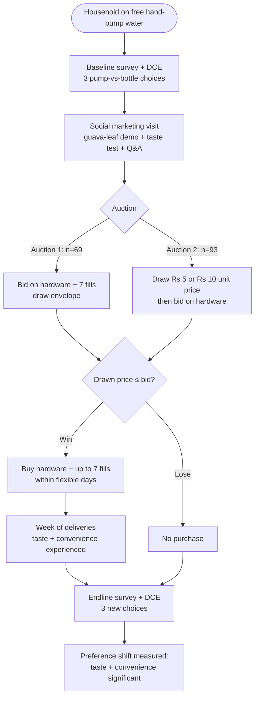

# A2 — PLOS ONE: Willingness to Pay for Potable Water Delivery (Rural Bihar)

**Meta**
- URL: https://journals.plos.org/plosone/article?id=10.1371/journal.pone.0283892
- Date read: 29 Sep 2026
- Access status: PARTIAL (full page fetched via webfetch but output truncated ~67KB; abstract + §§1–2.4 recovered in full, results/discussion via abstract + PMC mirror excerpts + PaniBox report §03-F2/§05-A2; marked below where secondary)
- Authors: Cameron, Ray, Parida, Dow (Yale / UC Berkeley / DCOR Consulting)
- Published: 6 Apr 2023, PLOS ONE 18(4): e0283892. DOI 10.1371/journal.pone.0283892
- Type: Peer-reviewed experimental study (random price auction + discrete choice experiment), n=162 households, Supaul district, rural Bihar
- Evidence grade: High for pricing/behavioural insight in low-income rural setting; NOT directly transferable to urban 20L-jar app pricing without adjustment (see Open questions)

## TL;DR

An NGO (SHRI) sold treated-water home delivery (20L bottles filled from 1000L 3-wheeler tanks; Drinkwell carbon-filtration + UV, seasonal chiller; tested quarterly for iron/fluoride/arsenic + bio contaminants) at **₹10 per 20L delivery** (₹15 summer with chilling; local RO vendors ₹15–20). Hardware (bottle + dispenser) first required a **₹120 refundable deposit**, but theft/damage/loss forced a switch to **outright sale at ₹250 (SHRI wholesale) / ₹275 (market)** — and discontinued customers repurposed bottles for grain storage. Among 162 non-customer households: **mean WTP for the first week of service ≈ 51% of market price and only ~1.7% of median household income (₹9,000/mo)** → untapped demand exists. **Small price subsidies showed mixed effects** on uptake (formal H0/H1/H2 win vs miss-out tests). **One week of participation significantly shifted stated preferences for TASTE (iron-free) and CONVENIENCE (delivery)** — i.e. experience teaches what marketing must sell. Authors frame delivery as a **stopgap, not a substitute for piped municipal water**. Maps to PaniBox **F2 (jar/deposit economics)**.

## Features (the studied product, exhaustive)

- Deep-groundwater → patented Drinkwell system → carbon filtration + UV → seasonal AC chiller → clean chilled potable mineral water
- Quarterly testing: iron, fluoride, arsenic removal + all biological contaminants
- Delivery on 3-wheeled vehicles in 1000L tanks; fills household-owned 20L bottles
- Per-fill price ₹10 (₹71 = USD 1 in 2019); summer up to ₹15 (chiller cost); RO competitors ₹15–20 same neighbourhoods
- Hardware path v1: ₹120 refundable deposit per bottle + dispenser → abandoned (theft/damage/loss rates too high)
- Hardware path v2: mandatory purchase — ₹250 from SHRI wholesale or ₹275 market retail (price widely known)
- Allowance: max 7 fills; winners could take >1/day or spread 7 fills over >7 days (none took >1/day)
- Social-marketing wrapper: 5 local young men (18–25), safe-water demo + taste test + Q&A per household; signature **guava-leaf iron demo** (crushed leaves turn untreated iron-heavy water dark in ~2 min, treated stays clear; replicable at home)
- Auction mechanics (Becker-DeGroot-Marschak style, "game" framing): state max price → draw 1 of 13 sealed envelopes (prices ≤ retail, no zero) → win (drawn ≤ stated → buy at drawn price) or lose; practice round on bar of soap
- Auction 1 (n=69, listed first): bid on COMBINED package (hardware + 7 deliveries)
- Auction 2 (n=93, listed later, NOT randomised — listing-order split, significant baseline differences, controlled in analysis): draw ₹5 (n=59, 63.4%) or ₹10 (n=34) per-delivery price first, then bid on HARDWARE only; winners buy hardware + 7 fills at drawn unit price
- DCE (discrete choice experiment): 6 attributes — price (₹0/3/6/9), taste (iron vs iron-free), convenience (on-demand vs call-for-delivery), safety (may vs will-not cause sickness), temperature (cold vs warm), neighbours (same vs different source); 128 combos → 124 non-dominated vs status-quo pump scenario; 3 random choices at baseline + 3 new at endline per respondent (≈486+ choices/round); visual cards (pump vs bottle) read aloud; "no preference / do not understand" allowed; random-utility logit, household-clustered errors

## How features interact

- `free shallow-well pump (in-plot, zero collection time, 94.2% untreated, iron taste, monsoon contamination) → social marketing (visual purity proof + taste test) → auction (incentive-compatible bid → win/lose draw) → winners buy hardware + 7 fills → week of lived experience → endline DCE (preference shift measured)`
- Subsidy logic under test: `unexpected ₹35 discount (win) → ?hardware WTP shift (H1: a<35 = positive price effect)` vs `missing out → ?hardware WTP shift (H2: b>70 = negative externality)` vs `H0: no effect (bids = package minus delivery cost)`
- Learning loop: `experience of iron-free taste + doorstep convenience → stated preference change → marketing message for next cohort (taste + convenience)`
- Hardware economics loop: `deposit → theft/loss → outright sale → known retail price → repurposing fallback (grain storage) → asset never fully lost to household, always lost to operator`

## User flow (mermaid)

## User requirements

- Water must be visibly/demonstrably cleaner than pump water (iron taste is the lived differentiator; Delaire: dissatisfaction with iron taste drives switching; Brouns: "clean, tasty, simple to use" top-3)
- Convenience must be felt, not described (delivery eliminates hassle/transport burden — strongest for households without reliable transport)
- Price must sit near ½ market for trial (mean WTP 51%) while framing as tiny income share (1.7%) for positioning
- Hardware cost is the adoption gate (deposit OR purchase both friction; purchase price widely known so no pricing opacity tolerated)
- Trust via replicable proof (at-home guava-leaf test) + free taste, not claims
- Belief context: "government should provide safe free water" + abundant free well water anchor → any paid water fights a legitimacy + free-alternative battle
- Low-literacy accommodation: verbal consent, read-aloud visual choice cards, practice auction round

## Vendor / supplier (operator/NGO) requirements

- Asset protection is existential: deposit model failed under theft/damage/loss → forced sale model; bottles need identity/tracking or buffer stock (cf. Rekart 2.5–3 jars/customer buffer, R-C group)
- Water quality system + quarterly testing discipline (Drinkwell + UV + chiller + lab cadence)
- 3-wheeler 1000L logistics reaching road-adjacent clusters (sample deliberately road-reachable — last-mile beyond roads unstudied)
- Social-marketing field team (5 youths) as demand engine, not just delivery crew
- Auction-grade pricing discipline for pilots (BDM envelopes, practice rounds) if running demand studies
- Record-keeping: fills per household (max-7 accounting), hardware sold vs deposited, seasonal price changes (₹10→₹15) communicated

## Pricing / business rules

- Market: ₹10/20L (₹15 summer chilled); RO alternatives ₹15–20
- Hardware: ₹120 deposit (dead) → ₹250 SHRI / ₹275 market sale (live)
- WTP: ~51% of market for first week; ~1.7% of median monthly income (₹9,000)
- Subsidy effects: MIXED — small discounts move some margins, no clean dose-response (do not assume discount → uptake)
- DCE price ladder tested: ₹0/3/6/9 — price sensitivity exists but taste/convenience learning dominates the story
- Seasonal surcharge (chiller) is accepted in market (₹10→₹15) — precedent for cost-passed surge IF pre-communicated (resonates with A1 "surge before booking, never after")
- Market numbers are 2019 Bihar rural; exchange ₹71 = $1 stated in paper

## UX lessons

1. **Market taste + convenience, not health.** The only significant post-experience preference shifts were taste (iron-free) and convenience — health/safety messaging did not move. Shodasha copy hierarchy: taste → doorstep ease → quality proof → health last.
2. **Trial converts; sampling is the funnel.** One week of use changed preferences. Free-taste + first-week trial mechanics beat feature lists.
3. **Visible proof beats claims.** Guava-leaf demo (2-minute colour change, replicable at home) is the trust pattern → Shodasha equivalent: lab report + RO+UV badge + quarterly test date on product/quality screen (with A3 quality-trust line).
4. **Deposit is a business-model risk, not just a UX field.** The deposit→sale forced migration proves asset leakage kills unit economics → Shodasha empty-exchange stepper + ₹150 deposit note + per-customer jar buffer are load-bearing, not cosmetic (F2).
5. **Free alternative anchors everything.** Abundant free well water + "govt should give it free" belief suppress WTP → Shodasha urban positioning differs (municipal supply unreliable, no free well), but onboarding must still answer "why pay?" with taste + reliability + window, never assume demand.
6. **Hardware gate needs explicit UX.** Widely-known ₹275 market price means users arrive with a number; show deposit/purchase math upfront (cf. Bisleri "have empty jars?" pattern) — no surprise at door.
7. **Repurposing insight:** dead-stock bottles became grain storage → exit/re-entry UX should handle dormant assets (return/refill/reactivate), and admin needs dormant-jar states.
8. **Mixed subsidies → design trials, not blanket discounts.** Test win-vs-miss-out framing; measure hardware-WTP shift before scaling promo pricing.

## Shodasha implication

- **User app:** onboarding answers "why pay" with taste + window + proof (lab-test/RO+UV line); trial/first-week nudge mechanics; hardware/deposit math shown at booking (empty-exchange stepper + ₹150/jar note); no doorstep surprises (cap-missing-type fees stated upfront); pause/resume for absence (links to F5/A5).
- **Vendor app:** per-stop empties in/out logging (the asset-protection lesson); cash collected per stop; seasonal/surge price shown pre-booking only.
- **Admin (Next.js):** jar-asset ledger (issued/returned/dormant/lost), deposit liability tracker, WTP-informed pricing experiments (trial vs subsidy cohorts), quality-proof CMS (test dates, reports), delivery-performance vs preference data.

## Open questions / unverified claims

- Results/discussion sections only partially fetched (truncated webfetch) — effect sizes, confidence intervals, and safety/neighbour/temperature attribute outcomes taken from abstract + mirror excerpts; full-text verification recommended before quoting numbers beyond "51% / 1.7% / mixed subsidies / taste+convenience shift."
- Auction 1 vs 2 split was listing-order, NOT randomised (authors control with covariates; direction of residual bias unknown).
- Rural Bihar 2019 (free pump, ₹9k median income, road-adjacent sample, poorer than rural-Bihar average per authors) ≠ urban Shodasha market — WTP levels do NOT transfer; only mechanisms (trial→taste/convenience learning, deposit failure, proof beats claims) transfer.
- Market prices (₹10/15/250/275) are source claims, independently unaudited per project rule (00-source-index note 1); verify via local survey before locking Shodasha ₹28/30.
