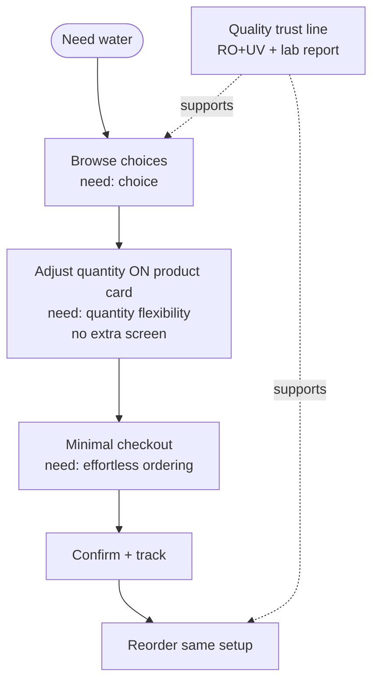

# A3 — Medium: Designing a Seamless Water Delivery App (UX Journey)

**Meta**
- URL: https://medium.com/@nanishanmugam3/designing-a-seamless-water-delivery-app
- Date read: 29 Sep 2026 (access attempts)
- Access status: BLOCKED — page returns Medium 404 ("PAGE NOT FOUND") on both markdown and text webfetch; web.archive.org snapshot fetch also 404; author-handle and title websearches return no matching article (only unrelated water-tracker/UX pieces). Article appears removed, renamed, or access-restricted.
- Fallback sources used (explicitly secondary): PaniBox research report `context/pani-app-research-report.pdf` §05-A3 entry + §04 quality-trust-line row (F3 + A3); task brief's A3 theme cues. NOT the article body.
- Type (per secondary index): Medium UX-journey case study, survey-driven, 3 user needs.
- Evidence grade: Low until primary is recovered — everything below marked [SECONDARY] where it rests on the index rather than the article text. Do NOT quote as primary findings.

## TL;DR [SECONDARY — from PaniBox report index]

A survey-driven UX journey study of a water-delivery app that distilled **3 user needs: choice, quantity flexibility, effortless ordering**. Two design rules survived into the PaniBox/Shodasha spec: (1) **quantity selection lives ON the product page** (steppers inline, no extra screen); (2) **cut checkout steps to the minimum**. The report also cites A3 alongside F3 for the **quality trust line** (RO+UV, lab test, report) — quality proof as a reliability signal. PaniBox finding map: §04 design-decision table ("Jar vs Jar+Container cards, steppers" ← user reference image; "Quality trust line" ← F3 + A3); §03 notes A3 has no direct F1–F8 citation except the §04 quality line. Recovery of the primary is an open task.

## Features (reconstructed [SECONDARY] — verify against primary when recovered)

- Product/choice browsing: comparable options visible (choice need)
- Inline quantity flexibility: −/+ steppers on product cards, adjustable without leaving the list (no dedicated quantity screen)
- Effortless ordering: shortened checkout (fewest steps from intent to confirm)
- Quality trust signals: purification claim (RO+UV), lab-test reference, report availability [SECONDARY — via §04 "Quality trust line (RO+UV, lab test, report) F3 + A3"]
- Standard journey scaffolding implied by "UX journey" framing (NOT verified): onboarding → browse → quantity → checkout → tracking → feedback; survey → needs → journey map → wireframes/prototype flow typical of Medium UX pieces

## How features interact (generic pattern [SECONDARY])

- `survey → 3 needs (choice / quantity flexibility / effortless ordering) → design rules: choose on list → adjust quantity inline → checkout with minimal steps`
- `quality proof (RO+UV + lab report) → trust → willingness to reorder (links F3 reliability)`
- Interaction claim is thin by necessity: without the article body, step-level causality (e.g. whether quantity-on-page causally lifted conversion) is UNVERIFIED.

## User flow (mermaid) — generic water-delivery journey pattern, NOT source-verified

> Treat this diagram as the plausible journey consistent with the secondary summary, not as A3's documented flow.

## User requirements [SECONDARY]

- Choice without overwhelm (compare options on one surface)
- Quantity flexibility at decision point (change counts where the price is seen)
- Effortless ordering (every removed checkout step = fewer drop-offs)
- Quality assurance visible pre-purchase (purification + test proof)

## Vendor / supplier requirements

- None evidenced in secondary material. Unverified — likely out of scope for this consumer-UX piece (consistent with A1's warning that household and driver need separate tracks; do not assume A3 covers vendor needs).

## Pricing / business rules

- None evidenced in secondary material. No prices, deposits, or surge rules attributable to A3. Do not cite A3 for pricing.

## UX lessons (careful attribution — group-level cues from the task brief, mapped to true owners)

The task brief lists "reorder=real use case, window beats dot, quantity on product page, OTP signup, calendar pause" as Group A watch-items. Evidence ownership matters:

1. **Quantity on product page (A3's own rule, [SECONDARY]).** Steppers inline on the 20L Refill / Jar+Container cards; no extra quantity screen. → Shodasha reference image already implements this (Rs 28 / Rs 30 cards with −/+). Keep; A/B test stepper defaults (project default: 2 jars).
2. **Reorder = real use case → owned by A1 (primary), not A3.** Do not cite A3 for this.
3. **Window beats dot → owned by A1 (primary), not A3.** Do not cite A3 for this.
4. **OTP signup → owned by A5 (primary), not A3.** Do not cite A3 for this.
5. **Calendar pause → owned by A5 (primary), not A3.** Do not cite A3 for this.
6. **Quality trust line (A3 co-cited with F3, [SECONDARY]).** RO+UV + lab-test + report as reliability signal → Shodasha quality strip on home/product (purification stages, last test date, report link). Verify wording against primary when recovered.
7. **Fewer checkout steps (A3, [SECONDARY]).** Checkout-step budget: address → window → payment on one sheet where possible; measure drop-off per step.

## Shodasha implication

- **User app (Flutter Android):** keep inline steppers on both SKU cards (already in scope); enforce minimal checkout (single booking sheet: quantity → empties → address/GPS → window → UPI/COD chips → confirm); add quality trust line (RO+UV, lab test date, report link) near product cards. No new surfaces from A3.
- **Vendor app:** no A3-derived requirements (unverified; do not invent).
- **Admin (Next.js):** quality-proof CMS slot (test dates, report uploads) — joint F3+A3 rationale; checkout-funnel analytics to verify the fewer-steps claim locally.

## Open questions / unverified claims

- PRIMARY RECOVERY PENDING: full article body (survey sample? methods? screens? metrics?) entirely unverified. Retry via logged-in browser (browseros-neo direct read per ADR-005), Google cache, or author contact before citing A3 as evidence for anything beyond the two secondary rules.
- The "3 user needs" (choice, quantity flexibility, effortless ordering) are index paraphrases — exact wording, survey n, and question design unknown.
- Quality-trust-line attribution (RO+UV/lab/report) needs primary confirmation — currently rests on one §04 table row.
- Checkout-step count recommendation (if any numeric claim existed) unknown — do not quote a number.
- Until recovery: cite quantity-on-page and quality-line as "A3 via PaniBox secondary index, primary pending" in any downstream synthesis.
