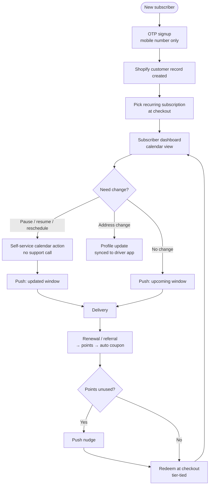

# A5 — Intelegencia: Digital Transformation for a D2C Water Brand

**Meta**
- URL: https://intelegencia.com/case-studies/engineering/digital-transformation-for-a-d2c-water-brand
- Date read: 29 Sep 2026
- Access status: OK (full page fetched via webfetch, markdown)
- Author: Intelegencia (engineering services vendor, case-study marketing page)
- Type: Vendor case study — Indian D2C subscription premium mineral water brand (unnamed; "competitive market" anonymity). Custom Shopify + native iOS (Swift) + native Android (Kotlin).
- Evidence grade: Medium for feature/solution inventory (concrete shipped list); Low for outcomes (quantitative metrics explicitly withheld; success = launch + 100% migration + workflow automation). Read as solution catalogue + transformation narrative, not measured impact study.

## TL;DR

An Indian D2C subscription mineral-water brand (7-step purification, eco-friendly BPA-free containers, automated route network) ran **entirely offline**: phone orders, paper delivery sheets, cash collection, 15-minute phone onboarding with heavy drop-offs, paper route planning with peak delays, manual bank-receipt verification, no customer-preference/purchase/subscription repository, no loyalty machinery. Intelegencia shipped: (1) **customised Shopify storefront** (scripts, recurring subscriptions at checkout) + **native iOS + Android apps**; (2) **mobile dashboard with calendar control** — subscribers pause/resume/reschedule themselves, push notifications carry delivery windows, no support call; (3) **dual OTP auth** (mobile OTP API + email/password fallback) tied to Shopify customer DB — onboarding from 15-minute call to a few taps; (4) **rewards + coupon engine** (points for renewals/referrals, auto coupons, tier-tied, push nudges for unused points); (5) **admin visibility** (real-time subscription/delivery data). Claimed outcomes: apps launched, **100% subscriber migration** to digital, tracking automated; numbers withheld. Next phase: automated route optimisation (driver coordinates + traffic + locations). Maps to PaniBox **F5 (pause/subscription core)**.

## Features (exhaustive)

### Storefront + apps
- Customised Shopify storefront (tailored scripts; recurring subscription plans at checkout)
- Native iOS app (Swift) + native Android app (Kotlin) — alongside web store
- Mobile subscriber dashboard: calendar-based delivery management (pause / resume / reschedule by subscriber)
- Push notifications: upcoming delivery windows, alerts (replaces status calls)
- Profile settings: delivery-address update, synced to driver application
- Payment gateway integration incl. card-on-file billing (audit: lack of it caused transaction delays)

### Auth engine (dual OTP)
- Third-party OTP API integration: sign up / log in with mobile number only
- Secure email + password fallback path
- Auth layer connected directly to Shopify customer database
- Claimed effect: onboarding verification from multi-minute phone process → a few taps

### Retention (rewards + coupons)
- Points database integrated with Shopify: automatic points for subscription renewals + referrals
- Automatic coupon-code generation rules from points; redeemable at checkout
- Rewards tied to active subscription tiers (longer commitment incentive)
- Push reminders for unused points (rewards as active retention tool, not passive balance)

### Admin / ops visibility
- Real-time logs: subscriptions, delivery performance, inventory visibility (audit found its absence obscured tracking)
- Migration of all orders/routes/payments off manual tracking (claimed 100%)

### Roadmap (next phase, NOT shipped)
- Delivery-logistics app: automated route optimisation from driver coordinates + traffic patterns + delivery locations → fuel/time savings

## How features interact

- `phone onboarding (15 min, drop-offs) → dual OTP + Shopify customer DB → few-tap signup → recurring-subscription checkout → subscriber record`
- `subscriber record → calendar dashboard (pause/resume/reschedule) → push window alerts → no support call → fewer admin interventions`
- `renewal / referral events → points engine → auto coupons → tier-tied redemption at checkout → push nudge on unused points → retention loop`
- `address change in profile → sync to driver app → fewer delivery errors`
- `card-on-file + gateway → faster subscription billing vs manual receipt verification`
- `real-time admin logs → subscription growth + delivery performance visibility → (future) route optimisation inputs`
- The core loop the case study sells: **self-service calendar + push windows + tiered rewards = support overhead down, retention up, acquisition friction down.**

## User flow (mermaid)

## User requirements

- Never call to change a schedule: pause/resume/reschedule must be self-service calendar actions
- Signup in taps, not a 15-minute phone call (OTP-first; password fallback exists but is not the path)
- Know the delivery window without calling (push-carried windows)
- Update address in-app with confidence it reaches the driver
- Loyalty must come to the user (points reminders), not sit as a hidden balance
- Subscription tiers should reward longer commitment visibly at checkout

## Vendor / supplier requirements

- Driver application exists as sync target for address changes (profile → driver app sync stated; driver-side UX otherwise undescribed — the logistics app is the NEXT phase, not shipped)
- Route planning pain (paper, peak delays) acknowledged in audit but NOT solved in shipped scope — route optimisation is roadmap
- Real-time delivery/inventory logs replace manual sheets and per-stop paper verification
- Gateway-verified billing replaces manual bank-receipt checks

## Pricing / business rules

- Recurring subscription plans at Shopify checkout (plan/interval mechanics undescribed)
- Subscription tiers modulate rewards (longer commitment → better redemption)
- Coupon generation rules from points (exact earn/burn ratios undisclosed)
- Card-on-file billing for subscription collection
- Anti-abuse and billing FAQs exist as questions but ANSWERS ARE MISSING on the fetched page ("How does the rewards engine prevent coupon abuse?", "How does the subscription billing work?", "What technology is used?" listed; bodies not returned) — do not assume fraud controls
- Brand, prices, subscriber counts, retention deltas: all withheld ("competitive nature")

## UX lessons (esp. for Shodasha)

1. **OTP signup is the onboarding fix.** 15-min phone setup → few taps is the single biggest acquisition lever in the study. → Shodasha: mobile-OTP-first auth (Firebase/custom OTP API), password/email fallback, quote visible pre-auth (with A1's no-wall rule).
2. **Calendar pause/resume is the support-cost fix.** The feature that lets subscribers "pause schedules… without calling support representatives" directly cuts admin overhead. → Shodasha: one-tap pause/resume link under BOOK NOW + auto-resume on return date (with Pure Pani F5 corroboration from Group B).
3. **Push windows replace status calls.** Delivery-window pushes are positioned as the call-centre killer. → Shodasha: window + rider-name pushes; keep WhatsApp as parallel channel (F6), not either/or.
4. **Rewards must be active, tier-tied, and nudged.** Passive balances don't retain; auto coupons + tier linkage + unused-point pushes do (claimed). → Shodasha v2 (NOT MVP): points for renewals/referrals, tier-tied coupons, nudge cadence. MVP stays rewards-free per report recommendation.
5. **100% migration is possible** (claimed) when the digital path is strictly easier than the phone path — migration completeness is a launch KPI to copy.
6. **Address-sync to driver app is a first-class feature**, not a profile afterthought — delivery-error reduction lives here.
7. **Inventory/route honesty:** the audit names paper route planning and blind inventory as the delay/error source, but shipped scope did NOT fix routing — Shodasha vendor/admin roadmap must explicitly schedule route optimisation (don't claim A5 solved it).

## Shodasha implication

- **User app (Flutter Android):** OTP-first signup (fallback path included); subscription/calendar dashboard with pause/resume/reschedule + auto-resume date; push window alerts; address edit with driver-sync confirmation; tiered rewards ONLY in v2 (MVP excludes per report §01 recommendation). (F5)
- **Vendor app (Flutter Android):** address-change sync endpoint from user profiles; per-stop logging to replace paper sheets (coordinate with B-group Rekart/PurePani/EPIXS patterns); route optimisation explicitly roadmap, not MVP.
- **Admin (Next.js web):** real-time subscription + delivery + inventory visibility (the "consolidated repository of preferences, histories, subscription patterns" the client lacked); coupon/points rules engine in v2 with anti-abuse controls (currently unspecified — design task); migration-rate dashboard (track % moved off phone/WhatsApp ordering).

## Open questions / unverified claims

- Brand unnamed; ALL quantitative outcomes withheld — treat "faster onboarding / fewer errors / better retention" as directional claims, not facts.
- 100% migration claim: denominator and timeframe undisclosed.
- Coupon anti-abuse, billing mechanics, and mobile tech-stack FAQ answers not present on fetched page — noted as missing, not as confirmed features.
- No vendor/driver-app UX detail (screens, flows) — only sync target + roadmap mention.
- No pricing, tier, or earn/burn numbers — Shodasha rewards v2 needs independent design (see synthesis).
- Vendor-authorship bias: case-study marketing page; assume favourable framing.
