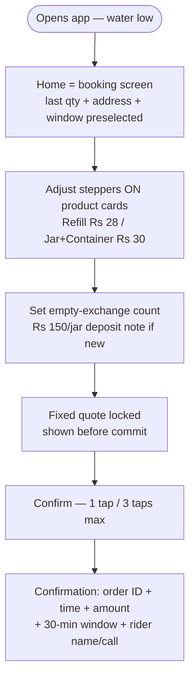
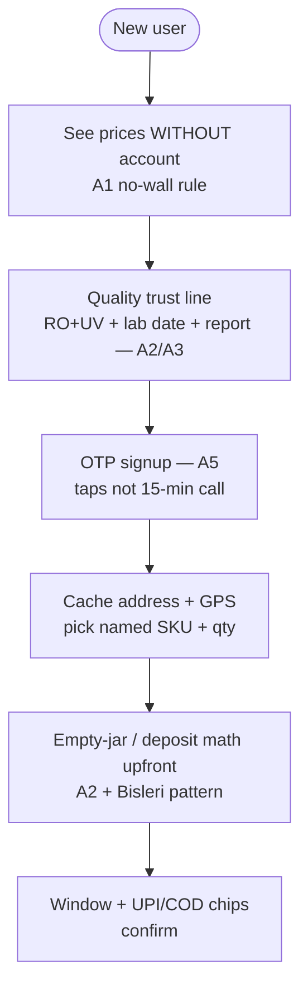
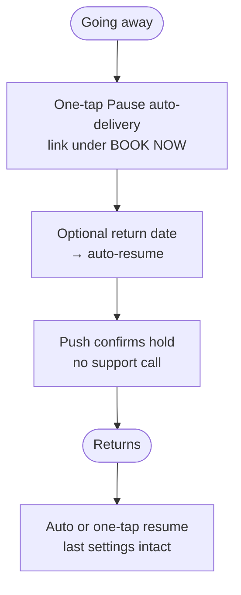
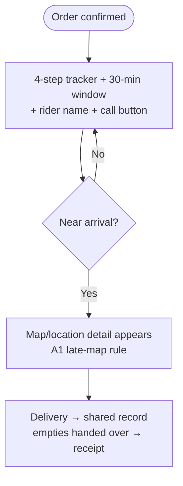
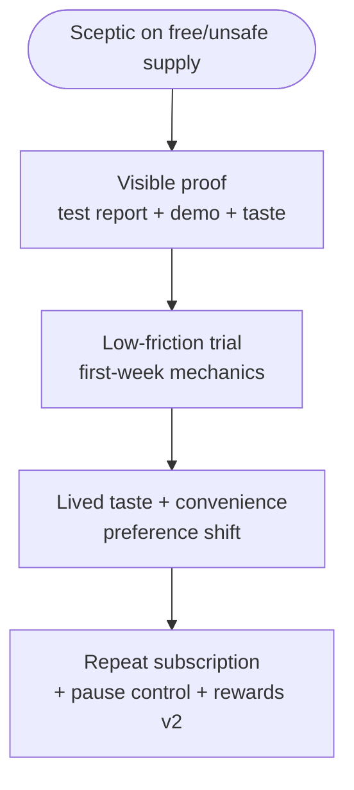

# Group A Summary — UX Case Studies (A1, A2, A3, A5)

**Meta**
- Date compiled: 29 Sep 2026
- Sources: A1 (OK, full), A2 (PARTIAL + mirrors), A3 (BLOCKED, secondary index only), A5 (OK, full)
- Detail files: `A1-aquahaulers.md`, `A2-plos-bihar.md`, `A3-medium-ux-journey.md`, `A5-intelegencia-d2c.md`
- Shodasha scope anchor: `context/project-overview.md` (20L Refill Rs 28 / Jar+Container Rs 30, repeat-order home, Rs 150 exchange deposit, 30-min window not live dot, pause, WhatsApp, UPI+COD, 3 surfaces)
- PaniBox finding anchors: F1 (repeat order), F2 (jar exchange/deposit), F3 (reliability), F4 (window beats dot), F5 (pause/subscription)

## Comparison table

| # | Source | Type / grade | What product does | Signature features | Pricing / business rules | Trust signals | Maps to | Shodasha reliability |
|---|--------|--------------|-------------------|--------------------|--------------------------|---------------|---------|----------------------|
| A1 | Aquahaulers (designwithsampath) | Designer case study, 2023, 7 wks, handoff-only; HIGH for reasoning, ZERO production metrics | Two-sided tanker marketplace: households book fixed-price verified tankers; drivers get proximity jobs without calls | 3-tap reorder; named sizes; quote-before-commit; binding slot price; surge-pre-only; reassign-at-price; window-not-dot; map-near-arrival-only; symmetric accept/decline + timeout; sunlight-legible driver UI; shared order record; operator console scoped OUT | Quote=f(address,size); binding per slot; never reprice; +40% capacity = modelled target, not result | Fixed price as fact; confirmation record; verification signal; dispute-settling shared record | F1, F3, F4 | Highest UX authority in group; mechanics transfer, tanker↔jar economics do not |
| A2 | PLOS ONE Bihar (Cameron et al. 2023) | Peer-reviewed experiment, n=162, Supaul Bihar; HIGH for behaviour, RURAL-2019 context | NGO treated-water home delivery (Drinkwell + UV + chiller, 3-wheeler 1000L tanks, 20L fills) + demand study (auction + DCE) | Guava-leaf iron demo + taste test; BDM auction (13 envelopes, soap practice); combined vs hardware-only auctions; 6-attribute DCE (price/taste/convenience/safety/temp/neighbours); max-7-fills flexible week | ₹10/20L (₹15 summer), RO ₹15–20; ₹120 deposit→DEAD→₹250/275 sale; WTP≈51% market, 1.7% income; subsidies MIXED | Replicable purity proof; quarterly lab testing; free taste; known hardware price | F2 | Only causal evidence in group; transfer mechanisms not price levels |
| A3 | Medium UX journey (@nanishanmugam3) | Medium UX piece, survey-driven; LOW until primary recovered (404 + no archive + no search hit) | Water-delivery app UX journey: 3 needs (choice, quantity flexibility, effortless ordering) | Quantity steppers ON product page (no extra screen); minimal checkout steps; quality trust line (RO+UV, lab test, report) [ALL SECONDARY] | None evidenced | Quality proof as reliability signal [SECONDARY] | §04 quality line w/ F3; no direct F1–F8 | Weakest link: cite only as "secondary index, primary pending" |
| A5 | Intelegencia D2C | Vendor case study (unnamed Indian brand); MEDIUM for solution list, LOW for outcomes (numbers withheld) | Shopify + iOS + Android subscription platform replacing fully-offline ops | Recurring Shopify checkout; dual OTP (mobile API + password fallback) → Shopify DB; calendar pause/resume/reschedule; push windows; tier-tied rewards + auto coupons + unused-point nudges; address→driver sync; real-time admin logs | Subscription tiers; card-on-file; coupon rules (ratios undisclosed); anti-abuse/billing answers MISSING | Migration completeness (100% claimed); push transparency; tier rewards | F5 | Strongest shipped-system reference; roadmap (route optimisation) explicitly NOT done |

## Consolidated user flows

### F-A1: Repeat order (the primary path — A1 + A5 + A3-secondary)

### F-A2: First order (the rare path — A1 + A2 + A5)

### F-A3: Pause / resume (F5 — A5 primary, B-group corroboration noted)

### F-A4: Tracking (F4 — A1; A5 pushes; A2 none)

### F-A5: Trial → trust (A2 mechanism, Shodasha acquisition)

## Top 8 UX rules for the Shodasha user app

1. **Home is the repeat machine.** Booking screen, not dashboard; last settings preselected; reorder in ≤3 taps / <30s design target (A1; instrument, don't assert).
2. **Quote lock before commit; never reprice after.** Fixed price shown pre-confirm; surge/cost changes pre-booking only with re-quote (A1; A2 summer-surcharge precedent).
3. **Window, not dot.** 30-min arrival window + rider name/call + 4-step tracker; map only near arrival or never in MVP (A1 F4).
4. **Quantity on the product card.** Inline −/+ steppers on both SKU cards; no separate quantity screen; minimal single-sheet checkout (A3-secondary + reference image).
5. **Deposit math at booking, not at the door.** Empty-exchange stepper + ₹150/jar note + fee schedule (cap-missing-type) upfront; asset logic is P&L-critical (A2 + F2; Bisleri pattern from E-group).
6. **OTP-first auth, price-visible pre-auth.** Taps-not-calls signup tied to customer record; never wall the quote behind registration (A5 + A1).
7. **One-tap pause with auto-resume.** Calendar hold under BOOK NOW; push-confirmed; support-call avoidance is the KPI (A5 F5).
8. **Proof beats promises, taste/convenience beat health claims.** Quality strip (RO+UV, last test date, report link) + trial mechanics; copy hierarchy taste → ease → proof → health (A2 + A3-secondary + F3).

## Cross-surface notes (vendor app vs admin)

- **Vendor app:** current-stop-or-next-alert home; symmetric accept/decline + timeout reassign; per-stop facts (address, jars in/out, cash); sunlight-legible big targets; GPS active-job only with record visible to rider (A1); empties/cash logging replaces paper (A5 audit + A2 asset lesson). Android-only justified by device reality.
- **Admin (Next.js):** the console A1 scoped out, Shodasha must build: unassigned-orders view, rider positions, reassign-at-price tool, dispute record viewer; jar-asset ledger + deposit liability (A2); subscription/delivery/inventory real-time visibility + migration-rate dashboard (A5); quality-proof CMS (A2/A3); coupon/points engine with explicit anti-abuse design in v2 (A5 gap).

## Unverified claims inventory (do not cite as fact)

- A1: 40% capacity lift (modelled), <30s reorder (target), window believability, cab legibility — all untested by author's own statement.
- A2: results/discussion effect sizes beyond abstract (partial fetch); 2019 rural prices as current/urban guidance.
- A3: EVERYTHING primary (article unrecovered; two rules rest on secondary index).
- A5: all efficiency/retention deltas; 100% migration denominator; coupon/billing mechanics; route optimisation (roadmap, not shipped); vendor-authorship bias throughout.
