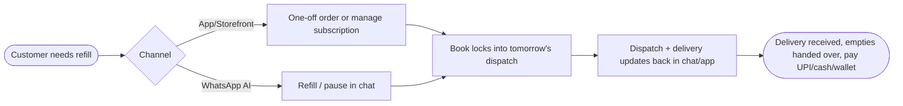
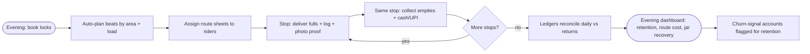

# B1 — Rekart Water Delivery Software (Jar / Refill / Deposit Platform)

## Meta

| Field | Value |
|-------|-------|
| Source | Rekart — Water delivery software for jars, refills and deposits |
| URL | https://rekart.io/in/water-delivery-software (supplement: https://rekart.io/water-delivery-software via search) |
| Group | B (jar/deposit/route/subscription software) |
| Maps to findings | F5, F6 (per `Feature_docs/00-source-index.md`) |
| Read date | 2026-09-29 |
| Method | `webfetch` full-page + `websearch` supplement (browseros-neo actions not exposed in this env; skill loaded, fallback used) |
| Status | Done |

## TL;DR

Rekart is the **enterprise end** of Group B: a water-first SaaS platform covering six modules — Commerce (white-label app + storefront), Agentic Commerce (WhatsApp AI agent), Subscriptions, Delivery Engine, Customer 360, Marketing. Its pitch is framed as **five weekly revenue leaks** (jars never returned, unreconciled deposits, late refills, unpredictable demand, doorstep cash) turned into **one daily routine**: tonight's book locks → routes self-plan → riders deliver + prove → money reconciles live → evening insights. No public self-serve pricing; ~7-day assisted migration; English-led; best fit claimed at 50–1000+ customers.

## Features (exhaustive)

### 1. Commerce
- White-label customer app + web storefront on a single catalog.
- Sells 20L jars, dispensers (returnable assets) and one-off orders together.
- (Global page) Three core modules: Business Dashboard + Customer App + Driver App; scales 50 → 5,000 bottles/day.

### 2. Agentic Commerce (WhatsApp AI agent)
- Customers request a **refill or pause supply inside WhatsApp chat**.
- Dispatch and delivery updates pushed back in the same chat.
- Positioned as handling most routine requests with no office call.

### 3. Subscriptions (standing orders)
- Refill schedules + standing orders with **pauses, quantity changes, holiday skips**.
- Recurring plans: daily / weekly / monthly (global page); one-time orders on same platform.
- Customer self-serve: pause, change can quantity, add products, pay — 24×7 via app/storefront/WhatsApp.

### 4. Delivery Engine
- Auto-planned optimised beats per rider from the day's order book (area + can-load balanced).
- **Routes re-sequence** when riders change or orders move.
- Rider app carries exact stop order with **photo proof of delivery** and **empty jars to collect** at the same stop.
- Zone-wise delivery windows native.

### 5. Customer 360 (per-customer ledger)
- One searchable record per household/office: **plan, balance, jar deposits, delivery history, complaints/tickets, refill history**.
- **Churn signals** surface before an account stops ordering; retention worked from one screen.
- Jar count + deposit balance tracked per customer; ledger reconciled **daily against returns**.

### 6. Marketing / growth
- Campaigns, referrals, coupons to grow refills and win back lapsed accounts.
- (Rekart Grow) Meta/Google ads, WhatsApp marketing, SEO, content, analytics — separate growth arm.

### 7. Billing & collections (from FAQ)
- Automated invoicing + digital collection across **UPI, cash, wallet**.
- Tracks **jar + dispenser deposits and advances per customer**.
- **Tax-ready statements** auto-generated.
- Refill payments and deposits post to each customer ledger **as taken** (live reconciliation).

### 8. Onboarding & proof points
- Go-live in **~7 days**, assisted migration: import customers, subscriptions, balances, jar deposits, routes → parallel run → cutover, "no lost history".
- Claims: **98.7% refill SLA met on time**; named supplier logos (DropWell, Aquely, AlkaBalance).
- Free trial exists on global page ("sign up for a free trial"); India page pushes Book-a-demo.

## Interactions — how the pieces connect

Rekart's own "day in operations" chain (order → assign → deliver → collect empty → cash → ledger → billing):

1. **Orders** — refill requests + standing orders from app + WhatsApp roll into tomorrow's dispatch; "tonight's book locks itself."
2. **Planning** — stops sequenced by area/load; full jars out + empties back in one trip.
3. **Delivery** — rider logs jars delivered + empties picked up **with proof at every stop**.
4. **Collections** — refill payments + deposits post to each customer ledger live (UPI/cash/wallet).
5. **Insights** — retention, route cost, jar recovery visible **by evening**, not month-end.

The five-leaks framing maps 1:1 onto Shodasha risks: jar asset loss → per-customer count; deposit disputes → reconciled deposit record; late refills → refill SLA + windows; unpredictable demand → locked dispatch book; doorstep cash chaos → ledger-tied collection.

## User flow (customer side)

## Vendor flow (supplier / rider side)

## Requirements

### Vendor (supplier) requirements evidenced
- V-B1-01: Per-customer **jar count + deposit balance** on one searchable record.
- V-B1-02: **Daily ledger reconciliation** against jar returns (not month-end).
- V-B1-03: Auto-planned, re-sequenceable **route beats** by area + load.
- V-B1-04: Rider proof-of-delivery (photo) + empties-collected captured **per stop**.
- V-B1-05: Live posting of UPI/cash/wallet collections to customer ledgers.
- V-B1-06: Churn-signal surfacing per account; retention from one screen.
- V-B1-07: Assisted migration of customers/subscriptions/balances/deposits/routes with parallel run.

### User (customer) requirements evidenced
- U-B1-01: Self-serve **pause / quantity change / add products / pay**, 24×7.
- U-B1-02: Refill-or-pause **inside WhatsApp chat** (no app install needed).
- U-B1-03: Dispatch + delivery updates pushed to chat/app.
- U-B1-04: Zone-wise delivery windows as part of the plan.

## Pricing
- **No public price** on India page (Book-a-demo / quote-led). Competitor comparison (PaniHisab `/compare`, itself a rival source) characterises Rekart as "Custom/Higher, ~₹1,500+/month" — **unverified, treat as rival claim**.
- Cost signals: 7-day assisted migration included; white-label apps included; growth/marketing arm (Rekart Grow) is a separate upsell surface.

## UX notes
- Pitch is owner-centric (revenue leaks, evening insights), not delivery-boy-centric; rider app presented as proof-capture tool.
- White-label apps: supplier keeps its brand; end-customer never sees "Rekart".
- Per PaniHisab's comparison table, Rekart UI is **English-only** — **unverified** (not stated on Rekart's own page; needs primary check).

## Shodasha implication (split by surface)

| Surface | Take from Rekart | Adapt / reject |
|---------|------------------|----------------|
| User app (Flutter) | Self-serve pause/qty-change/pay; WhatsApp refill-or-pause path; delivery updates in chat | Skip AI-agent chatbot for v1; Shodasha uses arrival **window** (no live dot) per scope |
| Vendor app (Flutter) | Per-stop fulls + empties + proof; route sheet order carried in-app; cash/UPI logged at stop | Photo proof → v2 (keep 1-tap speed first); resequencing → admin-side for v1 |
| Admin (Next.js) | Customer-360 record (plan, balance, deposits, history, tickets); daily reconciliation vs returns; evening route-cost + jar-recovery view; churn signals | Rebuild light: Shodasha scale is one plant, not multi-zone; tax-ready statements → v2 |

## Unverified / needs primary research
- [ ] Actual Rekart pricing and per-user/app fees (no public price; ₹1,500+ figure is a rival's claim).
- [ ] English-only UI (rival claim; Rekart page silent).
- [ ] 98.7% refill-SLA figure (vendor marketing claim, unaudited).
- [ ] Razorpay integration + API access (rival comparison claims; not on Rekart page fetched).
- [ ] Whether deposit tracking supports per-jar rates, advances, and partial refunds (page says "deposits and advances" but no field-level detail).
