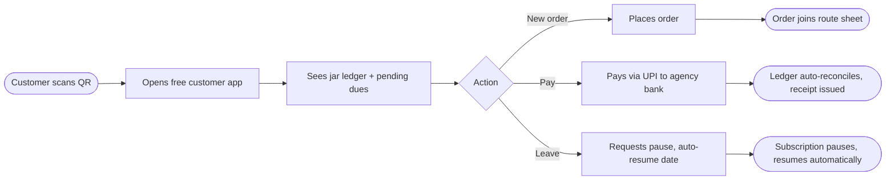
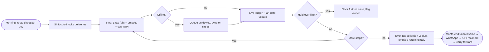

# B2 — Pure Pani Water Delivery Business App (+ RO Water Supplier App)

## Meta

| Field | Value |
|-------|-------|
| Source | Pure Pani — homepage + RO Water Supplier App sub-page |
| URLs | https://purepani.in + https://purepani.in/ro_water_supplier_app |
| Group | B (jar/deposit/route/subscription software) |
| Maps to findings | F5, F6, F7 (per `Feature_docs/00-source-index.md`) |
| Read date | 2026-09-29 |
| Method | `webfetch` full-page both URLs (browseros-neo actions not exposed in this env; skill loaded, fallback used) |
| Status | Done |

## TL;DR

Pure Pani is the closest operational twin to Shodasha: an **Android-first, Hindi-first** jar-water business app pitched against the paper register, with an explicit leakage figure (₹18,000–₹70,000/month lost unseen). Covers the full loop — 1-tap/bulk delivery entry, auto GST invoices on **WhatsApp**, free **customer app via QR** (ledger + order + UPI pay), subscriptions with **pause/resume**, **filled/empty/with-customer** jar states with hold-limit blocking, UPI/PhonePe/Paytm/Razorpay/cash with money landing in the **agency's own bank**, staff logins + payroll, 30+ reports + P&L, **8 languages**, **offline-friendly** delivery entry, multi-branch. Pricing is **per-customer** (₹1/customer/month yearly, ₹1.20 monthly; free to 25 customers). 10k+ Play Store downloads, 4.7 rating. RO sub-page adds route-wise planning, multi-shift cutoffs, corporate/apartment consolidated billing, and plant low-stock alerts.

## Features (exhaustive)

### 1. Daily deliveries
- **One tap per jar**; **bulk mode** logs a whole apartment/building on one screen.
- Morning / afternoon / **evening shifts** (multi-shift); every filled + empty jar stamped with who/when/where.
- Route screen shows live progress (e.g. 18/24 stops), per-stop quantity due, empties-returning counter (34/46), cash-to-collect total.

### 2. Auto invoicing + WhatsApp
- **GST-ready invoices auto-generate**; sent to every customer on **WhatsApp** on a chosen date, signed with agency logo.
- Bulk invoice generation; per-customer product rates; monthly P&L dashboard; 30+ built-in reports.

### 3. Customer app + QR (user self-serve)
- **Every customer gets a QR code** → free customer app showing **jar ledger, order placement, pending dues, UPI payment** (money lands in agency bank, not Pure Pani's).
- Customer logins on web too (`/agency_customers/sign_in`); business logins separate (`/users/sign_in`).
- Pause requests can originate from the customer app (RO page FAQ).

### 4. Subscriptions + pause
- Daily / weekly / **custom** schedules (RO page shows MON 2 / WED 2 / FRI pause / SAT 3 pattern).
- **One-tap pause for leave with auto-resume on return date**; weekend stops, holiday pauses, one-time orders coexist on one screen.
- Corporate **event bookings** (one-off bulk) as a separate flow.

### 5. Stock & returnables (jar ledger)
- Three-state tracking: **filled at plant / empty / with-customer** — "know your jar count in real time".
- **Hold-limit blocking**: block customers holding more than the set limit; over-limit **alerts** (RO page).
- Returnable flag per product; jars in transit vs with-customer distinguished (RO FAQ).

### 6. Payments
- Cash, **UPI, PhonePe, Paytm, Razorpay**, GPay, wallet.
- **Auto-reconciled, auto-receipted**; "UPI payments reconcile themselves"; due list one tap away; **per-customer due alerts**; auto WhatsApp payment reminders; real-time ledger per customer.
- Money lands in agency's bank — zero custody by vendor.

### 7. Staff & payroll
- Separate logins for **delivery boys + managers**; group/route assignment; role permissions.
- Delivery tracking per staffer; **advances + expenses**, monthly salary auto-calculation; expense categories + approvals.

### 8. Routes, groups, schedules
- Customers grouped by **route** (Sector 12, MG Road); "plan a day's route in 10 seconds"; assign to delivery boy; watch progress real time.
- Customer groups & routes; delivery schedules per customer; **multi-shift** each with own cutoff + delivery sheet.

### 9. Corporate & apartment billing (RO page)
- One building → one bulk delivery → **one monthly consolidated invoice** to society treasurer, with **per-apartment tracking preserved**.
- **Per-customer rate override** on top of default product rate (corporate contracts, early-customer rates, large apartments).

### 10. Plant ops (RO page)
- **Low-stock alerts**: reorder levels per product, alert before running out of empty jars.
- Unlimited product types (20L jars + 1L/2L bottles + cartons), each with own rate, **GST**, returnable setting.
- Opening balance + ledger import; discard/restore with audit; online product storefront.

### 11. Language, offline, access
- **8 languages** incl. full Hindi + English; 30-min Hindi staff training; Hindi/English support Mon–Sat 10AM–7PM.
- **Offline-friendly delivery**: mark deliveries offline, auto-sync on signal; no lost entries, no double-counted jars.
- **Multi-branch / franchise** support; white-label customer app (Scale tier); API access (Scale tier).

### 12. Onboarding funnel
- Free demo on **WhatsApp** (phone-number capture), 20-min Hindi/English walkthrough, diary/Excel import done-for-them, 30-min staff training, first-month WhatsApp handholding.

## Interactions — how the pieces connect

Order → assign → deliver → collect empty → cash → jar ledger → billing, Pure Pani style:

1. **Standing orders + one-time orders + customer-app orders** feed the day's route (grouped by route/shift).
2. Route planned per delivery boy in ~10 seconds; delivery sheet pushed to his Android login (works offline).
3. Per stop: tap fulls delivered + empties returned (stamped who/when/where) + cash/UPI collected → jar states + customer ledger update live (or on sync).
4. Over-limit holds block further issue; low plant stock alerts reorder.
5. Month-end: invoices auto-generate (per-customer rates + advances aware) → WhatsApp send with logo → UPI pay to agency bank → auto-reconcile → dues carry forward → reminders to laggards; P&L + 30+ reports close the loop.

## User flow (customer side)

## Vendor flow (agency / rider side)

## Requirements

### Vendor (agency) requirements evidenced
- V-B2-01: 1-tap per-jar + **bulk building entry**; multi-shift sheets with cutoffs.
- V-B2-02: Three-state jar inventory (filled / in-transit / with-customer) + **hold-limit block + alert**.
- V-B2-03: Route plan in seconds, assign to boy logins, **real-time progress** (stops done/left, empties returning, cash to collect).
- V-B2-04: **Offline-first** delivery marking with conflict-free sync (no double-count).
- V-B2-05: Per-customer rate cards + corporate consolidated invoicing with per-unit tracking preserved.
- V-B2-06: Staff logins, role permissions, advances/expenses, **payroll auto-calc**.
- V-B2-07: Plant low-stock reorder alerts; unlimited SKUs with rate/GST/returnable flags.
- V-B2-08: Opening-balance + diary/Excel import done-for-you; discard/restore audit.
- V-B2-09: 30+ reports + monthly P&L; expense categories + approvals.

### User (customer) requirements evidenced
- U-B2-01: Free app via **QR scan** — no sales call needed to onboard.
- U-B2-02: Self-view **jar history + pending dues** (kills "kitna baaki hai" calls).
- U-B2-03: Self order + **UPI pay direct to agency** with auto-receipt.
- U-B2-04: Self-requested **pause with auto-resume date**.

## Pricing
- **Free Start ₹0**: up to 25 customers (deliveries, invoices, WhatsApp send, QR app, all languages).
- **Growth ₹1/customer/month billed yearly** (₹1.20 on monthly): 100 → ₹119/mo (₹1,199/yr); 300 → ₹359/mo (₹3,599/yr); 500 → ₹599/mo; 1,000 → ₹1,199/mo. Unlimited staff logins, no per-user fee.
- **Scale Custom**: multi-branch/franchise, white-label customer app, dedicated success manager, custom reports + API.
- GST extra; no setup fee; cancel by one WhatsApp message; monsoon offer at read time: first 3 months 50% off (promo, time-bound).
- Traction claimed: **10k+ downloads, 4.7 Play Store rating** (vendor claim).

## UX notes
- Hindi-first positioning ("पानी का हिसाब, एक ऐप में"); delivery-boy learnability is the design bar (30-min Hindi training).
- Owner dashboard pattern: jars-to-deliver, collect-target, done/left progress, WhatsApp-sent counter, live payment ticker — built for **glanceable morning control**.
- Entire funnel runs on WhatsApp (demo booking, training, support, bills, reminders) — WhatsApp is the OS, the app is the ledger.

## Shodasha implication (split by surface)

| Surface | Take from Pure Pani | Adapt / reject |
|---------|---------------------|----------------|
| User app (Flutter) | QR-onboarded free app; jar ledger + dues visible; UPI pay with auto-receipt; pause-with-resume-date | Shodasha v1 can start QR-less (direct install); keep 2 SKUs (Rs 28/30) vs unlimited |
| Vendor app (Flutter) | 1-tap/stop + bulk building mode; offline queue + sync; per-boy route sheet with progress; hold-limit block | Copy almost as-is; Shodasha deposit rule = Rs 150/jar at booking |
| Admin (Next.js) | Auto GST invoices on WhatsApp; per-customer rates; consolidated society billing; 30+ reports → start with dues/jars/collections; staff payroll → v2 | Per-customer pricing model itself is reference for Shodasha's own admin SaaS thinking, not a feature |

## Unverified / needs primary research
- [ ] ₹18,000–₹70,000/month leakage figure (vendor marketing; unaudited).
- [ ] 10k+ downloads / 4.7 rating (check live Play Store listing).
- [ ] "Unlimited staff free / money never touches vendor" (verify T&Cs + Razorpay settlement path).
- [ ] Offline conflict resolution detail (last-write-wins vs per-stop idempotency keys — not documented).
- [ ] Exact hold-limit mechanics (count vs days) and auto-pause edge cases (pause mid-route day).
- [ ] Per-customer deposit-amount field (deposits implied via "returnables" but no Rs-value field shown on pages fetched).
