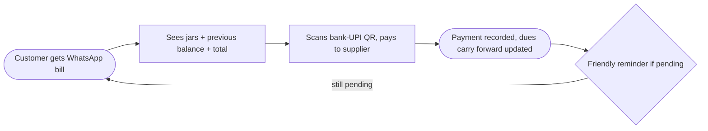
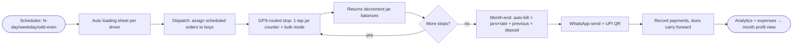

# B3 — PaniHisab Water Delivery Management Software (+ Features)

## Meta

| Field | Value |
|-------|-------|
| Source | PaniHisab — Water Delivery Management Software + Features pages |
| URLs | https://panihisab.in/water-delivery-software + https://panihisab.in/features (supplements: `/pricing`, `/hindi`, `/compare`, `/blog/best-water-jar-tracking-app` via search) |
| Group | B (jar/deposit/route/subscription software) |
| Maps to findings | F6 (per `Feature_docs/00-source-index.md`) |
| Read date | 2026-09-29 |
| Method | `webfetch` full-page both URLs + `websearch` supplements (browseros-neo actions not exposed in this env; skill loaded, fallback used) |
| Status | Done |

## TL;DR

PaniHisab is the **budget simplicity** end of Group B: flat **₹99/month** (≈200 customers), browser-based (no install), Hindi/Gujarati-first, **10 Indian languages**, pitched at 10–300-customer owner-led operations. Its spine is a **five-step cycle** (add customers once → log deliveries daily → track jar returns → auto-generate monthly bills → WhatsApp-share + collect with carry-forward dues). Standouts vs the group: **schedule engine** (Alternate-Day Every-N-Days, weekdays, Odd/Even dates), **Google Maps GPS pin + 1-click driver routing**, **automated loading sheets** per driver, **business expenses tracker** (diesel/salary/repairs/jar purchase), **dealers & wholesale tiers** (custom rates, deposit logs, empty balances), **1-tap 44×44px jar counter** with bulk entry, granular staff permissions + audit, and a worked bill formula ((jars × rate) + previous balance). Zero transaction fees; scannable bank-UPI QR on bills; 15-day trial.

## Features (exhaustive)

### 1. Five-step operating cycle (category page)
1. Add customers once (name, phone, address, **per-jar rate**) → digital ledger.
2. Log deliveries daily on route (delivery boy from own phone) → jar count + running total auto-update.
3. Track jar returns → deduct from outstanding jar count per customer.
4. Month-end auto-bill: **this month's deliveries + previous pending + jar deposit**, zero manual maths.
5. One-tap **WhatsApp share in Hindi/Gujarati** → record payments → **pending carries forward automatically**.

### 2. Daily mobile entry
- 2-second doorstep entry; **bulk entry** for multiple customers at once.
- 3-line header + 3 filter dropdowns; **1-tap 44×44px jar counter** (explicit touch-target spec — rare candour).
- Works in phone browser (Android + iPhone), "easy to use while walking".

### 3. Customer groups & schedules (most advanced schedule engine in Group B)
- Colony groups with **custom color tags**.
- **Alternate-Day (Every N Days)** engine, weekday patterns, **Odd/Even calendar** delivery schedules + Odd/Even route filters.

### 4. Google Maps GPS navigation
- Pin exact customer house on map; **1-click driver GPS routing**; "zero route navigation loss".

### 5. Monthly invoices / billing
- Auto error-free bills incl. previous pending + partial payments; professional **PDF invoice formats**; bill **images** downloadable.
- Worked example on page: 25 jars × ₹30 = ₹750 + previous ₹240 = **₹990** (confirms formula + per-jar-rate model; ₹30 rate matches Shodasha's Jar+Container SKU).

### 6. WhatsApp receipts + UPI
- One-click WhatsApp share, direct chat integration, friendly payment reminders, jars+amount summary in message.
- **Instant/scannable bank-UPI QR payment links** on bills; **zero transaction fee** — 100% lands in supplier's bank.

### 7. Analytics
- Live revenue vs collection, monthly growth curves, customer dues dashboards, daily throughput; sample: revenue ₹45.2k / collected ₹38k / pending ₹7.2k.

### 8. Staff logins & permissions
- Separate driver accounts; **granular toggles** (Daily Entry, Create Customers, Billing & Ledger); driver mobile view; **full action audit logs** (who added what, when).

### 9. Create & dispatch deliveries
- Advance **scheduled order lists** (sample Order #PH-2918: 15 cans, assigned boy) with pending-vs-completed tracking; **WhatsApp order alerts** to clients + confirmation triggers.

### 10. Automated loading sheets
- Per-driver auto-computed requirements (sample: 140 full 20L + 135 expected empties + 5 dispenser stands) — kills morning miscounts.

### 11. Business expenses tracker
- Diesel/fuel logs, driver salaries, repairs, **empty-jar purchases**, office expenses; category-wise monthly breakdown.

### 12. Dealers & wholesale tiers
- Separate dealer list/portal; **custom wholesale price tiers** (sample: ₹18/can); **jar deposit logs**; dealer empty-jar ledgers + transaction statements; outstanding dues per dealer (sample ₹16,500 / 85 empties).

### 13. Deposit tracking (field-level — from blog supplement)
- **Dedicated jar-deposit field per customer**: jars held + deposit amount paid; **alert when a customer holds 5+ jars for 3+ days**.
- Hindi page: a jar is worth **₹200–400** (asset-value anchor for recovery urgency).

### 14. Language, platform, fit
- **10 Indian languages** (English, Hindi, Gujarati, Marathi, Punjabi, Bengali, Tamil, Telugu, Kannada, Malayalam); strong Hindi/Gujarati positioning; Instagram/YouTube/WhatsApp-community support in Hindi.
- Cloud-based, browser + Android/iOS, online backup; delivery-only **or** own-plant businesses; best fit **10–300 customers**.

## Interactions — how the pieces connect

Same five-step spine, PaniHisab accents: **schedule engine decides WHO is due** (N-day/weekday/odd-even) → loading sheet converts due-stops into **truck-load numbers** → driver logs per-stop taps (GPS-routed, permission-scoped, audited) → returns decrement jar balances → billing applies (jars × customer rate) + previous + deposit → WhatsApp bill with UPI QR → payments recorded → dues carry forward → reminders → analytics + expense tracker close the month into **profit view** (revenue − diesel − salary − jars).

## User flow (customer side — via WhatsApp, no app install)

## Vendor flow (supplier / driver side)

## Requirements

### Vendor (supplier) requirements evidenced
- V-B3-01: **Schedule engine**: Every-N-days, weekdays, Odd/Even dates + route filters (strongest in group).
- V-B3-02: **Automated loading sheets** (fulls in, expected empties back, stands) per driver/route.
- V-B3-03: GPS pin per customer + 1-click driver routing.
- V-B3-04: Granular staff permissions + **audit log** of every driver action.
- V-B3-05: Bill formula **(jars × per-customer rate) + previous balance + deposit**, partial-payment aware.
- V-B3-06: WhatsApp bill + **bank-UPI QR**, zero-fee, friendly reminders.
- V-B3-07: Dedicated **deposit field per customer** + **5-jars/3-days hold alert**.
- V-B3-08: Dealer/wholesale tier with custom rates, deposit logs, empty balances, statements.
- V-B3-09: Expense tracking (diesel, salary, repairs, jar purchase) feeding profit view.
- V-B3-10: Advance scheduling + dispatch monitoring + WhatsApp order alerts.

### User (customer) requirements evidenced
- U-B3-01: Bills + reminders **in Hindi/Gujarati on WhatsApp** — no app install needed.
- U-B3-02: Bill shows jars, rate math, previous balance, final amount (transparent arithmetic).
- U-B3-03: Pay by scanning supplier's own UPI QR (trust: money path visible).

## Pricing
- **Basic ₹99/month** (~200 customers): delivery entry, billing, WhatsApp bills, jar tracking, all languages.
- **Pro ₹199/month** (~400): + multiple zones, multiple delivery staff, advance tracking. (Pricing-page supplement: tier ladder continues Growth/Pro/Max up toward ~600 customers / ~₹499; 15-day free trial, no card.)
- Positioning claim vs enterprise ERPs (Trakop/Rekart ~₹1,250+/month, "10–12× more") — **rival claim, unverified**.
- Zero transaction/processing fees (own-bank UPI settlement).

## UX notes
- "Everything in 1–2 clicks" as an explicit design contract; named **44×44px** tap target (accessibility-grade detail none of the others publish).
- Browser-first (no install) lowers driver adoption friction vs native-app mandates.
- Hindi everyone's-language strategy: UI + bills + reminders + support + community all in Hindi/Gujarati first, English second.
- Trust-through-arithmetic: showing the worked bill (25×30+240=990) teaches the formula while selling it.

## Shodasha implication (split by surface)

| Surface | Take from PaniHisab | Adapt / reject |
|---------|---------------------|----------------|
| User app (Flutter) | Transparent bill arithmetic (jars × rate + previous + deposit); Hindi/Gujarati bills + reminders | WhatsApp-only customer side is a valid v1 (skip customer login); UPI-QR-on-bill pattern |
| Vendor app (Flutter) | 1-tap counter + bulk mode; GPS-routed stops; permission-scoped driver view | Copy entry UX incl. 44px target; loading-sheet numbers → show "take X fulls, expect Y empties" on route sheet |
| Admin (Next.js) | Schedule engine (N-day/weekday/odd-even); auto loading sheets; dealer tier w/ custom rates; expense tracker; **5-jars/3-days hold alert**; audit log | Schedule engine is the single biggest borrow; expenses → v2; dealer tier → only if Shodasha does wholesale |

## Unverified / needs primary research
- [ ] ₹99/₹199 tier limits and higher-tier prices (marketing page vs pricing page differ slightly in customer caps).
- [ ] "10–12× cheaper than enterprise ERP / Trakop ₹1,250" (rival claim).
- [ ] Offline behaviour (comparison table claims offline "Yes" but feature pages don't detail queue/sync semantics).
- [ ] Deposit-field mechanics (per-jar rate? partial refund? forfeiture?) beyond the 5-jars/3-days alert.
- [ ] Bill-image vs PDF-invoice duality (both shown; which is GST-valid?).
- [ ] Actual Play Store presence/ratings and driver-app vs browser parity.
