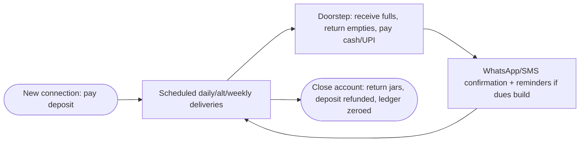
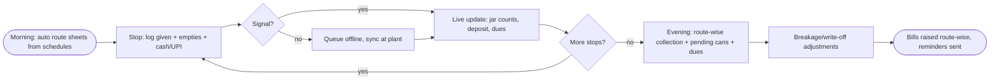

# B4 — EPIXS Water Can & Jar Delivery Software (Tirupati, Custom/Local)

## Meta

| Field | Value |
|-------|-------|
| Source | EPIXS Media — Water Can & Jar Delivery Software |
| URL | https://epixs.in/software/water-delivery-software (live demo links noted, not executed) |
| Group | B (jar/deposit/route/subscription software — operations reference; no direct F1–F8 citation) |
| Read date | 2026-09-29 |
| Method | `webfetch` full-page (browseros-neo actions not exposed in this env; skill loaded, fallback used) |
| Status | Done |

## TL;DR

EPIXS is the **custom-local** counterpoint to the three SaaS products: a Tirupati-based studio that builds water-can software **around each plant's routes, rates, deposit habits and schedules**, installs on-site (own PC hardware), trains staff in person, and charges a **one-time scope-based quote** (no per-user monthly fee). Functionally it is the most explicit Group B source on the **doorstep data triple** (cans given / empties returned / cash collected per stop), **deposit/security lifecycle** (new-connection → refund → closed account), **breakage/damage/write-off**, can inventory, and the **owner's evening report** (route-wise collection, pending cans, dues). Light Android rider app works **offline and syncs**; counter system on Windows PC; UPI/QR + WhatsApp/SMS; role logins + audit; local-first data with optional cloud backup; Excel/PDF export; Starter/Growth/Pro edition matrix.

## Features (exhaustive)

### 1. Customer master
- Route, area, **rate**, **deposit**, subscription schedule — one record per customer.

### 2. Delivery-boy app (doorstep triple)
- Per stop records **cans given + empties returned + cash/UPI collected** "in seconds".
- Light Android app for ordinary phones; **offline in patchy lanes, syncs back** at plant.
- Route sheet per boy per day with quantity due at each stop.

### 3. Empty-can / jar accounting
- **Live count** per customer and at plant, updated every delivery; pending-jar chase list.

### 4. Deposit & security tracking
- Refundable amount per customer with **live balance + deposit/refund history**; clean refunds, no disputes.
- Explicit **lifecycle cases**: new-connection, deposit-refund, closed-account.

### 5. Subscriptions & schedules
- **Daily, alternate-day, weekly**; route sheets **built automatically every morning** from schedules (Pro: full auto).

### 6. Route-wise billing + dues
- Bills and running dues **per route and per customer**; no delivery missed, no payment slips through; automatic **WhatsApp/SMS dues reminders**.

### 7. Collection capture
- **UPI/QR + cash at doorstep**, dues update instantly; confirmations via WhatsApp/SMS.

### 8. Inventory integrity
- **Jar breakage, damage and write-off** flow so counts stay honest; can inventory + **rate & area master**.

### 9. Owner dashboard + reports
- **Every evening**: route-wise cash/UPI collection, pending cans, outstanding dues; trends in Pro scope.

### 10. Data ownership + security
- Data on **supplier's own machine** (subscription lapse can't lock records); **role-based logins** (owner/counter/boy); **audit trail** on collection + deposit edits; auto daily backups + optional encrypted cloud; always exportable (Excel/PDF); GST billing for office/institutional accounts.

### 11. Editions (scope matrix)

| Capability | Starter | Growth | Pro |
|---|---|---|---|
| Customers, routes & billing | ✓ | ✓ | ✓ |
| Rider app | 1 route | multi-route | unlimited |
| Jar accounting | basic count | ✓ | full + reconciliation |
| Deposit & security | — | ✓ | ✓ |
| Subscriptions/auto route sheets | simple | ✓ | full auto |
| UPI/QR + cash capture | ✓ | ✓ | ✓ |
| WhatsApp/SMS reminders | — | ✓ | ✓ |
| Breakage & inventory | manual | ✓ | ✓ |
| Reports | daily summary | standard | full + trends |
| Multi-plant consolidation | — | — | ✓ |

### 12. Engagement model
- 5 steps: on-site study + free demo → custom build → install + opening balances + phones → **in-person training** → go-live with local support. Decisions framed explicitly **against distant national SaaS** (rigid template, call-centre queue, driver screens "too fiddly").

## Interactions — how the pieces connect

Morning route sheet (auto-built from daily/alt/weekly schedules) → rider doorstep triple (given/empties/cash-UPI, offline-capable) → live jar counts + deposit balances + running dues update → route-wise bills raised → WhatsApp/SMS reminders to laggards → **evening owner report** (collection per route, pending cans, dues) → breakage/write-off keeps inventory honest → closed-account path refunds deposit and zeroes the ledger. Data never leaves the plant PC except optional encrypted backup.

## User flow (customer side)

## Vendor flow (plant / rider side)

## Requirements

### Vendor (plant) requirements evidenced
- V-B4-01: Customer master with route/area/rate/deposit/schedule in one place.
- V-B4-02: Doorstep triple capture (given/empties/cash-UPI) **offline-tolerant**.
- V-B4-03: **Auto-built morning route sheets** from subscription schedules.
- V-B4-04: Live per-customer + at-plant jar counts; pending-jar chase view.
- V-B4-05: Deposit/security live balance with history; **new-connection / refund / closed-account** lifecycle.
- V-B4-06: **Breakage/damage/write-off** inventory adjustments.
- V-B4-07: Evening **route-wise collection + pending + dues** report; trends.
- V-B4-08: Role logins + audit trail on money/deposit edits; local-first data, exportable.
- V-B4-09: Rate & area master; multi-route/multi-boy; multi-plant consolidation (Pro).

### User (customer) requirements evidenced
- U-B4-01: Deposit paid once, visible balance, **clean refund at closure**.
- U-B4-02: Pay cash or UPI at door; instant dues update + WhatsApp/SMS confirmation.
- U-B4-03: Reminders before dues become disputes.

## Pricing
- **Quote-only, one-time, scope-based** after free on-site study; **no per-user monthly fee**; support/updates agreed up front. No numbers published — Shodasha cannot benchmark SaaS price from this source, only the **model contrast** (capex custom vs opex SaaS).

## UX notes
- "Simple enough to actually use" as anti-SaaS positioning: doorstep speed > feature depth; designed for ordinary Android phones and patchy signal.
- Split screens by role: simple owner/counter PC system vs **even simpler** rider app — a direct precedent for Shodasha's vendor-app minimalism.
- Local trust levers (on-site install, in-person training, data stays on your machine) map to owner anxiety about losing ledgers — Shodasha's cloud answer must be **export-anytime + offline-proof**, not just "cloud backup".

## Shodasha implication (split by surface)

| Surface | Take from EPIXS | Adapt / reject |
|---------|-----------------|----------------|
| User app (Flutter) | Deposit visa: pay-once → live balance → clean refund path; doorstep UPI with instant confirmation | Closed-account flow → include in v1 scope (deposits make churn a money event) |
| Vendor app (Flutter) | **Doorstep triple as the atomic stop transaction** (given/empties/cash); offline queue + sync; quantity-due per stop | Copy as the core stop screen; reject PC-counter model (Shodasha is mobile-first) |
| Admin (Next.js) | Auto morning route sheets; evening route-wise collection/pending/dues report; **breakage/write-off**; rate & area master; audit trail on money edits | Copy reporting + breakage + audit; reject on-premise data (Shodasha is cloud, but match with export-anytime) |

## Unverified / needs primary research
- [ ] No pricing numbers at all (quote-only) — cannot use for price benchmarking.
- [ ] Live demo exists (`/one/demo/water-delivery-software/`) but was **not executed** in this pass — doorstep-triple UX unverified visually.
- [ ] Offline sync semantics (conflict handling) not detailed.
- [ ] "Short drive away" support and one-time-quote economics are Tirupati-local; not transferable claims.
- [ ] Multi-plant consolidation, GST e-invoice depth, SMS-gateway costs — unspecified.
