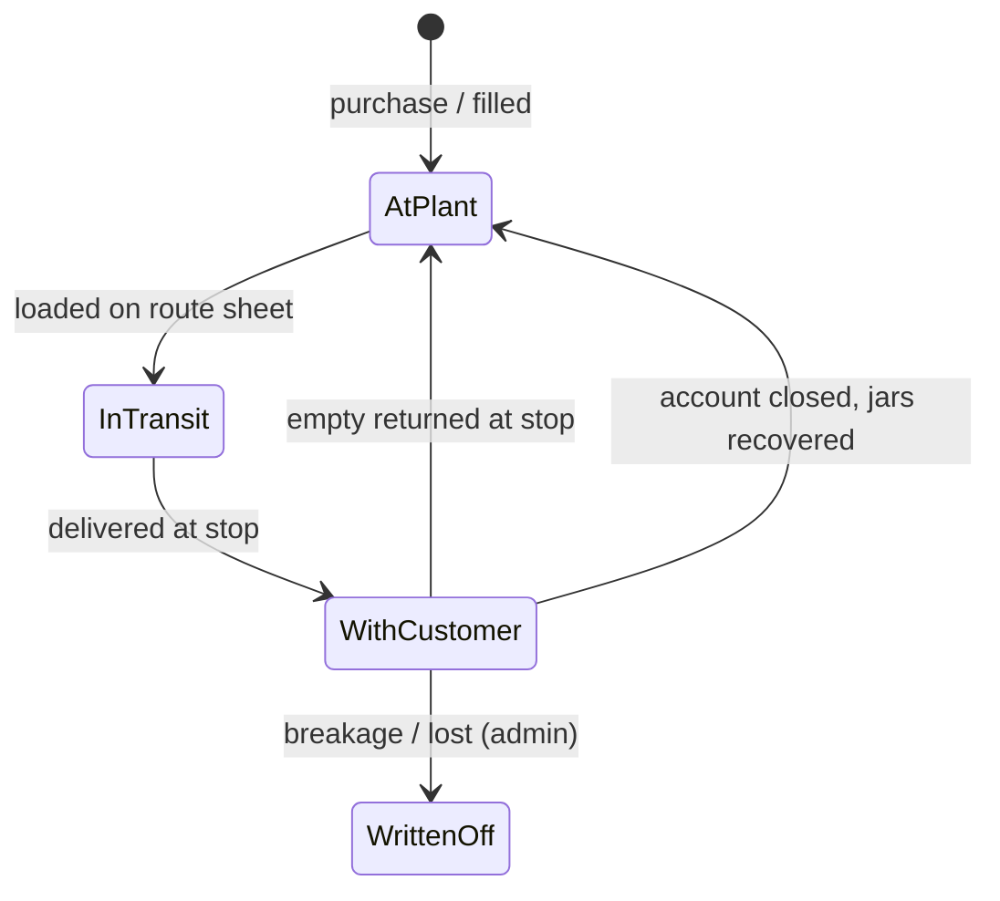
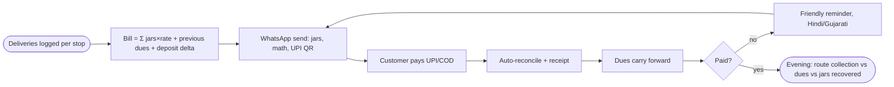

# Group B Summary — Jar/Deposit/Route/Subscription Operations → Shodasha

## Meta

| Field | Value |
|-------|-------|
| Group | B — vendor + user ops software (jar/deposit/route/subscription) |
| Sources | B1 Rekart · B2 Pure Pani (+RO sub-page) · B3 PaniHisab (+Features) · B4 EPIXS |
| Context | Shodasha: Flutter Android user app + Flutter Android vendor app + Next.js super-admin; 20L Refill Rs 28 / Jar+Container Rs 30; Rs 150 jar-exchange deposit; arrival window (no live dot); pause; WhatsApp help; UPI+COD |
| Read date | 2026-09-29 |
| Status | Done |

## TL;DR

All four vendors run the same spine — **order → assign → deliver → collect empty → cash → jar ledger → billing** — and differ only in where they put weight: Rekart = enterprise retention + AI-WhatsApp; Pure Pani = Hindi-first agency OS with QR customer app + payroll; PaniHisab = ₹99 schedule-engine + loading sheets + wholesale tier; EPIXS = custom-local doorstep triple + deposit lifecycle + breakage. For Shodasha the non-negotiable kernel is: **per-customer jar ledger (held jars + deposit balance), atomic doorstep triple per stop, pause-with-resume schedules, WhatsApp bills with own-bank UPI, dues carry-forward, evening route reconciliation, deposit-refund closure**. Everything else is v2.

## 1. Vendor-app feature matrix

Legend: ● native/strong · ◐ partial/basic · ○ absent/unverified · (R) = rival-source claim, verify.

| Capability | B1 Rekart | B2 Pure Pani | B3 PaniHisab | B4 EPIXS | Shodasha v1 |
|---|---|---|---|---|---|
| Per-stop fulls + empties + cash log | ● (photo proof) | ● 1-tap + bulk | ● 1-tap 44px + bulk | ● doorstep triple | **● must** |
| Offline delivery + sync | ○ (R: No) | ● offline-friendly | ● (R: Yes) | ● offline + sync | **● must** |
| Route sheets auto-built from schedules | ● auto + resequence | ● 10-sec plan | ● dispatch lists | ● auto mornings | **● must (admin-built)** |
| GPS stop routing | ○ | ◐ groups/routes | ● Maps pin + 1-click | ○ | ◐ v1 (address+GPS pin only) |
| Loading sheet (take-X/expect-Y) | ◐ load-balanced beats | ○ | ● per-driver auto | ○ | **● must (cheap, high value)** |
| Jar ledger: filled/empty/with-customer | ● per-customer count | ● 3-state + hold-block | ● outstanding count | ● live both ends | **● must** |
| Deposit balance per customer | ● + advances | ◐ implied | ● field + 5-jar/3-day alert | ● + refund history | **● must (Rs 150)** |
| Deposit refund / closed-account flow | ○ | ○ | ○ | ● explicit lifecycle | **● must** |
| Breakage / write-off | ○ | ○ | ○ | ● | ◐ v2 (admin manual adjust v1) |
| Subscriptions: daily/alt/weekly/custom | ● + holiday skip | ● custom + events | ● N-day/weekday/odd-even | ● daily/alt/weekly | **● must (pause v1)** |
| Pause with auto-resume date | ● self-serve | ● 1-tap + customer-side | ● (schedule engine) | ○ | **● must** |
| Customer self order (app/QR/WhatsApp) | ● white-label + AI WA | ● QR app + UPI | ◐ WA bills only | ○ | ◐ v1: in-app repeat + WA help |
| WhatsApp bills + reminders | ● AI chatbot | ● logo bills + reminders | ● 1-tap + UPI QR | ● WA/SMS reminders | **● must** |
| UPI at door, own-bank settlement | ● UPI/cash/wallet | ● + zero-custody claim | ● zero-fee QR | ● instant dues update | **● must (UPI+COD)** |
| Bill formula w/ carry-forward dues | ● daily reconcile | ● auto-reconcile | ● (jars×rate)+prev+deposit | ● running dues | **● must** |
| Per-customer / corporate rates | ○ | ● override + society bill | ● per-jar rate + dealer tier ₹18 | ● rate master | ◐ v2 (flat Rs 28/30 v1) |
| Staff logins + permissions + audit | ○ | ● + payroll calc | ● granular + audit log | ● roles + audit | ◐ v2 (single vendor login v1) |
| Expenses (diesel/salary/jars) + P&L | ○ | ● P&L + 30 reports | ● tracker + profit view | ○ | ○ v2 |
| Hindi/Gujarati UI | ○ (R: English-only) | ● 8 langs | ● 10 langs | ○ local training | **● must (Hindi; Gujarati v2)** |
| Pricing model | Quote/enterprise | ₹1/cust/mo, free ≤25 | **₹99/mo flat** (~200) | One-time quote | Shodasha decides (ref: ₹99 anchor) |

## 2. Jar ledger model (for Shodasha)

### State

### Per-customer record (minimum fields)

- `held_jars`: cumulative fulls delivered − empties returned − written off. **Invariant: never negative; delivery blocked when held ≥ hold-limit.**
- `deposit_balance`: total deposit paid − refunded. Shodasha default **Rs 150/jar** at booking (exchange stepper); refundable on closure against jars recovered.
- `rate`: per-jar rate (v1: SKU rate — Rs 28 refill / Rs 30 jar+container; v2: override).
- `dues`: running money balance carried forward across bills.
- `schedule`: daily / alternate / weekly / custom + pause windows with resume dates.
- Every mutation comes from one **atomic stop event**: `{stop_id, fulls_given, empties_back, cash, upi, rider, timestamp}` — stamped who/when/where (Pure Pani rule).

### Worked example (Shodasha numbers)
Customer holds 0, dues 0. Books 2× Refill (2×28=56) + 1× Jar+Container (30) = 86, hands 2 empties, pays 0 (COD pending):
- Delivered 3 fulls, returned 2 empties → `held = 0 + 3 − 2 = 1` (the new container stays out).
- Deposit: 1 uncovered jar × Rs 150 = **Rs 150 held** (asked at booking via exchange stepper).
- Dues: 86 + previous 0 = **86 carry-forward**; bill on WhatsApp with UPI QR; on payment, dues → 0 with auto-receipt.

### Deposit lifecycle (EPIXS borrow)
`new-connection (pay)` → `live balance (top-up as held grows)` → `closure (return jars → refund → ledger zeroed)`. Disputes die iff the balance + jar history is customer-visible (Pure Pani QR rule).

## 3. Billing flows (for Shodasha)

### Monthly cycle

### Formula (PaniHisab-verified pattern)
`bill_total = (jars_this_period × rate) + previous_balance + deposit_due − payments_received`; partial payments carried, never zeroed silently. Sample anchor: 25×₹30 + ₹240 = ₹990.

### Collection reconciliation (Rekart/EPIXS rule)
Every doorstep payment posts to the customer ledger **as taken** (or on sync); the owner's evening view shows per-route cash + UPI vs pending + jars still out — **day-close, never month-end surprise**.

## 4. Top vendor requirements (ranked for Shodasha build)

1. **Atomic doorstep triple** — fulls + empties + cash/UPI per stop, one screen, 1-tap, offline-proof. (All four; EPIXS names it.)
2. **Per-customer jar ledger** — held count + deposit balance + dues, visible to vendor and (read-only) to user. (All four; Rekart Customer-360.)
3. **Rs 150 deposit at booking + refund-on-closure** — exchange stepper asks empties count; uncovered jars accrue deposit; closure refunds against returns. (Shodasha scope; EPIXS lifecycle; PaniHisab alert pattern.)
4. **Schedules with pause/resume-date** — daily/alternate/weekly/custom; auto route sheets; loading sheet (take-X/expect-Y) per rider. (PaniHisab engine + sheets; Pure Pani auto-resume.)
5. **WhatsApp bills with own-bank UPI QR + carry-forward dues + reminders** — transparent arithmetic on the bill. (Pure Pani + PaniHisab; zero-fee settlement.)
6. **Evening route reconciliation** — collection vs dues vs jars-out per route, day-close. (Rekart insights; EPIXS owner report.)
7. **Hindi UI + bills + support; Gujarati next** — driver adoption lives or dies here. (Pure Pani 8 / PaniHisab 10 langs.)
8. **Permissions + audit on money/deposit edits** — who touched what, when. (PaniHisab + EPIXS; v1 = admin-only edits, logged.)
9. **Hold-limit block + hold-days alert** (e.g. 5+ jars / 3+ days pattern) — asset recovery before leakage. (Pure Pani block; PaniHisab alert.)
10. **Breakage/write-off + dealer/custom-rate tier** — v2, but data model must leave room. (EPIXS; PaniHisab ₹18 dealer tier.)

## 5. Pricing landscape (vendor-claimed; verify before quoting)

| Vendor | Model | Anchor price |
|---|---|---|
| PaniHisab | Flat/month | **₹99 (~200 cust) → ₹199 (~400) → ~₹499**; 15-day trial; zero txn fee |
| Pure Pani | Per-customer | **₹1/cust/mo yearly** (₹1.20 monthly); free ≤25; 300 cust ≈ ₹359/mo |
| Rekart | Enterprise/quote | No public price; rival claim ~₹1,500+/mo |
| EPIXS | One-time custom quote | No numbers; no monthly fee |

Shodasha note: the market anchors vendor-side ops software at **₹99–₹360/mo for single-plant scale** — any Shodasha admin pricing above this needs a WhatsApp/UPI/offline story at least as strong.

## 6. How the spine interacts (single paragraph for spec reuse)

Standing orders + refill requests (app/call/**WhatsApp**) lock into tomorrow's dispatch; the schedule engine expands them into **route sheets with loading numbers**; the rider executes the **doorstep triple** per stop (offline-tolerant); each stop mutates the **jar ledger** (held/deposit/dues); billing folds the ledger into **(jars×rate)+previous+deposit** bills pushed on **WhatsApp with UPI QR**; payments reconcile live; dues carry forward with reminders; the evening **route reconciliation** (cash/UPI/pending/jars-out) closes the day; pause/resume, hold-alerts, deposit-refund closure, and breakage write-offs are exceptions handled against the same ledger — never in a side notebook.

## 7. Shodasha build checklist (surface split)

- **User app**: repeat-order home; Rs 28/30 SKU steppers; empty-exchange stepper + Rs 150 note at booking; arrival window + rider call; pause/resume-date; read-only jar+deposit+dues view; WhatsApp help; UPI+COD chips; Hindi v1.
- **Vendor app**: route sheet (take-X/expect-Y); doorstep-triple stop screen (44px targets, bulk mode); offline queue + sync; hold-limit block surfacing; cash/UPI per-stop totals; Hindi v1.
- **Admin**: customer-360 (plan, held, deposit, dues, history, tickets); auto route-sheet + loading generation; bill engine + WhatsApp send + UPI QR; dues/reminder dashboard; evening route reconciliation; deposit-refund closure; audit log; schedule engine (N-day/weekday/odd-even); v2: photo proof, per-customer rates, payroll, expenses/P&L, Gujarati.

## Unverified (carry to Series-3 / primary research)
- [ ] Exact deposit Rs-value handling per vendor (only Shodasha Rs 150 + PaniHisab ₹200–400 jar-value anchor are sourced; "Rs 150–300" band in the brief is not directly any vendor's field spec).
- [ ] Rekart price + English-only + Razorpay/API (rival claims, single-sourced via PaniHisab).
- [ ] Pure Pani traction (10k+/4.7), zero-custody settlement, offline conflict semantics.
- [ ] PaniHisab caps/tiers, offline depth, GST-validity of bill images.
- [ ] EPIXS demo UX (not executed), sync semantics, any pricing.
- [ ] Per PDF §06 footer rule: all market numbers above are source-website claims, **not independently audited** — confirm via local survey before locking Shodasha pricing/deposit constants.
