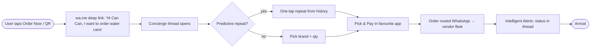
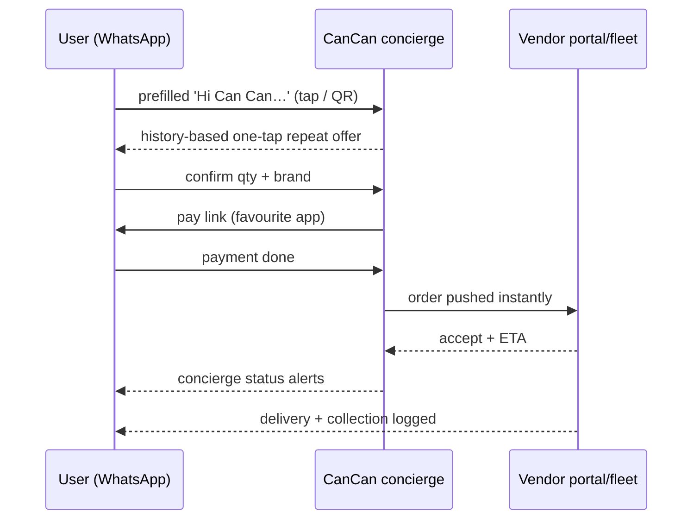

# C1 — CanCan WhatsApp-Only Ordering (cancanindia.com)

- **Source**: https://cancanindia.com (C1)
- **Fetched**: 2026-09-29 via webfetch (full page markdown) + websearch (history/press)
- **Group**: C-competitors → maps to Findings F1, F6
- **Surfaces affected**: user app (repeat order, WhatsApp help), vendor app (order queue), super-admin web (vendor ops)

## TL;DR

CanCan (Chennai) runs **WhatsApp-only ordering — no downloads, no accounts**. Entry point is a `wa.me` deep link ("Hi Can Can, I want to order water cans"); repeat is a **predictive one-tap** from order history; vendors fulfil through a **portal dashboard** where "orders flow from WhatsApp to your fleet instantly". Claimed scale: **500+ active customers, 50+ verified vendors, 10k+ orders, 4.9/5**. This is the closest live proof of Shodasha's "WhatsApp help + one-tap repeat" scope — minus subscriptions/deposits, which CanCan never shows publicly.

## Features (as listed on site)

1. **WhatsApp concierge ordering** — "No downloads, no accounts — just the world's most intuitive ordering system active in your WhatsApp." CTA `Order Now` → `https://wa.me/919025320535?text=Hi%20Can%20Can%2C%20I%20want%20to%20order%20water%20cans`.
2. **Predictive Ordering** — "One tap to repeat your history. Minimum friction." (exact site copy).
3. **Intelligent Alerts** — "Real-time concierge updates on your delivery status."
4. **Demo/simulation block** — "Experience the flow" chat mock (Start Demo Order) that walks Start Chat → Pick & Pay → Arrival without leaving the page.
5. **Vendor dashboard ("Master your supply chain")** — Real-time Orchestration (WhatsApp → fleet), Financial Intelligence (predictive analytics on daily collections), Vendor Login at `/portal/login`. Live-sim counters: Collection ₹0 / Orders 0 / Avg Order ₹0 + Recent Orders list.
6. **3-step public process** — 01 Start Chat (scan QR / click link) → 02 Pick & Pay (browse verified brands, one tap pay via favourite app) → 03 Arrival (delivery orchestrated by vendor network).
7. **Trust badges** — ISO 9001:2015, Verified Brands; footer: "Direct, daily, and delightful."

## Interactions

- **User → WhatsApp**: tap link/QR → prefilled "Hi Can Can…" → concierge thread → pick brand/qty → pay in favourite app → status alerts in same thread.
- **Vendor → Portal**: login → live order feed → accept/assign → collection analytics → revenue splits ("automated revenue splits" per site copy).
- **Proof strip**: 500+ customers / 50+ vendors / 10k+ orders / 4.9/5 — static marketing counters, not a live dashboard.

## Mermaid flows

## User requirements (inferred from site)

- No app install; smartphone + WhatsApp only.
- Phone number = identity (no accounts page shown).
- Payment via UPI/favourite app inside chat flow (no COD mention on current site).
- Address assumed known from history (no address form shown publicly).

## Vendor requirements (inferred from site)

- Portal login (`/portal/login`); accepts WhatsApp-routed orders in real time.
- Fleet assignment + delivery confirmation feed the "Recent Orders" + collection counters.
- Multi-brand catalogue (historically Bisleri, Aquafina, Parry — current site says "verified brands").

## Pricing

- **No prices on site.** No per-jar rate, no subscription, no deposit figure published. (Historical 2015 press: branded cans, COD, time slots, referral credit — all from the old app era, not the current WhatsApp product.)

## UX notes

- Luxury-concierge positioning ("curated experience", "morning breeze") for a commodity — sells reliability, not price. Matches Shodasha goal #3.
- Zero-form repeat is the whole homepage hero; vendor ops are the second section — dual-audience page (customer + vendor acquisition in one scroll).
- Simulation block lets visitors "experience the flow" without contacting anyone — lowers trial hesitation.

## Shodasha implication

| CanCan pattern (C1) | Shodasha adoption |
|---|---|
| wa.me deep-link entry, no download | **Adopt 1:1** — WhatsApp help button + shareable order links use prefilled `wa.me` text (order ID, qty, address). User app. |
| Predictive one-tap repeat from history | **Adopt 1:1** — home BOOK NOW with last settings pre-selected = same mechanic inside the app. User app. |
| Concierge status alerts in thread | **Adopt** — order confirmations/bills shareable to WhatsApp; status pushes mirror the 4-step card. User app. |
| WhatsApp → fleet instant routing | **Adopt** — vendor app order queue is the same handoff, native instead of portal web. Vendor app. |
| Dual customer+vendor homepage | **Adapt** — Shodasha super-admin web covers the vendor-dashboard role (stops, empties, cash). |
| No public pricing/subscription/deposit | **Differentiate** — Shodasha publishes Rs 28/30 SKUs, Rs 150 deposit, pause — transparency CanCan avoids. |

## Unverified

- 500+ / 50+ / 10k+ / 4.9/5 counters — marketing claims, no audit or date.
- Collection/Orders dashboard values shown as ₹0/0 — simulation, not live data.
- Current delivery zones, SLA, and price list inside WhatsApp — not publicly visible; needs mystery-shop (order via the wa.me link) to confirm.
- Relation between 2015 CanCan app (Dinesh/Mohana Srinivas, The Hindu 2016) and current cancanindia.com operator — assumed same brand, not confirmed.
