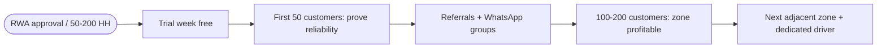
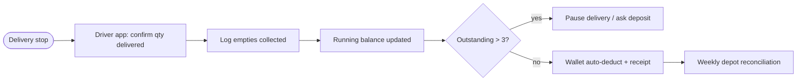
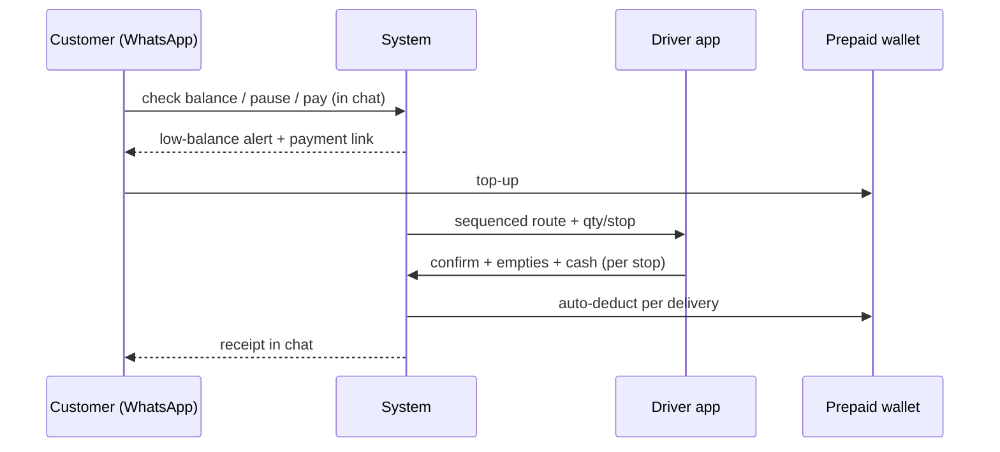

# C2 — Rekart Business Blueprint (rekart.io/insights/how-to-start-water-jar-delivery-business-india)

- **Source**: https://rekart.io/insights/how-to-start-water-jar-delivery-business-india (C2)
- **Fetched**: 2026-09-29 via webfetch (full article markdown, 11-min guide, Rekart Team, May 2026)
- **Group**: C-competitors → maps to Findings F1, F2, F3, F7, F8
- **Surfaces affected**: all three (pricing/subscription → user app; routes/driver/jars → vendor app; billing/zones → super-admin web)

## TL;DR

Rekart's guide is the **operating playbook for a 20L jar delivery business**: tight 2–3 km zones, **2.5–3 jars per customer** inventory buffer, **Rs 200–300/jar deposit**, RWA empanelment (50–200 households per approval), offices at **20–30 jars/floor/month**, **prepaid wallet** as the most scalable billing model, and software from day one (breaks manual at 50–75 customers). Demand-side economics favour Shodasha: high frequency, **low price sensitivity**, strong retention once the route habit forms.

## Features (blueprint steps 1–9 + FAQ)

1. **Market validation (2–3 weeks ground work)** — map competition gaps (unreliability, poor service), local price band **Rs 40–120 per 20L jar**, customer density, institutional demand.
2. **Tight service area** — start **2–3 km radius**; short routes = fuel cost + turnaround = margin per jar.
3. **Supply options** — (A) local plant tie-up at wholesale **Rs 15–35/jar** + backup supplier; (B) authorised brand distributor (trust vs thinner margins). Quality-test before signing.
4. **Compliance (distribution, not manufacturing)** — GST (required > Rs 20L turnover; register early for B2B invoices), sole prop → LLP/Pvt Ltd later, **basic FSSAI registration** (not plant licence), municipal trade licence, commercial vehicle RC + insurance.
5. **Jar inventory** — **2.5–3 jars per active customer** (100 customers → 250–300 jars); jar cost **Rs 200–400**; single-use caps/seals; two-wheeler < 50 customers/route, tempo (40–60 jars/trip) above; free/rental **dispenser as lock-in**.
6. **Acquisition channels** — RWA empanelment (**one approval = 50–200 households**, trial week free); office facility managers (**one floor = 20–30 jars/month**; one 50-jar/mo office ≈ 10–15 households); door-to-door (**10–15 conversions/day**); resident WhatsApp groups (**one trusted message = 20–30 enquiries**); Google Business Profile for "near me" inbound.
7. **Pricing/subscription** — per-jar (fine small-scale) vs subscription (e.g. **8 jars/mo @ Rs 75 = Rs 600 prepaid**) vs **prepaid wallet** (most scalable: auto-deduct, no monthly billing); B2B = monthly postpaid invoicing with credit limit.
8. **Jar tracking discipline** — log jars out AND empties collected per stop; running balance per customer; auto-flag above threshold (**say 3**); weekly depot reconciliation; **15–20% shortage** without tracking; notebook works < 50 customers, dedicated software beyond.
9. **Delivery management system** — subscription store, auto-sequenced routes, **driver app** (today's route, qty/stop, one-tap confirm, jar returns, cash log), payment automation (wallet deduct, **low-balance WhatsApp alerts**, one-tap payment links), **Rekart AI on WhatsApp** (balance, pause, pay inside chat).
10. **Scale rule** — expand at **100–200 customers/zone**, one adjacent zone at a time, **dedicated driver per zone**, local depot if > 5 km from storage, one central dashboard.

## Interactions

- **Customer → business**: RWA trial → first 2 jars free/half → subscription or wallet → WhatsApp for balance/pause/pay → doorstep exchange (full for empty + cash/UPI delta).
- **Driver → app**: today's sequenced route → per-stop qty → confirm delivery → log empties → log cash → sync to dashboard real time.
- **Owner → dashboard**: zones/routes/drivers/billing/jar balances centrally; outstanding-jar alerts; B2B invoices.

## Mermaid flows

## User requirements (per guide)

- Household: weekly/bi-weekly 20L need; reliability > price.
- Pays per-jar, subscription, or wallet; B2B expects postpaid invoice + GST.
- First-50 proof: trial free/half-price jars; dispenser increases switching cost.

## Vendor requirements (per guide)

- 2.5–3 jars/customer + 10–15% buffer; caps/seals never reused.
- Driver per zone with app; tempo above ~50 customers/route.
- Rs 200–300/jar onboarding deposit; pause rule at 2–3 outstanding jars.
- Pilot budget **Rs 50k–1.5L for 20–50 customers** (jars Rs 30–60k + rented two-wheeler + compliance + marketing).

## Pricing (verbatim bands)

| Item | Band |
|---|---|
| Retail 20L jar, most cities | Rs 40–120 |
| Wholesale from local plant | Rs 15–35/jar |
| New food-grade jar asset | Rs 200–400 |
| Onboarding deposit (standard) | Rs 200–300/jar |
| Example subscription | 8 jars/mo @ Rs 75 = Rs 600 prepaid |
| Pilot capex (20–50 customers) | Rs 50,000–1,50,000 |

## UX notes

- "Your first 50 customers are your proof of concept… Nail service for 50, ask referrals, let word-of-mouth carry the next 200." — acquisition is local trust, not ads.
- Software-from-day-one argument: clean data + trained customers > retrofit at 200.
- Rekart AI on WhatsApp (balance/pause/pay in chat) is the exact concierge mechanic CanCan sells — validates Shodasha WhatsApp scope.

## Shodasha implication

| Blueprint rule (C2) | Shodasha adoption |
|---|---|
| 2.5–3 jars/customer + 10–15% buffer | **Adopt** — depot stocking formula; super-admin inventory view. |
| Rs 200–300 deposit; pause above 2–3 outstanding | **Adapt** — Shodasha Rs 150 deposit (locked scope); keep threshold + pause rule in vendor app. |
| RWA = 50–200 HH per approval; office floor 20–30/mo | **Adopt** — GTM phasing: households first, RWA/offices bulk later (matches audience note). |
| Prepaid wallet most scalable; B2B postpaid + credit | **Defer wallet to v2** — Phase-1 UPI+COD; keep wallet/credit fields in model. |
| Driver app per-stop confirm + empties + cash | **Adopt 1:1** — vendor app stop flow (stops, empties in/out, cash collected). |
| Low-balance WhatsApp alerts + payment links | **Adopt** — WhatsApp help + shareable bills. |
| 2–3 km start zone; driver per zone; depot > 5 km | **Adopt** — ops rollout rule for super-admin zones. |
| Rs 40–120 city band vs Shodasha Rs 28–30 | Pricing verification open question stands — survey before lock. |

## Unverified

- USD 6.5B by 2032 / 8.8% CAGR (attributed to Persistence Market Research) — not independently checked.
- Channel conversion figures (10–15/day door-to-door, 20–30 enquiries/message) — Rekart's claims, no methodology.
- Rekart AI WhatsApp bot depth — product page not fetched in this task (B-group territory).
