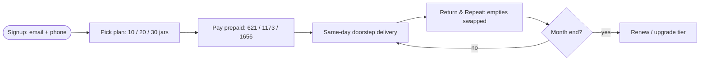

# C3 — Paniwale Premium Jar Delivery (paniwale.com, Pune)

- **Source**: https://paniwale.com (C3) — JS-rendered; body via websearch snippets (site title + pricing/FAQ text indexed)
- **Fetched**: 2026-09-29 via webfetch (shell only: "Paniwale - Premium Water Jar Delivery in Pune") + websearch (pricing, plans, deposit, contact)
- **Group**: C-competitors → maps to Finding F2
- **Surfaces affected**: user app (subscription cards, deposit note, same-day), super-admin web (plans, deposits)

## TL;DR

Paniwale (Pune) is the **subscription-pricing reference**: **Rs 69 per 20L jar**, **Rs 150 refundable deposit per jar**, and three prepaid plans — **10 jars Rs 621 (10% off), 20 jars Rs 1,173 (15% off), 30 jars Rs 1,656 (20% off)** — all with free delivery. "Return & Repeat" (empties swapped at delivery) plus **same-day delivery, no minimum order** is the convenience bundle Shodasha competes with at Rs 28–30.

## Features (as listed)

1. **Simple pricing** — Rs 69/jar (20L), free home delivery.
2. **Three subscription plans** (all "FREE delivery included"):
   - 10 jars/month — Rs 621 (base Rs 690, 10% savings) — flexible scheduling.
   - 20 jars/month — Rs 1,173 (base Rs 1,380, 15% savings) — priority delivery + weekend delivery.
   - 30 jars/month — Rs 1,656 (base Rs 2,070, 20% savings).
3. **Refundable jar deposit** — Rs 150/jar, "fully returned when you return the jars."
4. **Return & Repeat** — "Return empty jars when we deliver new ones. Simple and hassle-free."
5. **Same-day delivery available**; no minimum order.
6. **Onboarding in 3 steps** — account in seconds (email + phone) → pick plan → doorstep same-day delivery.
7. **Quality/support** — 100% RO purified; phone **+91 86689 17824**, WhatsApp, info@paniwale.com; Shop 1, Vishwashree Park, Manjari Budruk, Pune 412307.

## Interactions

- **Signup → plan → delivery**: email+phone account → subscription card select → delivery slot → same-day doorstep drop.
- **Repeat**: empties handed over at each delivery (exchange, not separate pickup trip).
- **Support**: call/WhatsApp; FAQ covers subscription mechanics, deposit, empty returns, same-day.

## Mermaid flows



```mermaid
sequenceDiagram
    participant U as User
    participant P as Paniwale
    participant R as Rider
    U->>P: signup + plan (10/20/30)
    P-->>U: confirm + deposit receipt (Rs 150/jar)
    P->>R: same-day route + qty
    R->>U: full jars; collect empties
    U->>P: call/WhatsApp for help
    P-->>U: deposit refund on jar return
```

## User requirements (inferred)

- Email + phone account (heavier than CanCan's no-account model).
- Prepaid monthly commitment; flexible scheduling (10-jar) → priority/weekend (20/30-jar) ladder.
- No minimum order — single-jar households welcome.

## Vendor requirements (inferred)

- Same-day route capacity across Pune; empty-for-full swap at every stop.
- Deposit ledger per jar (Rs 150 in/out).
- Tiered SLA: priority + weekend delivery for upper tiers.

## Pricing (verbatim)

| Item | Price |
|---|---|
| 20L jar refill | Rs 69 |
| Deposit (refundable) | Rs 150/jar |
| 10 jars/mo | Rs 621 (Rs 690 − 10%) |
| 20 jars/mo | Rs 1,173 (Rs 1,380 − 15%) |
| 30 jars/mo | Rs 1,656 (Rs 2,070 − 20%) |
| Delivery | Free, all plans; same-day available; no minimum |

## UX notes

- Tier ladder sells **savings % + perks** (flexible → priority → weekend), not just volume — a pattern Shodasha can reuse when subscriptions arrive.
- "Return & Repeat" naming makes the exchange mechanic a brand feature, not fine print.
- Premium framing at Rs 69 vs Shodasha Rs 28–30: different segments; Shodasha wins on price, must match on reliability cues (confirmation, window, WhatsApp).

## Shodasha implication

| Paniwale pattern (C3) | Shodasha adoption |
|---|---|
| 10/20/30-jar tiers with 10/15/20% savings | **Defer tiers to subscription v2** — Phase-1 repeat/one-tap; keep `plan + tier + discount` fields in model. |
| Rs 150 deposit, refunded on return | **Adopt 1:1** — identical figure already in Shodasha scope; deposit note at booking. |
| Return & Repeat at delivery | **Adopt 1:1** — empty-exchange stepper at booking + vendor handover count. |
| Same-day + no minimum | **Adapt** — Shodasha default = tomorrow-morning window (Bisleri rule); same-day = later SLA. |
| Email+phone signup | **Simplify** — Shodasha Phase-1: phone/OTP only (lower friction, JalSeva-validated). |

## Unverified

- Page body never fetched directly (JS shell) — all copy from search-index snippets; plan/FAQ wording needs in-browser confirm.
- Working hours 9 AM–9 PM (Sulekha listing) — third-party, not official site text.
- Deposit refund mechanics (timing, mode) and pause/reschedule policy — not visible in snippets.
- Whether Rs 69 is RO-only or brand-tiered — not confirmed.
