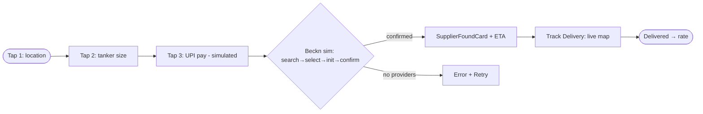
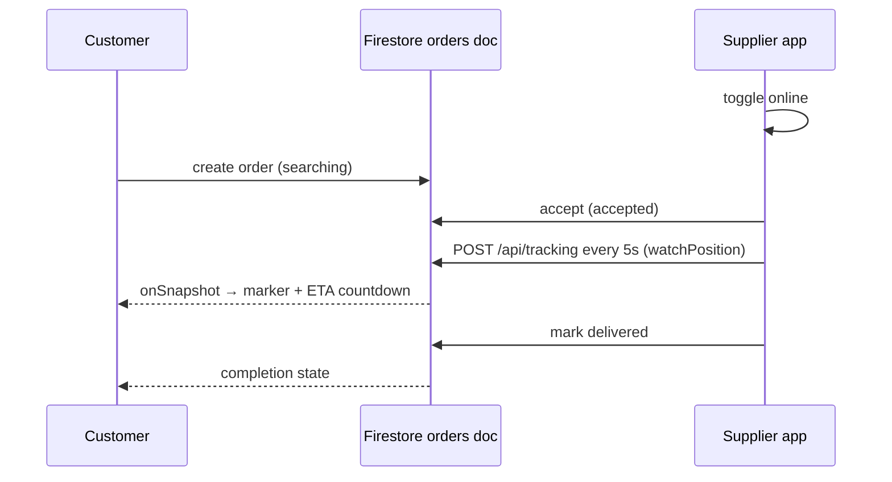
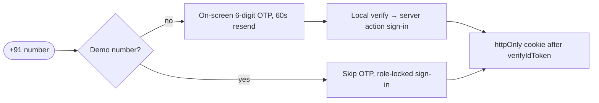

# C5 — JalSeva Open-Source Tanker Platform (github.com/divyamohan1993/jalseva)

- **Source**: https://github.com/divyamohan1993/jalseva (C5) — repo tree + README + key source files read verbatim
- **Fetched**: 2026-09-29 via webfetch (repo page, README raw, `booking/page.tsx`, `login/page.tsx`, `useTracking.ts`, `payments/create-order/route.ts`, `firebase.ts`, `gemini.ts`, `maps.ts`, `types/index.ts`)
- **Group**: C-competitors → maps to Finding F8
- **Surfaces affected**: all three (booking/auth/tracking → user app; supplier dashboard → vendor app; admin/commission → super-admin web)

## TL;DR

JalSeva is a **student capstone** (Jatin Sharma, Shoolini University — B.Tech CSE-DS Sem 8, mentor Dr. Abhishek Tomar) building an **Uber-style water-tanker marketplace**: customer PWA + supplier dashboard + admin hub in **one Next.js 16 codebase, one Cloud Run container (scale-to-zero)**. For Shodasha it is an **architecture reference, not a competitor**: Firebase Phone Auth (with zero-SMS demo OTP), Firestore live GPS (`onSnapshot` + 5 s `watchPosition` broadcast), simulated Razorpay/UPI, Gemini voice + 22-language translation, PWA offline, Haversine-then-Routes ETA, and a full domain type model worth reusing.

## Repo map (verified tree)

```
jalseva/                          # Next.js app root
  src/app/
    login/                        # phone + role toggle
    booking/                      # 3-tap booking + ONDC sim stages
    tracking/[orderId]/           # live GPS map
    supplier/                     # dashboard + delivery flow
    admin/                        # analytics + supplier mgmt
    api/ (19 routes)              # auth, pricing, orders, suppliers,
                                  # tracking, payments, ratings,
                                  # admin/analytics, ai/chat+voice,
                                  # beckn/*, whatsapp/webhook, health
    pitch/route.ts  report/route.ts
  actions/auth.ts                 # ID-token-verifying server action
  hooks/ useAuth, useSupplier, useTracking
  lib/ firebase, firebase-admin (ADC), gemini, maps,
       redis (optional Upstash), rate-limiter, firestore-shard,
       razorpay (sim), batch-writer, cache, circuit-breaker
  types/index.ts                  # full domain model
  firestore.rules  Dockerfile  cloudbuild.yaml  .env.example
docs/  scripts/  .github/
```

## Features (README-verified)

1. **3-tap booking** — tap 1 location, tap 2 tanker size, tap 3 UPI pay; live map + per-step notifications + post-delivery rating.
2. **Auth** — Firebase Phone Auth; demo numbers bypass OTP (`+91 99999 0000X`, fixed OTPs); any other number gets an **on-screen generated 6-digit OTP (no SMS sent)**; role toggle customer/supplier; admin number role-locked to `/admin`; session via `jalseva_auth` httpOnly cookie set only after `verifyIdToken()`.
3. **Live GPS** — supplier `watchPosition` → `POST /api/tracking` every 5 s → customer marker advances via Firestore `onSnapshot`; client-side 1 s ETA countdown between pushes; 500 ms write coalescer collapses 5–20 GPS writes into 1.
4. **Payments** — Razorpay **simulated in dev**: create-order validates (400/404/409 paid/cancelled guards), L1 cache check, `simulateCheckout`, batch-write `razorpayOrderId`, cache invalidation; verify via HMAC-SHA256.
5. **Voice-first + 22 languages** — Gemini `processVoiceCommand` (mixed-language input, STT error correction: "aarow"→RO, "tenker"→tanker; defaults tanker/500L; "can/jar/bottle" = 20L); `translateText`; `generateChatResponse` for WhatsApp assistant; Hindi-first UI, ARIA/`sr-only`, keyboard nav, `prefers-reduced-motion`, RTL-ready.
6. **Supplier dashboard** — real-time Firestore order queue, online toggle, accept → navigate → mark delivered, earnings analytics.
7. **Admin** — supplier verification (Aadhaar/RC/FSSAI/water-quality docs), commission, live ops map, aggregate analytics (5-min L2 / 2-min L1 cache).
8. **Scaffolded only** — WhatsApp bot webhook, ONDC/Beckn handshake (booking page runs a **simulated** search→select→init→confirm chain against local `/api/beckn/*` with Hindi stage strings).
9. **Ops** — Cloud Run `asia-east1` min=0/max=3/512Mi; Firestore native `asia-south2`; ADC service account (no keys in image); referrer-restricted Maps key; token-bucket limits (100 burst/50 sustained per IP); geohash `O(k)` nearby-supplier lookup; bounded `.limit()` queries; Vitest + Biome.

## Interactions

- **Customer**: role → phone → OTP (or demo bypass) → 3-tap order → ONDC-sim matching → SupplierFoundCard (type/qty/price/ETA) → Track Delivery → live map → delivered → rate.
- **Supplier**: login → toggle online → order appears → accept (status `accepted`) → Start Navigation (GPS broadcast) → mark delivered.
- **Admin**: verify documents → monitor live map → commission/analytics.

## Mermaid flows







## User requirements (per code)

- Phone-owning user; Hindi/English bilingual strings minimum.
- Location permission for tap-1; UPI-capable (simulated in demo).
- PWA install for offline; modern browser for `watchPosition`/maps.

## Vendor requirements (per code)

- Phone login + role; vehicle + service-area + water-types profile.
- Documents for verification: Aadhaar, vehicle RC, licence, FSSAI, water-quality report (pH/TDS/lab/FSSAI flag).
- GPS + data during delivery; bank details for payouts.

## Pricing (per code — domain model, not storefront)

- `OrderPrice { base, distance, surge, total, commission, supplierEarning }`; `GET /api/pricing` (30 s cache); `PricingZone { basePrice per WaterType, perKmRate, surgeMultiplier, demandLevel }`; `AdminSettings { commissionPercent, surgeThresholds, maxDeliveryRadius }`. No public tariffs — tanker business, not jar retail.

## UX notes

- ONDC stage visualisation (broadcasting → matching → selecting → initialising → confirming, each with Hindi line + `beckn:` protocol tag) turns waiting time into trust — the same job as Shodasha's arrival-window card.
- SupplierFoundCard compresses decision into one screen: who + what + price + ETA + single Track CTA.
- Voice-first bar ("your grandmother who can't read English can order") exceeds Shodasha Phase-1 needs but sets the accessibility ceiling (22 langs, screen reader, RTL, reduced motion).

## Shodasha implication

| JalSeva pattern (C5) | Shodasha adoption |
|---|---|
| Phone+role OTP login, demo bypass, httpOnly cookie after verify | **Adopt** — user/vendor apps: phone OTP; keep role split; adopt server-verified session. |
| 3-tap booking (location → size → pay) | **Adopt 1:1** — Shodasha repeat flow is the same skeleton (address → qty → UPI/COD). |
| `onSnapshot` live doc + 1 s ETA countdown + coalesced writes | **Adapt (no live dot)** — Shodasha scope fixes arrival *window*; reuse countdown/coalescer patterns for window-tick updates, not a moving dot. |
| Simulated Razorpay create/verify guards (409/paid/cancelled) | **Adopt** — UPI intent + COD; copy state guards into payment code. |
| Domain types (Order/Tracking/Payment/Subscription/DeliveryVerification) | **Adopt** — seed Shodasha models from `types/index.ts` (incl. `SubscriptionPlan`, `DeliveryVerification{otp,photo,volume}`). |
| Haversine → Routes refinement; geohash nearby; rate limits | **Adopt** — window ETA + zone assignment without new design. |
| Gemini voice/translation/demand prediction | **Defer** — WhatsApp help is human-first in Phase-1; keep `language` + demand hooks for v2. |
| Scale-to-zero + ADC + restricted keys + rules | **Adopt posture** — no keys in image, per-user Firestore rules, OWASP headers. |
| WhatsApp/ONDC scaffolded | **Ignore** — Shodasha WhatsApp is direct (deep links), not bot/ONDC. |

## Unverified

- Live deployment claims (cold start ~5 s, ₹0 idle) — README assertions, not load-tested here.
- "22 languages" — Gemini-powered at runtime; shipped UI strings observed bilingual (EN/HI) only.
- Razorpay is explicitly simulated; no live-money path reviewed.
- Supplier earnings/commission math and admin analytics accuracy — not exercised.
- Author/mentor/university attribution — taken from README at face value.
