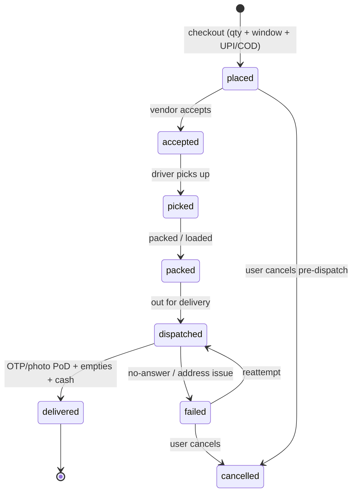
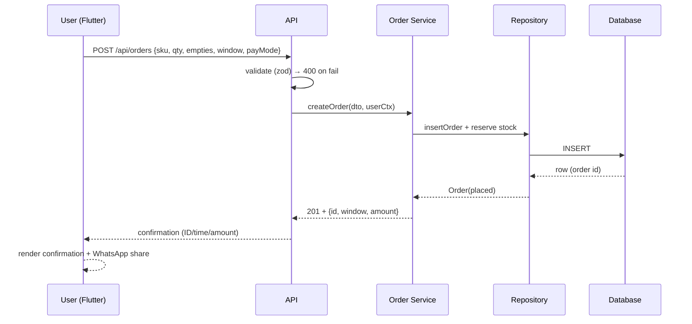

# D1 — Octal IT Solution: Water Delivery App Development Guide

- **Source**: https://octalsoftware.com/blog/water-delivery-app-development (Group D, code D1)
- **Read**: 2026-09-29. **Access: BLOCKED** — direct fetch returned HTTP 403 on both
  markdown and text attempts (bot-guard). No BrowserOS tab tools exist in this
  session, so the dedicated-browser fallback was unavailable.
- **Reconstruction basis (verified)**: Octal's adjacent on-demand guides retrieved via
  live search — InstaShop instant-delivery guide, medicine-delivery tri-panel page,
  on-demand services page (all octalsoftware.com, excerpts captured 2026-09-29).
  Items below marked **[direct]** (from Octal excerpts) vs **[inferred]** (standard
  Octal checklist pattern, needs re-verify when the page is reachable).
- **Shodasha scope anchor**: 20L Refill Rs 28 / Jar+Container Rs 30, repeat-order home,
  Rs 150 deposit, arrival window (no live dot), pause, WhatsApp, UPI+COD, 3 surfaces.

## 1. Octal's standard checklist (as corroborated across their guides)

| Checklist item | Octal content **[direct]** | Shodasha note |
|---|---|---|
| Quantity selection | Cart + checkout system; product browsing/search **[direct]** | −/+ steppers on the two 20L SKU cards (Rs 28 / Rs 30) |
| Scheduled deliveries | Scheduling of pickups, bookings done easily; subscription/refill options in on-demand pages **[direct]** | Delivery window at booking + pause/resume; no live dot |
| Tracking | Live order tracking: order status + courier position + approx delivery time; reduces support queries **[direct]** | Internal GPS for admin/driver; user sees 30-min arrival window + rider name/call |
| Payments | Secure payment integration; Stripe/Razorpay/PayPal APIs; multi-currency/multi-option checkout **[direct]** | UPI + COD at booking (Razorpay-compatible); wallet deferred to v2 |
| Auth | User registration/authentication, OTP verification **[direct]** | Phone + OTP for user app; role logins for driver/admin |
| Vendor/supplier panel | Store dashboard (orders, revenue, performance), product mgmt, auto inventory update, low-stock warnings **[direct]** | → Next.js super-admin: SKUs, stock, offers |
| Delivery-partner app | Task assignment, real-time tracking + navigation, order-status updates, earnings dashboard **[direct]** | → Flutter vendor/delivery app: stops, empties in/out, cash collected |
| Notifications | Order tracking + notifications **[direct]** | Confirmation (ID/time/amount), dispatch, arrival, payment reminders; WhatsApp-shareable |
| Tech stack | Google Maps/Mapbox APIs, real-time tracking + navigation, backend services/APIs, admin dashboards **[direct]** | Flutter (2x Android) + Next.js admin; maps SDK internal-only for v1 |
| Cost/timeline **[direct]** | Simple $15–30K / medium $30–80K / complex $80K+; basic 2–3 mo, 3–6 mo with AI/realtime **[direct, vendor claim — unverified]** | Budget sanity anchor only; not a quote |

## 2. Tri-app model (Octal pattern)

- **Customer app** [inferred standard]: browse → cart (quantity) → checkout
  (schedule + address + payment) → live tracking → history/invoices → support.
- **Vendor/store panel** [direct]: dashboard, product/inventory mgmt, order handling.
- **Delivery-partner app** [direct]: assigned tasks, navigation, status updates, earnings.
- Octal's medicine-delivery variant adds verified-delivery ideas reusable for PoD:
  OTP-based handover + photo/signature proof **[direct]** → adopt OTP handover for
  Shodasha jar exchange (empty count + cash collected at door).

## 3. Order-state sketch (Octal-consistent)

## 4. Request/response sketch (place order)

Failure branches: 400 validation, 401 auth, 409 double-submit (idempotency key),
429 rate-limit, 5xx retry-safe (no duplicate order).

## 5. MVP vs v2 (from D1)

- **MVP**: quantity steppers, scheduled windows, UPI/COD, status updates, OTP PoD,
  vendor accept/reject, driver tasks + navigation, admin dashboard.
- **v2 (future)**: AI recommendations/offers, IoT (see D3), advanced analytics,
  multi-currency wallets.

## 6. Open questions / re-verify

1. Re-open the D1 URL via a real browser when available; confirm the water-specific
   checklist verbatim (this file is reconstructed, not quoted).
2. Octal cost/timeline figures are vendor marketing — do not use for budgeting.
