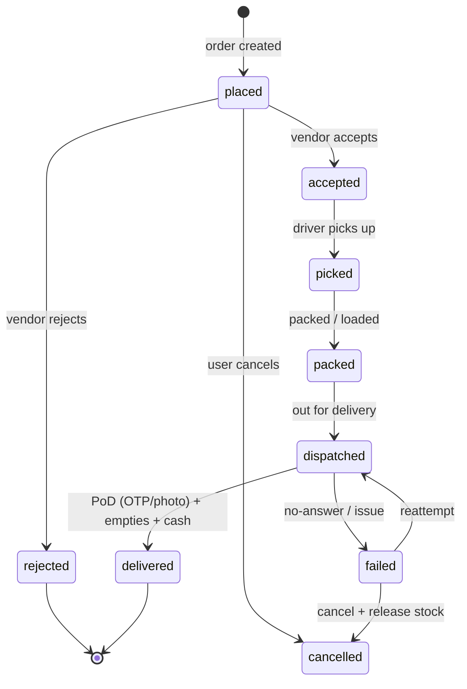
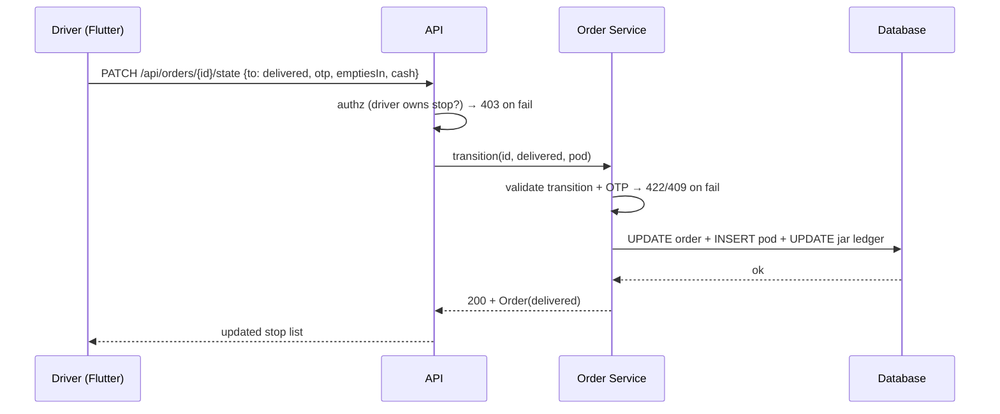

# D2 — Goteso: Water Delivery App Development (Tri-App Reference)

- **Source**: https://goteso.com/solutions/water-delivery-app-development.html
  (Group D, code D2). **Read**: 2026-09-29, full page fetched.
- **Why it matters**: the cleanest tri-app spec of the four guides — separate
  Customer / Vendor / Delivery-Agent feature lists plus a backend
  software/system layer. Used as the structural backbone of `_group-D-summary.md`.
- **Shodasha scope anchor**: 20L Refill Rs 28 / Jar+Container Rs 30, repeat home,
  Rs 150 deposit, arrival window (no live dot), pause, WhatsApp, UPI+COD.

## 1. Customer app checklist (Goteso → Shodasha user app)

| Goteso feature | Shodasha mapping (Flutter user app) |
|---|---|
| Registration/login via email, phone, social + OTP | Phone + OTP only (MVP); social deferred |
| Product catalog (cans, bottles, dispensers + images/pricing) | Two 20L SKU cards with −/+ steppers + empty-exchange stepper |
| Order placement: one-time or recurring; quantity, time, address | One-tap repeat (last settings pre-selected) + window picker; default 2 jars / next morning |
| Live order tracking (status + GPS map with agent location) | **Adapt**: arrival window + rider name/call; live dot suppressed in v1 (scope lock) |
| Schedule & manage: daily/weekly/custom; pause or skip | One-tap pause/resume link under order button (core Shodasha ask) |
| Payments: cards, wallets, UPI, COD + gateway integration | UPI + COD chips at booking; wallet/cards in v2 |
| Order history & invoices (view/download/email) | Confirmation (ID/time/amount) + WhatsApp-shareable bill |
| Ratings & reviews (agents + products) | Post-delivery feedback sheet; complaint → WhatsApp |
| Notifications (confirmation, dispatch, reminders) | Confirmation, dispatch, arrival, payment/low-balance reminders |
| Customer support (chat, call) | WhatsApp help button (home + account) |

## 2. Vendor app checklist (Goteso → Shodasha Next.js super-admin + vendor ops)

| Goteso vendor feature | Shodasha mapping |
|---|---|
| Login & profile mgmt | Role logins (vendor, dispatcher, super-admin) |
| Product mgmt (add/edit/remove, prices, stock, offers) | SKU/stock/offer console in super-admin web |
| Order mgmt (new/pending/completed; accept/reject) | Order queue with accept/reject + auto-dispatch (see D4) |
| Inventory tracking + low-stock alerts | Jar-asset ledger (plant → vehicle → customer); low-stock alerts |
| Delivery coordination (assign agents, view status) | Stop lists, route sequencing, driver assignment |
| Earnings & reports (daily/weekly, commission, payouts) | Collections, dues, UPI-vs-COD split, P&L export |
| Customer feedback view | Ratings/complaint inbox |
| Push notifications | Order/stock/announcement pushes |

Goteso's backend note: pair the apps with water-delivery **software** (subscriptions,
billing, scheduling, inventory) and a **system** (orders + route planning + driver
activity + stock movement in real time) — i.e. the Next.js admin is not a CRUD
skin, it owns the subscription engine and the jar ledger.

## 3. Delivery-agent app checklist (Goteso → Shodasha Flutter vendor/delivery app)

| Goteso driver feature | Shodasha mapping |
|---|---|
| Login; task dashboard (assigned deliveries, pickup/drop addresses) | Per-stop queue: address, customer, qty, empties expected |
| GPS navigation (Google Maps or similar) | Internal navigation + sequenced stops |
| Status updates: picked / out-for-delivery / delivered + notes | Full state machine (see §4); driver advances states |
| **Digital proof of delivery** (signature or photo) | OTP handover + photo + empties-in count + cash collected |
| In-app call/chat with customer | Call button; chat deferred (WhatsApp instead) |
| Earnings dashboard | Completed stops + cash collected per shift |
| Availability toggle (shifts) | Driver on/off duty toggle |
| Notifications (new delivery alerts, reminders) | Assignment + reattempt pushes |

## 4. Order-state machine (Goteso-derived)

## 5. Request/response sketch (advance state + PoD)

Branches: 401/403 auth, 409 illegal transition, 422 bad OTP, 5xx retry-safe
(idempotency key per stop).

## 6. MVP vs v2 (from D2)

- **MVP**: phone/OTP auth, 2-SKU catalog, repeat + window, UPI/COD, pause/skip,
  status updates, OTP/photo PoD, driver tasks + nav, admin queue + inventory + reports.
- **v2**: social login, cards/wallets, in-app chat, commissions/payouts engine,
  customer-facing live map (only if scope lock revisits the no-dot rule).

## 7. Open questions

1. Goteso stack (React Native + Laravel + MariaDB/MySQL) is vendor-stack marketing —
   Shodasha stack stays Flutter + Next.js per ADR-004; no decision implied.
2. Pause/skip semantics (pause one delivery vs whole subscription) need Series-3 spec.
