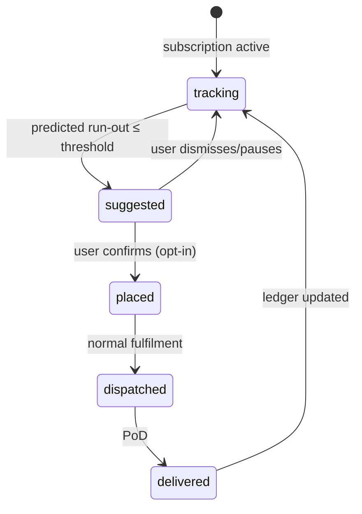
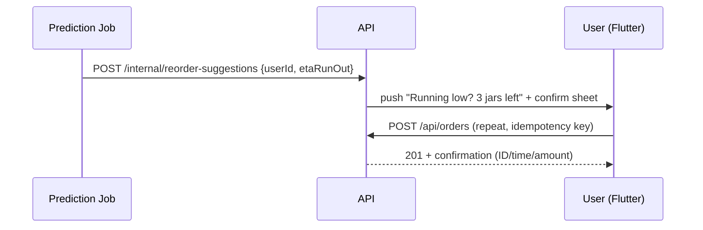

# D3 — Appinop: AI Auto-Reorder, IoT, Route Optimization, Deposit Management

- **Source**: https://appinop.com/water-delivery-app-development-company
  (Group D, code D3). **Read**: 2026-09-29, full page fetched.
- **Role in group D**: the "future" guide — everything here is positioned as
  **v2, not MVP**: AI consumption prediction, smart auto-reorder, IoT dispenser
  integration, route optimization, deposit management at scale, B2B.
- **Shodasha scope anchor**: MVP stays repeat-tap + window + UPI/COD + OTP PoD;
  this file's items are parked for v2 unless Series-3 promotes them.

## 1. AI auto-reorder (Appinop claims → Shodasha v2 parking)

- Consumption prediction 95% accuracy (household size, weather, history);
  demand forecasting for seasonal spikes; ETA optimization ±15 min with traffic;
  dynamic pricing (+20% revenue claim); AI support bot 24/7 **[vendor claims —
  unverified, treat as marketing]**.
- Mapped to Shodasha v2: usage tracking per household → reorder suggestion →
  one-tap confirm (never silent auto-charge in v1; explicit opt-in + confirmation).
- MVP counterpart (ship now): "Running low?" nudge based on simple days-since-last
  heuristic + the manual repeat button — no ML needed.

## 2. IoT integration (v2)

- IoT dispenser integration (level sensing), USA-market feature; smart storage &
  delivery monitoring pattern **[direct]**.
- Shodasha v2: jar-level sensing is out of reach for 20L exchange economics;
  realistic IoT is plant-side (stock/vehicle) not household-side. Park entirely.

## 3. Route optimization (plan hooks in MVP, full engine in v2)

- Smart multi-stop planning, fuel savings, "25% delivery-cost saved" claim
  **[unverified]**; GPS via Google Maps/Mapbox + geofencing; tech list:
  React Native/Flutter, Node/Python, TensorFlow, Razorpay/subscriptions **[direct]**.
- Shodasha: MVP = admin-sequenced stop lists + driver GPS nav (covers D4's
  multi-stop need); v2 = auto-sequencing + traffic-aware ETA. Keep route
  data model (stops, sequence, geofence) from day one so v2 is an upgrade,
  not a rewrite.

## 4. Deposit management (MVP-adjacent — Shodasha core)

- Flexible payments incl. subscriptions, COD, **bottle deposits**; FAQ confirms
  drivers manage bottle returns and deposits **[direct]**.
- Shodasha mapping (ship in MVP): Rs 150 refundable deposit/jar asked at booking;
  empty-exchange stepper; driver records empties-in per stop; jar ledger
  (plant → vehicle → customer premises) with per-customer balance; deposit
  disputes near zero is a success metric (project-overview).

## 5. Subscription management (MVP core)

- Weekly/monthly plans, flexible schedules, auto-renewal, pause options **[direct]**.
- Direct fit: standing orders + one-tap pause/resume; subscriptions auto-generate
  the next delivery (no manual entry).

## 6. Quality tracking + compliance (MVP-lite)

- Quality reports, source info, certifications (WHO/FDA/FSSAI/ISO/BIS pattern);
  B2B bulk/corporate accounts **[direct]**.
- Shodasha MVP: show source + certification badges on SKU cards; full lab-report
  viewer and B2B portal are v2.

## 7. Future-state sketch (v2 auto-reorder loop)

Request/response sketch (v2 suggestion):

## 8. Cost/timeline anchor + warnings

- Appinop: $20K–$100K+, 3–6 months, 10–14 weeks to MVP **[vendor claims]**.
- Market stats on page ($350B by 2028, 7.2% CAGR, 65% prefer home delivery, 92%
  retention) are **unverified** — R-F owns verification; do not quote in specs.

## 9. Open questions

1. Auto-reorder opt-in UX (silent vs confirm) — Series-3 must decide; default is
   confirm-first (trust > automation for water).
2. Deposit edge cases: broken jar, brand-mismatch empties, deposit refund path —
   needs Series-3 spec with R-B (operations) and R-E (Bisleri deposit reference).
