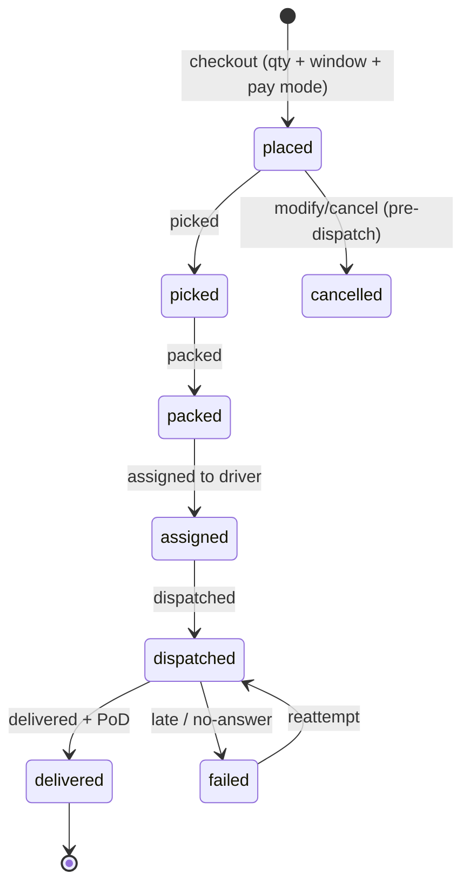
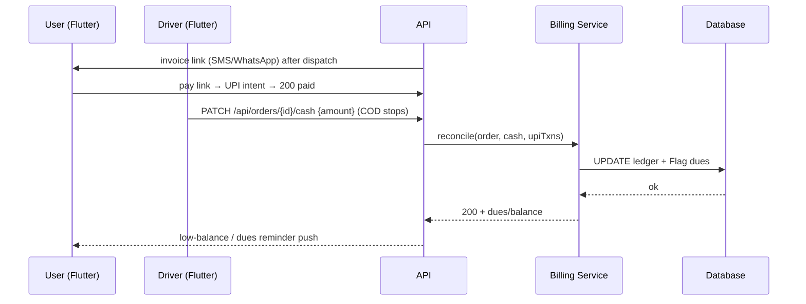

# D4 — Water Delivery Solutions: Seamless Customer Journey

- **Source**: https://www.waterdeliverysolutions.com/blog/seamless-customer-journey-with-water-delivery-app-development-solutions
  (Group D, code D4). **Read**: 2026-09-29, full page fetched.
- **Slug note (honest)**: the PDF index truncated the slug at
  `seamless-customer-journey-`; the closest live match found via search is the
  `...-with-water-delivery-app-development-solutions` URL above (June 22, 2023,
  WDS blog). Treated as D4 on content match (customer-journey + lifecycle +
  ETA + payment links + Salesforce stats all present).
- **Shodasha scope anchor**: repeat home, arrival window, UPI+COD, WhatsApp,
  confirmation discipline (ID/time/amount).

## 1. Order lifecycle (verbatim from D4)

> Customers receive real-time order status updates as their water bottles are
> **picked, packed, assigned, dispatched and delivered.**

Proposed machine adds `placed` (checkout) at the front and `assigned` as D4 orders
it (assign after pack — kept as-sourced; Series-3 may reorder to assign→pick):

D4 also stresses: one-time **or subscription** orders, place/modify/cancel from the
customer app, predefined vendor schedules, auto-update to admin panel (no
call/WhatsApp ordering, fewer human errors) → maps to Shodasha repeat + window +
pause.

## 2. ETA + live tracking (adapted for Shodasha)

- D4: live tracking + system-calculated **ETA from distance** so customers are
  available at the door **[direct]**.
- Shodasha adaptation (scope lock): ETA feeds the **30-min arrival window**
  shown to users (e.g. 9–9:30 AM); raw live dot stays internal (driver/admin).
  Rider name + call button accompanies the window.

## 3. Payment links + flexible payments (MVP core)

- Auto-generated order summaries/invoices, sent via email/SMS, viewable in-app;
  **invoices are linked-based — customers pay directly from the link** (NPS driver)
  **[direct]**.
- Flexible modes: PayPal, Paytm, Stripe, Sagepay/Trustpay, debit/credit, **cash**;
  drivers enter cash received in the driver app → auto-updated in admin **[direct]**.
- Shodasha mapping: UPI + COD chips at booking; bill/confirmation WhatsApp-shareable
  (link-pay pattern); driver cash entry syncs to admin; pending-payment and
  low-balance reminder notifications (D4: protects cash flow, avoids subscription
  suspension) **[direct]**.

## 4. CX stats (verbatim, with sources as cited by D4)

- **78%**: "if the business offers a good customer experience, 78% of customers will
  do the business again even after a mistake" — cited as Salesforce research **[as
  cited by WDS; verify against Salesforce source before quoting externally]**.
- **89%** likely to make repeat sales after a positive experience — Salesforce State
  of the Connected Customer, 4th ed. **[as cited]**.
- **$1.6T** lost annually by US companies to poor CX (CMSWIRE) **[as cited]**.
- 5–7x cost of acquiring vs retaining a customer **[as cited, industry adage]**.
- Use in synthesis: justify confirmation discipline + windows + reminders as
  retention levers, not decoration.

## 5. Tri-component sync (D4 architecture line)

> Admin panel + customer interface + driver application, in synchronisation —
> changes on either app reflect in the admin panel **[direct]**.

Request/response sketch (payment-link + cash reconciliation):

Branches: link expired (reissue), partial cash (dues carry-forward), 409 double-pay
(idempotency key), offline driver (queued sync on reconnect).

## 6. MVP vs v2 (from D4)

- **MVP**: lifecycle statuses, ETA→window, invoice links, UPI+COD+cash-entry,
  auto/manual notifications, payment reminders, coupons/discounts hooks (WDS lists
  coupons; Shodasha parks promos to v2).
- **v2**: full live customer tracking, NPS/CSAT dashboards, promo engine.

## 7. Open questions

1. D4's assign-after-pack ordering vs Goteso's accept-then-pick — Series-3 must lock
   one canonical sequence (proposal in `_group-D-summary.md`).
2. Coastal Water Store "500% customer base" case study on the same site is a
   **vendor claim** — do not cite as evidence.
