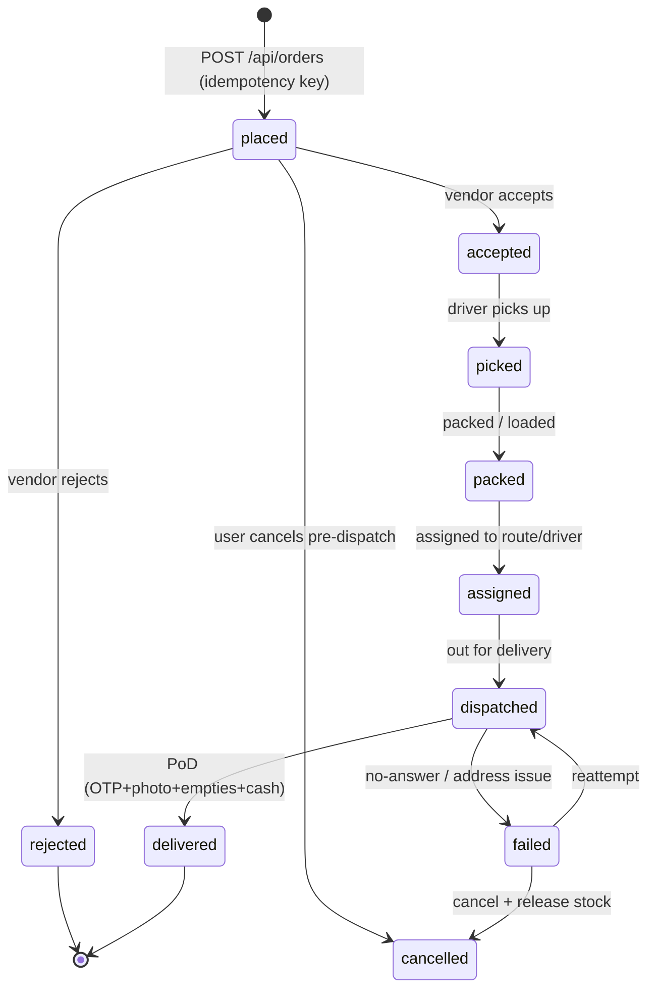
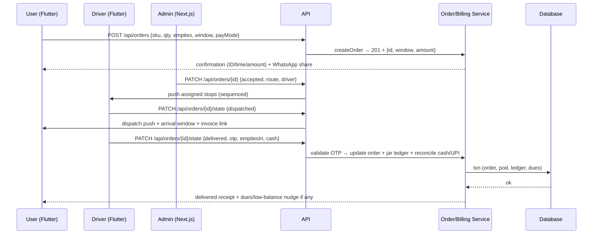

# Group D Summary — Unified Tri-App Checklist, Order-State Machine, MVP vs v2

- **Group**: D-dev-guides (R-D). **Date**: 2026-09-29.
- **Inputs**: D1-octal (reconstructed — page 403-blocked), D2-goteso-triapp
  (structural backbone), D3-appinop-ai-iot (v2/future), D4-customer-journey
  (lifecycle + ETA + payment links + CX stats).
- **Method note**: live reads via webfetch (this session has no BrowserOS tab tools;
  ADR-005's browseros-neo path was loaded but not executable here — re-verify D1
  via a real browser when available).
- **Shodasha scope**: 20L Refill Rs 28 / Jar+Container Rs 30, repeat home, Rs 150
  deposit, arrival window (no live dot), pause, WhatsApp, UPI+COD; surfaces =
  Flutter user app + Flutter vendor/delivery app + Next.js super-admin web.

## 1. Unified tri-app feature checklist

### Flutter user app (customer)

- [ ] Phone + OTP auth (MVP); social login v2
- [ ] Two 20L SKU cards with −/+ steppers + empty-exchange stepper + Rs 150/jar note
- [ ] One-tap repeat (BOOK NOW, last settings pre-selected; default 2 jars / next morning)
- [ ] Window picker (predefined vendor schedules); one-tap pause/resume
- [ ] UPI + COD chips at booking; invoice **payment links** (D4) via SMS/WhatsApp
- [ ] Order status card: 4-step progress + 30-min arrival window + rider name/call (no live dot)
- [ ] History + WhatsApp-shareable bills; feedback sheet / complaint → WhatsApp
- [ ] Pushes: confirmation (ID/time/amount), dispatch, arrival, dues/low-balance reminders

### Flutter vendor/delivery app (driver)

- [ ] Duty toggle; sequenced stop queue (address, customer, qty, empties expected)
- [ ] Internal GPS navigation; state advance per stop (picked → packed → dispatched → delivered)
- [ ] **Proof of delivery**: OTP handover + photo + empties-in count + cash collected (D2+D4)
- [ ] Runtime order edit/cancel at door; cash entry auto-syncs to admin (D4)
- [ ] Call customer button; per-shift earnings + cash reconciliation
- [ ] Offline queue → sync on reconnect

### Next.js super-admin web

- [ ] Order queue: accept/reject, assign, auto-dispatch, multi-stop route sequencing
- [ ] Subscription engine: standing orders, auto-generate next delivery, pause handling
- [ ] Jar-asset ledger (plant → vehicle → customer) + per-customer balance + low-stock alerts
- [ ] Billing: UPI/COD reconciliation, dues carry-forward, GST invoice export, UPI-vs-COD split
- [ ] CRM-lite: profiles, custom pricing hooks (v2), ratings/complaint inbox
- [ ] Analytics: on-time window adherence, repeat rate, reorder time, deposit disputes

## 2. Canonical order-state machine (proposed for Series-3 approval)

Merges D4's verbatim lifecycle (picked→packed→assigned→dispatched→delivered) with
D2's accept/reject front and failure branches. Payment is a **separate field**
(`unpaid | link_sent | paid_upi | paid_cash | partial_dues`), not an order state.

Guards: only forward-or-cancel transitions (409 otherwise); `dispatched→delivered`
requires valid OTP + empties count; cancel after dispatch needs dispatcher override.

## 3. Request/response sketch (full loop: place → dispatch → PoD → reconcile)

Error branches: 400 validation, 401/403 auth, 409 illegal transition / double-submit,
422 bad OTP, link-expired (reissue), offline driver (queued sync).

## 4. MVP vs v2 split (group-D consensus)

| Area | MVP (Series-3 spec) | v2 (parked) |
|---|---|---|
| Ordering | Repeat + steppers + window + pause/resume | AI suggestions, silent auto-reorder (D3) |
| Tracking | Arrival window + rider/call; GPS internal | Customer live map, ±15-min traffic ETA (D3) |
| Payments | UPI + COD + invoice links + cash entry + reminders | Cards/wallets, dynamic pricing (D3) |
| Deposits | Rs 150/jar, exchange stepper, jar ledger | Deposit refunds automation, breakage rules |
| Driver | Tasks, nav, OTP/photo PoD, offline queue | Route-AI auto-sequencing (D3) |
| Admin | Queue, subscriptions, ledger, billing, reports | NPS/CSAT dashboards, promos, B2B portal (D3/D4) |
| Compliance | Source/certification badges | Lab-report viewer (D3) |

## 5. Evidence integrity notes

- D1 content is **reconstructed** (403-blocked); D2–D4 are full-page reads.
- Vendor numbers (Octal $15–80K+, Appinop $20–100K / 92% retention / 95% AI accuracy /
  25% route savings / $350B market, WDS 500% case study) are **unverified marketing** —
  useful as anchors, never as commitments. Market figures belong to R-F.
- D4's 78% (Salesforce, good CX → repeat business after a mistake) and 89%
  (positive experience → repeat sale) are **as cited by WDS**; verify against the
  Salesforce 4th-ed report before external quoting.
- D4 slug was truncated in the PDF index; resolved to the closest live match and
  noted in D4 file.

## 6. Handoff to Series-3

1. Lock the §2 state machine (one decision: keep D4's assign-after-pack or move
   assign before pick).
2. Spec pause semantics (skip-one vs pause-all) with R-B.
3. Spec deposit edge cases (breakage, brand-mismatch, refunds) with R-B + R-E.
4. Confirm-first rule for any auto-reorder (trust > automation).
