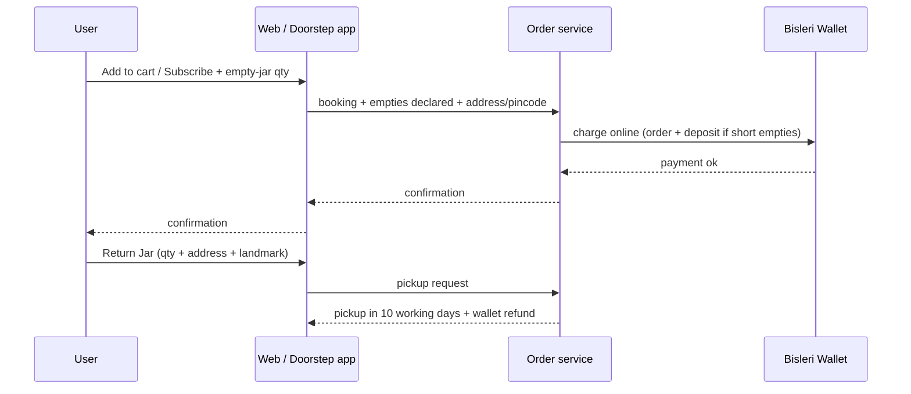

# E1 — Bisleri Official FAQs (bisleri.com/FAQs.html)

- **Source**: https://bisleri.com/FAQs.html (E1)
- **Fetched**: 2026-09-29 via webfetch (full page markdown)
- **Group**: E-bisleri (industry standard) → maps to Findings F2, F5, F7
- **Surfaces affected**: user app (booking, subscription, hold, return), super-admin web (wallet, disputes), vendor app (delivery rules)

## 1. Verbatim rule extraction

### FAQ-1 — How to Place an Order (one-time)
1. Visit `www.bisleri.com` or download **Bisleri@Doorstep** app (Play Store / App Store).
2. Website one-time: Shop Products → All Products → select product → Add to cart. App: tap Add button.
3. Cart icon → review order + billing details.
4. **20L jar rule**: "if you have empty jars, please mention the corresponding number beside **Have empty Bisleri jars with cap? If yes, select the quantity below.**"
5. Website: Checkout → payment page. App: Proceed icon.
6. Add delivery address with pincode.
7. Make payment → receive order confirmation.

### FAQ-2 — How to start a new subscription
1. Log in on web or Doorstep app.
2. Shop products → All Products → Add to cart (read delivery instructions first). App users tap **Subscribe button**.
3. Select **Subscription Type (Daily, Weekly or Custom)**, **Subscription Duration (1 Month, 3 Months, 6 Months or 1 Year)**, days of delivery & payment frequency.
4. Add to Cart (web) / Cart icon (app).
5. **20L subscription**: same empty-jar declaration — "Have empty Bisleri jars with cap? If yes, select the quantity below."
6. Check pricing details & split → Checkout (web) / Proceed → Continue → Payment Page (app).
7. Pay → order confirmation.
8. Delivery commences on selected delivery day. **Same-day delivery isn't possible** — select next working day for quicker delivery.
9. Advice: review consumption pattern, pick matching frequency. **Can hold subscription temporarily if needed.**

### FAQ-3 — How to Hold your Subscription
1. Log in (web/app).
2. Web: Account Settings. App: Subscription icon.
3. Web: My subscriptions. App: same under Subscription icon.
4. Mobile: tap **Hold Deliveries**.
5. Select hold duration → Confirm.
6. Subscription paused **for the selected date range**.

### FAQ-4 — How to Activate / Resume paused subscription
1. Log in (web/app).
2. Web: Account Settings. App: Subscription icon.
3. Web: My subscriptions. App: View Detail.
4. Under Hold Subscription → Resume Subscription. App: Subscription Details.
5. Web: Yes, Activate. App: Activate Subscription.
6. Subscription resumed/activated.
7. **Must activate at least 24 hours before scheduled delivery day.** After activation, delivery per scheduled day + frequency. **Customer must choose preferred delivery date for timely delivery.**

### FAQ-5 — Empty jar Pick-up / Return request
1. Log in (web/app).
2. Click Profile icon.
3. Web: **Return Jar**. App: **Return Empty Jar**.
4. Mention number of jars for pick-up.
5. Mention current address + landmark.
6. Submit.
7. **Eligibility**: only 20L jars purchased through Bisleri website/app **by paying online security deposit after July 2021**. Store / retailer / DB purchases → return empties to respective seller.
8. Pick-up within **10 working days** of request.
9. Refund credited to **Bisleri wallet**, transferable to source account.

### FAQ-6 — Account activation
- Call Toll-Free **18001211007** or `wecare@bisleri.co.in` for reactivation.
- Customer care **8 AM–8 PM, except Sundays and public holidays**.

### FAQ-7 — Payment Flow / Bisleri Wallet
1. Customer may use **Bisleri Wallet** to pay for orders.
2. Customer may use available payment gateways to add money to wallet.
3. May add any amount **≥ order amount**.
4. May **withdraw wallet balance to source account**.

## 2. Interaction flow (E1)

```mermaid
flowchart LR
    A([Booking start]) --> B[Select product: one-time / Subscribe]
    B --> C{20L jar?}
    C -- yes --> D[Prompt: Have empty Bisleri jars with cap? + qty stepper]
    C -- no --> E[Skip empty declaration]
    D --> F[Cart + pricing split + address/pincode]
    E --> F
    F --> G[Pay online / Wallet]
    G --> H[Confirmation]
    H --> I{Subscription?}
    I -- yes --> J[Type Daily/Weekly/Custom + Duration 1mo-1yr + days + pay freq]
    J --> K[Delivery from next working day]
    K --> L{Hold needed?}
    L -- yes --> M[Hold Deliveries + date range + Confirm]
    M --> N[Resume >=24h before delivery + pick date]
    L -- no --> O[Scheduled deliveries]
    N --> O
```

## 3. Shodasha implication

| Bisleri rule (E1) | Shodasha adoption |
|---|---|
| Empty-jar prompt with cap + qty stepper at booking AND subscription | **Adopt 1:1** — empty-exchange stepper on booking card; label "Empty jars with cap to return"; qty feeds deposit calc. User app. |
| Subscription types Daily/Weekly/Custom; durations 1/3/6/12 mo; delivery days + pay frequency | **Adopt simplified** — Shodasha Phase-1: repeat/one-tap + pause; Custom/Weekly schedule deferred to auto-delivery v2 but data model keeps `type + duration + days + freq` fields. User app + admin. |
| Hold for date range + resume ≥24h before delivery + must pick preferred date | **Adopt 1:1** — one-tap pause/resume link under order button; enforce 24h resume cutoff; store hold range. User app. |
| Return Jar via Profile → qty + address + landmark → Submit; 10 working days; wallet refund + transfer to source | **Adopt flow, adapt refund** — Return-jar request screen (qty + address + landmark); SLA 10 working days shown; Phase-1 refund via UPI/manual (COD market), wallet = v2. User + vendor + admin. |
| Eligibility: only online-deposit jars after Jul 2021; offline → return to seller | **Adopt note** — Shodasha deposit ledger per jar; offline/other-brand empties rejected or non-refundable — show reason at handover. Vendor app + admin. |
| Wallet pay / top-up ≥ order / withdraw to source | **Defer to wallet v2** — Phase-1 = UPI + COD (Shodasha scope); keep wallet fields in model so Bisleri parity is a migration, not rewrite. |
| Support 18001211007 / wecare@, 8AM–8PM ex-Sun/holidays | **Adapt** — Shodasha: WhatsApp help button (home + account) + same hours note; toll-free/email pattern reused for escalation. |
| No same-day subscription start; next working day | **Adopt** — default delivery = tomorrow morning window; copy "delivery from next working day". |

## 4. Evidence notes
- Empty-jar prompt wording is identical in FAQ-1 step 5 and FAQ-2 step 6 — confirms stepper is mandatory for both one-time and subscription 20L.
- Hold (FAQ-3) and Resume (FAQ-4) are separate flows with different CTAs (Hold Deliveries vs Yes, Activate) — Shodasha pause link must expose both states.
- Return-jar SLA and wallet refund are in FAQ-5 note, not the step list — must be shown as post-submit confirmation text, not buried.
