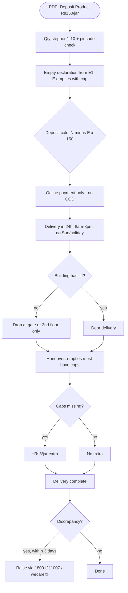
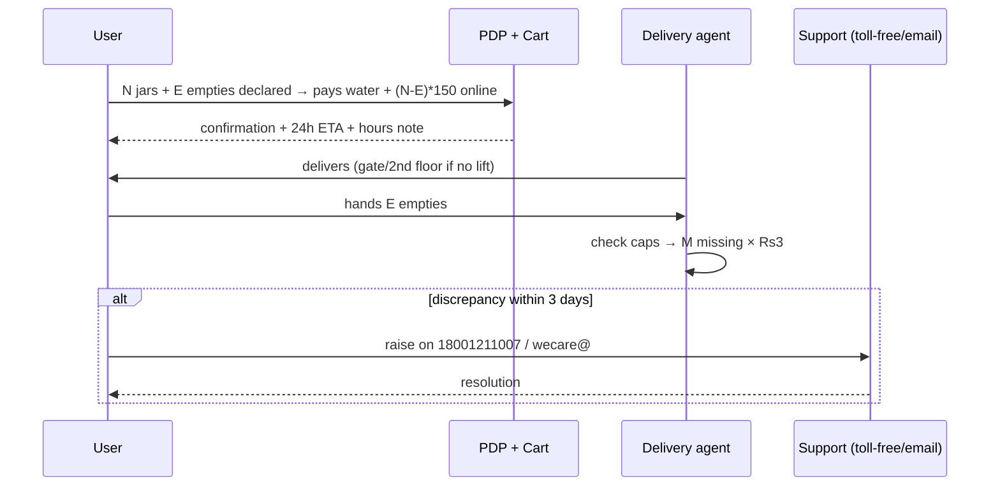

# E2 — Bisleri 20L Jar Deposit Product Page (Bis-20LTRDeposit-Amount-Product.html)

- **Source**: https://bisleri.com/Bis-20LTRDeposit-Amount-Product.html (E2)
- **Fetched**: 2026-09-29 via webfetch (full page markdown)
- **Group**: E-bisleri (industry standard) → maps to Finding F2
- **Surfaces affected**: user app (deposit calc, delivery expectations), vendor app (cap check, lift rule), super-admin web (disputes, refunds)

## 1. Verbatim rule extraction

### Price block
- **₹150/- Per Jar (Inclusive of all taxes)** — Deposit Amount Product.
- Qty stepper: Select Quantity, −/+ , values 1–10.
- Availability: In Stock. CTA: Add to cart.
- Pincode check line: "Delivery available for this pincode for 1 jar subscription order" (green) vs "We are not servicing this pincode" (red).

### Delivery Instructions (8 bullets, verbatim)
1. "Dear Customer, we endeavour to serve you within 24 hours."
2. "**The cash on delivery option is not available** for both one-time and subscription orders."
3. "If you don't have empty Bisleri 20-litre Jar, There will be **(refundable) deposit charge of Rs. 150/- Per Jar**."
4. "It is **mandatory to handover empty Jars with jar caps. If caps are missing, Rs.3 per jar will be charged extra.**"
5. "Offers will be void in case of cancellation of subscription."
6. "In case your building **doesn't have a lift, the delivery will be done either till the security gate or till the 2nd floor only**."
7. "Our **Delivery hours are from 8am to 8pm on all days except Sunday**. please note that there will be **no deliveries during public holidays and Sundays**."
8. "Customer is eligible to raise any requests related to the **discrepancy in delivery updates within three days** upon receiving communication on his/her registered mobile/email. Such requests can be raised on our toll free - **18001211007** or email - **wecare@bisleri.co.in**."

### Product Description (quality + shelf)
- 10-step quality process, 114 quality tests, added minerals, TDS up to 150 PPM, double ozonisation, contactless production.
- BEST BEFORE ONE MONTH FROM MANUFACTURE.
- Green-tinted vs transparent 20L cans: both authentic during transition.

### Doorstep 3-step pitch (Related Products section)
1. Select product → 2. Select plan (one-time or subscription) → 3. Delivered to doorstep. Online purchase + home delivery in major metros.

## 2. Deposit calculation logic

```
ordered_jars   = N            (qty stepper 1–10)
empties_with_cap = E          (E1 prompt qty)
caps_missing   = M            (counted at handover)
deposit_due    = max(0, N - E) × 150
cap_charge     = M × 3
payable_now    = water_bill + deposit_due        (online only — no COD)
payable_at_handover = cap_charge (if caps missing on empties handed over)
refund_on_return = returned_jars × 150 → Bisleri wallet → source account
```

Example: order 2 jars, declare 1 empty with cap → deposit = (2−1)×150 = Rs 150. Hand over 1 empty without cap → +Rs 3.

## 3. Interaction flow (E2)





## 4. Shodasha implication

| Bisleri rule (E2) | Shodasha adoption |
|---|---|
| Rs 150/jar refundable deposit (incl. taxes), qty 1–10 | **Adopt 1:1** — Rs 150/jar exchange deposit already in Shodasha scope; show "refundable" + math `(N−E)×150` under stepper. User app. |
| Empty handover mandatory with caps; Rs 3/jar extra if cap missing | **Adopt 1:1** — cap-missing +Rs 3 note at booking; vendor app counts caps at handover, adds charge. |
| No COD (one-time + subscription, online only) | **Diverge deliberately** — Shodasha Phase-1 keeps UPI + COD (local refill market); show deposit payable via UPI/COD, note Bisleri is prepaid-only for reference. Decision log entry. |
| 24h endeavour; 8AM–8PM; closed Sun + public holidays | **Adopt hours, adapt SLA** — Shodasha arrival window (30-min, e.g. 9–9:30 AM) sits inside 8AM–8PM; Sunday-closed + holiday note shown at booking. |
| No lift → gate or 2nd floor only | **Adopt 1:1** — delivery-note copy + vendor-app stop instruction; capture lift flag at address. |
| 3-day discrepancy window via toll-free/email on registered contact | **Adopt window, adapt channel** — 3-day dispute window in admin; raise via WhatsApp help + call (Shodasha), logged to super-admin. |
| Offers void on subscription cancellation | **Adopt** — discount/coupon void on cancel; show at confirm step. Admin billing rule. |
| Pincode serviceability check (green/red) | **Adopt** — pincode/GPS service check before BOOK NOW enabled. User app. |
| Green vs transparent cans both authentic | Shodasha equivalent: jar-condition photo/accept rule at handover to avoid brand disputes. Vendor app. |

## 5. Evidence notes
- Deposit product is a separate SKU (not bundled water price) — confirms deposit is a ledger item, refundable, not revenue.
- Cap charge (Rs 3) is in Delivery Instructions, not FAQs — must be surfaced at booking anyway or it becomes a handover surprise.
- No-COD + wallet-only (E1 FAQ-7) + 3-day window + Sunday-closed all live on the same PDP — the PDP is the single "rulebook" surface; Shodasha booking-confirm screen plays that role.
