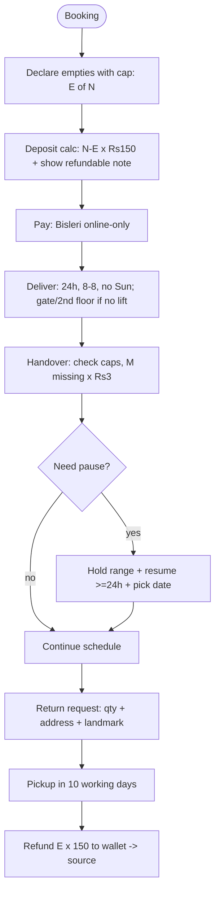

# Group E Summary — Bisleri Rulebook + Shodasha Adoption

- **Sources**: E1 FAQs + E2 20L Deposit Product Page (both fetched full 2026-09-29)
- **Role**: industry-standard reference for deposits, holds, returns, wallet, delivery discipline
- **Detail files**: `E1-bisleri-faqs.md`, `E2-bisleri-deposit.md`

## 1. Bisleri rulebook (consolidated)

| # | Rule | Value / wording | Source |
|---|---|---|---|
| R1 | Empty-jar declaration prompt | "Have empty Bisleri jars with cap? If yes, select the quantity below." + qty stepper — both one-time AND subscription | E1 FAQ-1§5, FAQ-2§6 |
| R2 | Refundable deposit | **Rs 150 / jar**, incl. taxes, qty 1–10, separate deposit SKU | E2 price block + instruction §3 |
| R3 | Deposit formula | `(ordered − empties_declared) × 150` | E1+E2 combined |
| R4 | Cap-missing surcharge | Empties **must have caps**; **Rs 3 / jar extra** if missing | E2 instruction §4 |
| R5 | Payment mode | **No COD** (one-time + subscription); online / Bisleri Wallet only | E2 §2; E1 FAQ-7 |
| R6 | Subscription types | **Daily / Weekly / Custom** | E1 FAQ-2§3 |
| R7 | Subscription durations | **1 Month / 3 Months / 6 Months / 1 Year** + delivery days + payment frequency | E1 FAQ-2§3 |
| R8 | No same-day start | Subscription starts selected day; same-day impossible → pick **next working day** | E1 FAQ-2§9 |
| R9 | Hold | Account Settings / Subscription icon → My subscriptions → **Hold Deliveries** → date range → Confirm; paused for range | E1 FAQ-3 |
| R10 | Resume | Resume / Yes, Activate; must resume **≥24h before** delivery day; must **choose preferred delivery date** | E1 FAQ-4 |
| R11 | Return-jar request | Profile → **Return Jar / Return Empty Jar** → qty + address + landmark → Submit | E1 FAQ-5§1–6 |
| R12 | Return eligibility | Only jars bought via **website/app with online deposit after Jul 2021**; retail/DB → return to seller | E1 FAQ-5§7 |
| R13 | Pickup SLA + refund path | Pick-up within **10 working days**; refund to **Bisleri wallet** → transferable to source | E1 FAQ-5§7 |
| R14 | Wallet | Pay via wallet; top-up via gateway **≥ order amount**; withdraw to source | E1 FAQ-7 |
| R15 | Delivery SLA | **Endeavour within 24 hours** | E2 §1 |
| R16 | Delivery hours | **8 AM–8 PM, all days except Sunday**; no deliveries **Sundays + public holidays** | E2 §7; E1 FAQ-6 |
| R17 | Lift rule | No lift → delivery **till security gate or 2nd floor only** | E2 §6 |
| R18 | Dispute window | **Within 3 days** of comms on registered mobile/email → **18001211007 / wecare@bisleri.co.in** | E2 §8 |
| R19 | Cancellation | **Offers void** on subscription cancellation | E2 §5 |
| R20 | Serviceability | Pincode check: servicable / not-servicable for subscription | E2 price block |
| R21 | Quality/shelf proof | 10-step, 114 tests, TDS 150 PPM, best-before 1 month; green vs transparent cans both authentic | E2 description |

## 2. End-to-end interaction (booking → refund)



```mermaid
sequenceDiagram
    participant U as User
    participant C as Doorstep (web/app)
    participant V as Delivery agent
    participant W as Wallet/Ledger
    participant S as Support
    U->>C: N jars + E empties + address/pincode + plan (one-time/Daily/Weekly/Custom, 1-12mo)
    C->>C: deposit=(N-E)*150; cap note Rs3; hours/Sun; lift check
    C->>W: online payment (no COD)
    W-->>C: ok → confirmation
    V->>U: deliver in 24h (gate/2F if no lift)
    U->>V: hand E empties; M caps missing → +M*3
    U->>C: Hold range / Resume ≥24h (if away)
    U->>C: Return Jar request
    V->>U: pickup ≤10 working days
    W->>U: refund to wallet → source
    alt discrepancy ≤3 days
      U->>S: 18001211007 / wecare@
    end
```

## 3. What Shodasha adopts

### Adopt 1:1
- **Empty stepper + deposit note at booking** — "Empty jars with cap to return" stepper; live math `(N−E)×150`; "Rs 150/jar refundable" label. (User app booking card — already in scope.)
- **Cap-missing Rs 3/jar** — booking note + vendor-app handover counter. (User + vendor.)
- **Hold + resume** — one-tap pause link; date-range hold; **≥24h resume cutoff**; must pick preferred date. (User app.)
- **Return-jar request** — qty + address + landmark; **10-working-day SLA** shown on confirm. (User + vendor.)
- **Lift rule** — "No lift → gate / 2nd floor only" copy + address lift flag + vendor stop instruction.
- **Hours + Sunday/holiday closed** — 8AM–8PM; no Sun/holiday; arrival window lives inside hours.
- **3-day dispute window** — enforce in super-admin; raise via WhatsApp help + call (Shodasha channel adapt).
- **Offers void on cancel** — billing rule in admin.

### Adapt / diverge (with reason)
- **No-COD → DIVERGE**: Bisleri is prepaid/wallet-only; Shodasha Phase-1 keeps **UPI + COD** (local Rs 28/30 refill market, scope-locked). Deposit collected via UPI/COD at door. Log as ADR.
- **Wallet → DEFER to v2**: Bisleri wallet (pay / top-up ≥ order / withdraw) becomes Shodasha wallet v2. Phase-1: UPI + COD + manual deposit ledger. Keep `wallet_balance, deposit_ledger` fields in model now.
- **Subscription matrix → SIMPLIFY Phase-1**: keep Daily/Weekly/Custom + 1/3/6/12mo + days + pay-freq in data model; ship one-tap repeat + pause first, full matrix in auto-delivery v2.
- **Eligibility note → ADAPT**: per-jar deposit ledger; non-Shodasha / no-deposit empties = no refund, show reason at handover (parallels "retail → return to seller").
- **Support → ADAPT**: WhatsApp help primary; keep 8AM–8PM ex-Sun hours + toll-free/email escalation pattern.

## 4. Deposit / hold rule table (return deliverable)

| Rule | Bisleri | Shodasha |
|---|---|---|
| Deposit / jar | Rs 150 refundable, incl. taxes | Same: **Rs 150 refundable** |
| Formula | (N − E) × 150 | Same, shown live under stepper |
| Cap missing | +Rs 3 / jar, handover mandatory with caps | Same |
| COD | Not available (online/wallet only) | **UPI + COD** (deliberate diverge) |
| Wallet | Pay / top-up ≥ order / withdraw to source | **v2**; Phase-1 ledger + UPI/COD |
| Subscription | Daily/Weekly/Custom; 1/3/6/12 mo | Model all; ship repeat + pause first |
| Hold | Date-range hold via Hold Deliveries | Same (one-tap pause link) |
| Resume | ≥24h before delivery + pick date | Same cutoff enforced |
| Return SLA | Pickup ≤10 working days | Same SLA shown |
| Refund path | Wallet → source account | Phase-1 UPI/manual; wallet v2 |
| Hours | 8AM–8PM, closed Sun + holidays | Same; window inside hours |
| Lift | Gate / 2nd floor if no lift | Same |
| Disputes | ≤3 days via 18001211007 / wecare@ | ≤3 days via WhatsApp + call, logged admin |

## 5. Open items for Series-3 synthesis
1. ADR: COD divergence + wallet-v2 deferral (reason: local market vs Bisleri prepaid).
2. Data model: `empties_declared, empties_returned, caps_missing, deposit_ledger, hold_range, resume_cutoff, return_sla, dispute_window` per order/subscription.
3. Vendor-app handover screen: empties in/out + cap counter (+Rs 3) + lift/gate note.
4. Admin: 10-day return queue + 3-day dispute queue + deposit ledger + offers-void-on-cancel rule.
