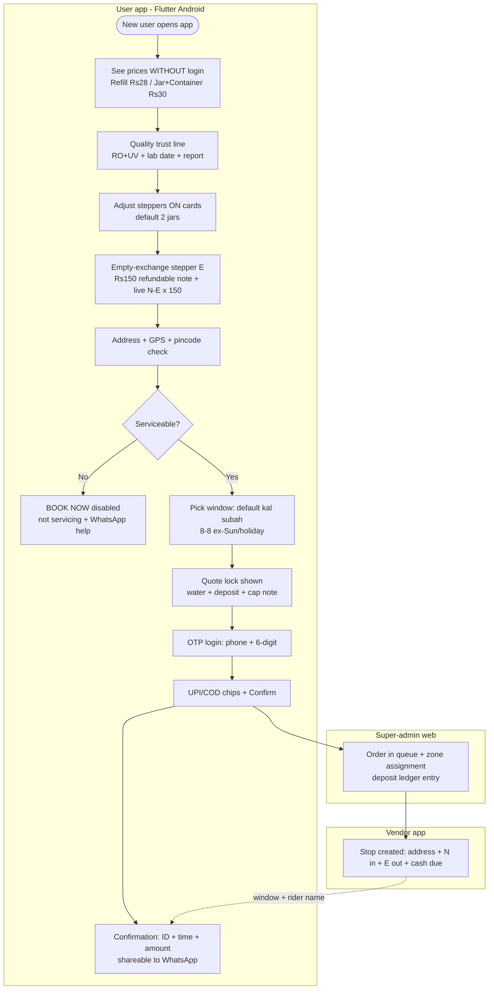
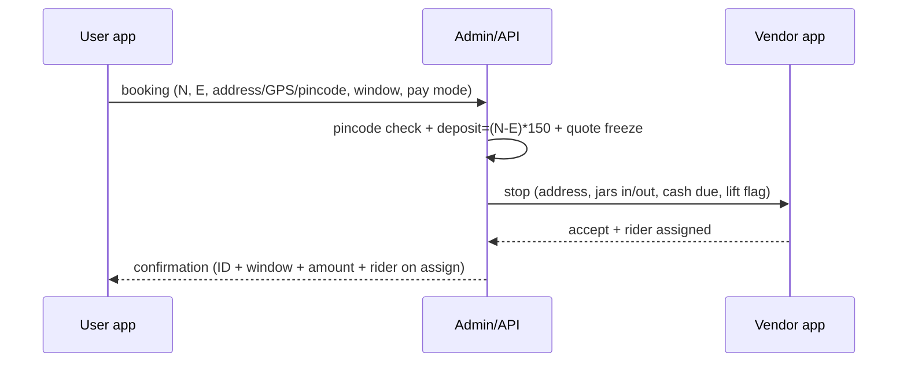
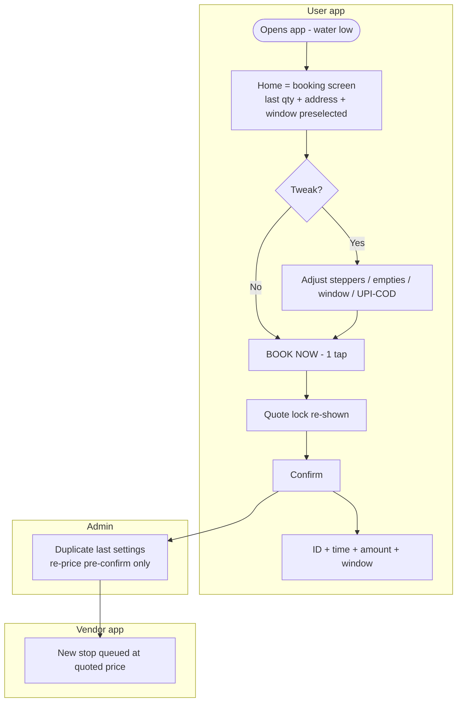
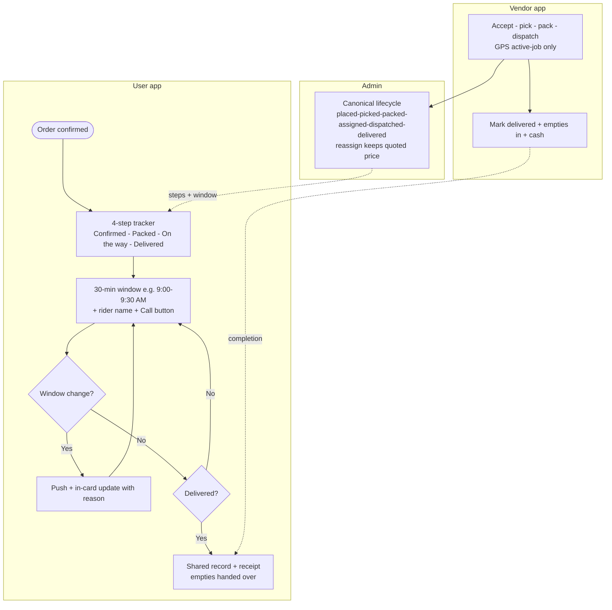
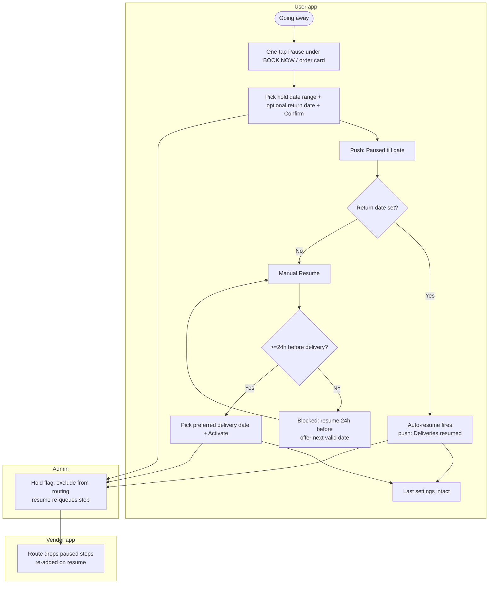
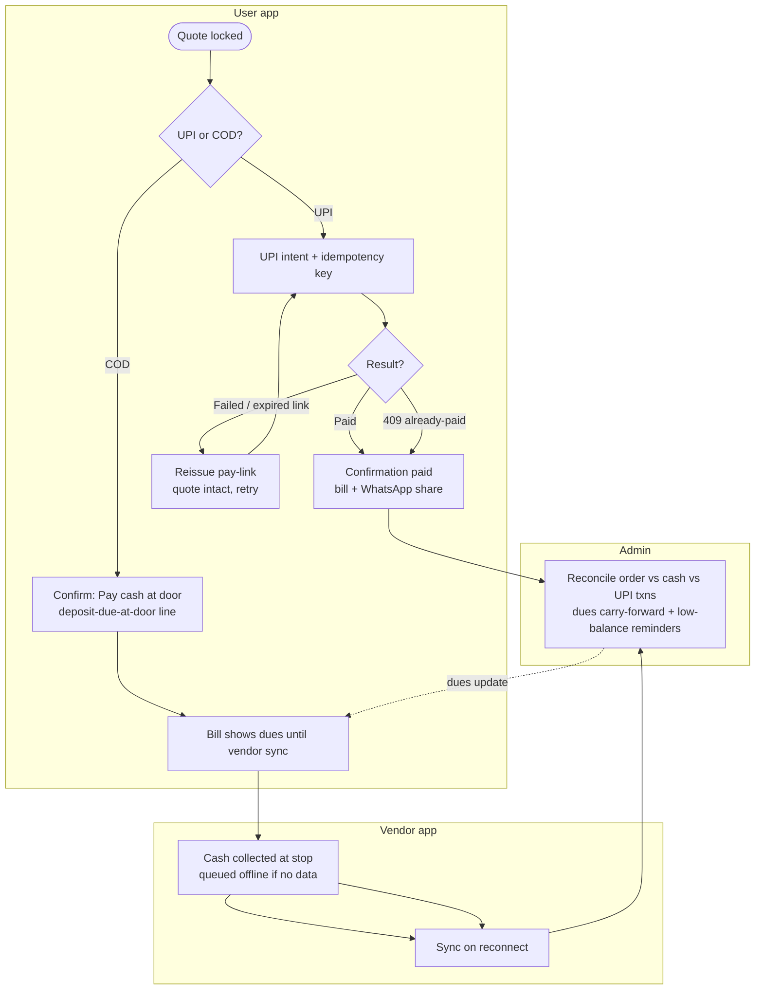
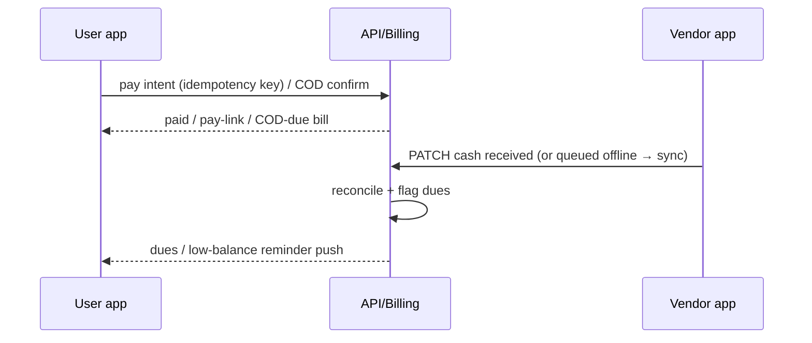
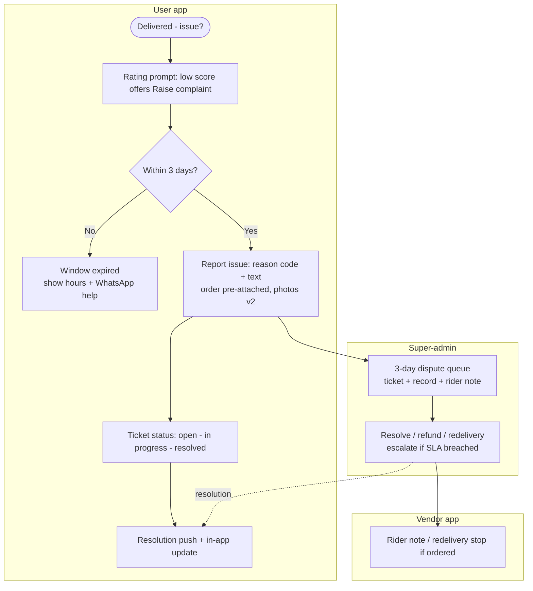
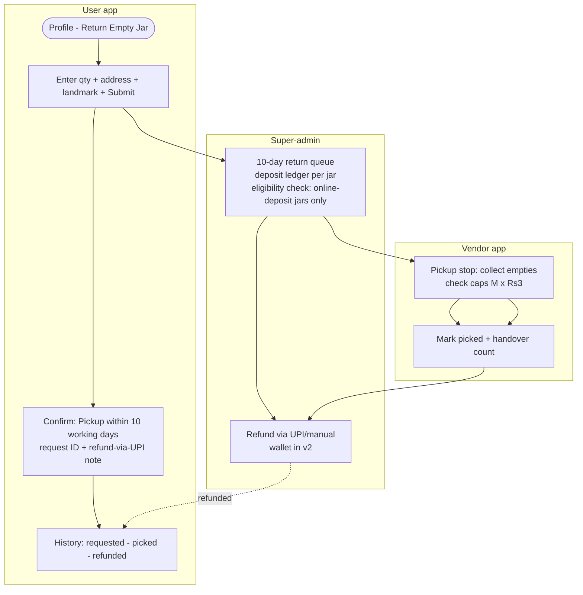

# User Flows — Shodasha User App ↔ Vendor App ↔ Admin Web (v1)

- **Scope**: Flutter Android user app flows with vendor-app and super-admin counterparts. No code.
- **Conventions**: `U-` = user-app step · `V-` = vendor/delivery-app step · `A-` = super-admin (Next.js) step. Windows are 30-min arrival windows inside 8 AM–8 PM, ex-Sun/holidays; default = kal subah (next working day). Deposit = `(N−E)×150`, refundable; cap-missing = +Rs 3/jar (E2). UPI + COD in v1 (deliberate diverge from Bisleri no-COD).
- **Req links**: UR-IDs refer to `user-requirements.md`.

---

## 1. First order (new user: see price → trust → OTP → address → pay → confirm)

Covers UR-02/03/04/05/06/07/08/09/11/12/13/14/21/23. Sources: A1 (no-wall quote, named SKUs), A2/A3 (proof strip), A5/C5 (OTP), E1/E2 (empties, deposit, next-day, pincode).

---

## 2. Repeat 1-tap (2 jars default, kal subah)

Covers UR-01/02/07/13/14/25. Sources: A1 (3-tap repeat, quote-before-commit), C1 (predictive one-tap), C5 (location → size → pay skeleton).

---

## 3. Tracking — 30-min window (no live dot)

Covers UR-09/10/18. Sources: A1 (window beats dot, map only near arrival), A5 (push windows), D4 (lifecycle + ETA-to-window).

---

## 4. Pause / resume (incl. ≥24h cutoff + auto-resume)

Covers UR-15/16. Sources: A5 (calendar self-service), E1 (hold range + resume ≥24h + pick date).

---

## 5. Payment — UPI / COD (guards + reconcile + reminders)

Covers UR-13/14/24. Sources: D4 (invoice links, cash entry → admin, dues reminders, 409/expired/partial/offline branches), C5 (create/verify guards, idempotency), E-group (deposit ledger; wallet = v2).

---

## 6. Complaint / dispute (≤3-day window, WhatsApp + call)

Covers UR-19/20. Sources: E2 (3-day window → adapt channel), D4 (recovery = retention), C1 (thread alerts).

---

## 7. Return jar (qty + address + landmark, 10-working-day SLA)

Covers UR-22/05/06. Sources: E1 FAQ-5 (flow + SLA + eligibility), E2 (deposit ledger, cap check), A2 (dormant-asset states).

---

## Cross-flow notes (vendor ↔ admin contracts, user-app visible effects)

| # | Contract | User-visible effect |
|---|----------|---------------------|
| 1 | Reassignment keeps quoted price (A1/D4) | Price on confirmation never changes after confirm |
| 2 | GPS active-job only; no live dot in user app (A1/C5-adapt) | Window + rider name + call instead of moving marker |
| 3 | Address edit syncs to stop pre-dispatch (A5) | Mid-order edit either propagates or is blocked with message |
| 4 | COD cash entry → admin reconcile (D4) | COD bill flips to paid/dues after vendor sync |
| 5 | Deposit ledger per jar; offline-brand empties = no refund + reason (E1-adapt) | Handover shows accepted vs rejected empties with reason |
| 6 | Sunday/holiday + lift gate-2F rules (E2) | Window picker + confirm copy + vendor stop instruction stay consistent |
