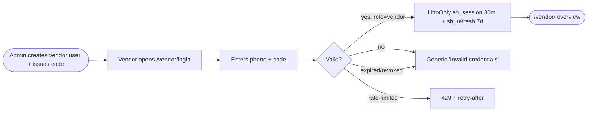
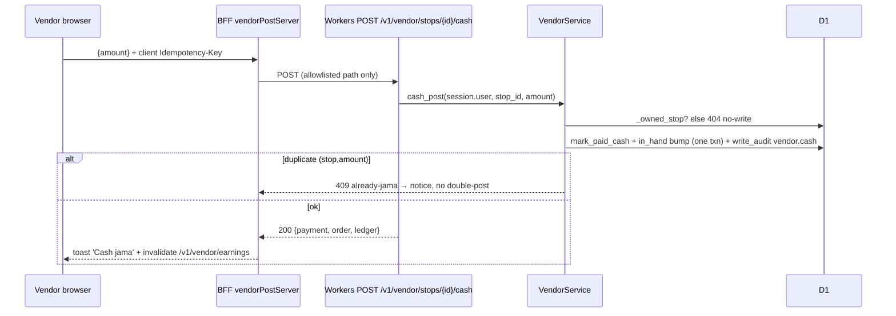
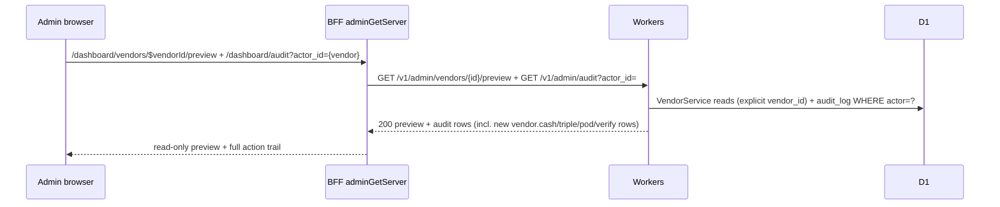
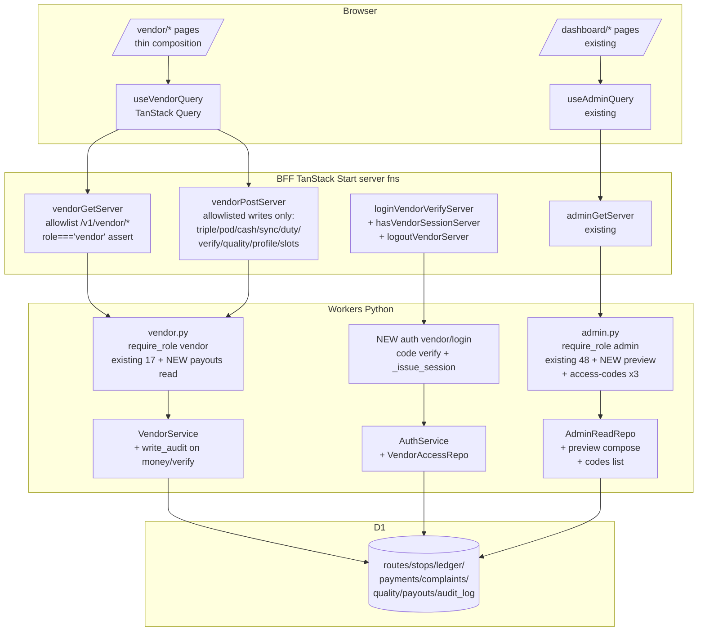

# 027 Vendor RBAC in Admin Dashboard — Feature Spec

- **Date**: 2026-10-04
- **Branch (planned, NOT created)**: `027-vendor-rbac` from `main` tip — created only after explicit approval
- **Status**: DRAFT — awaiting explicit user approval (no backend/admin code written; vendor Flutter app untouched throughout)
- **Inputs**: `Feature_docs/synthesis/vendor-requirements.md` (VR-01…VR-14), `Feature_docs/synthesis/feature-requirements.md` (FR-26…FR-34), `Feature_docs/vendor-app/spec.md`, `Feature_docs/vendor-dashboard/spec.md` (016, ADR-064), `Feature_docs/flow-sync/spec.md` (017, ADR-065), `Feature_docs/vendor-user-sync/spec.md` (015)
- **Backend truth cited**: `workers/api/src/app/api/v1/admin.py` (48 routes, all `require_role('admin')` via `Admin = Depends(require_role("admin"))` :39), `workers/api/src/app/api/v1/vendor.py` (17 routes, all `require_role('vendor')` via `_vendor` :19), `workers/api/src/app/api/auth_deps.py` (`require_role` :85-93, `_bearer` cookie fallback :29-37), `workers/api/src/app/repositories/admin_read_repo.py` (only `vendor_detail` :204 is vendor-scoped), `workers/api/src/app/services/vendor_service.py` (owner-scope via `_owned_stop` :613-637 + `r.vendor_id=?` filters), `workers/api/src/app/services/auth_service.py` (`demo_login` :246-272, session 30m/7d :28-29), `workers/api/src/app/services/dispatch_service.py` (`write_audit` :74-96), `workers/api/src/app/services/payment_service.py`
- **Admin UI truth cited**: `apps/admin_app/src/navigation/sidebar/sidebar-items.ts` (4 groups), `apps/admin_app/src/server/admin-api.ts` (adminGet/Post/PatchServer + path guard :142), `apps/admin_app/src/hooks/use-admin-api.ts` (`useAdminQuery` :12-27), vendors screen template (`vendors/-components/vendors.tsx` 263 lines + `$vendorId/-components/vendor-detail.tsx` 445 lines)
- **Skills loaded + one rule applied each**:
  - `ssdlc` (`.agents/ssdlc/SKILL.md`) → rule applied: STRIDE threat model + "authz enforced in the service layer, not the UI" — every matrix row names the backend enforcing layer (§5), UI hiding is defense-in-depth only.
  - `sitemap` (`.agents/sitemap/SKILL.md`) → rule applied: "no page exists that isn't on the map; access levels explicit" — §1 annotates every route with access level + data dependency.
  - `user-flows` (`.agents/user-flows/SKILL.md`) → rule applied: "every API call has all branches drawn (success, 4xx, timeout)" — §2 sequences include 401/403/404/409/429 branches.
  - `design-patterns` (`.agents/design-patterns/SKILL.md`) → rule applied: minimum-code mandate + named patterns only (controller-service-repo + BFF Adapter) — §3 reuses existing layers, §4 builds only proven-missing components.
  - `folder-structure` (`.agents/folder-structure/SKILL.md`) → rule applied: co-locate by domain + thin route composition — §4 puts every screen under its route's `-components/` (admin AGENTS.md convention).
  - `ui-checklist` (`.agents/ui-checklist/SKILL.md`) → rule applied: Login-page + Table + Verifying-Account + state checklists — §6 pre-code checklist covers states/a11y per screen.
  - (`security-audit`, `redesign-existing-projects`, `premium-design`, `design-taste-frontend` live under `.agents/skills/` post-`Skills.py`; their roles are covered here by `ssdlc` §5 STRIDE + reuse-first premiumness on locked `base-nova` tokens. No new component library — current stack kept per brief.)

---

## 0. Non-negotiable boundaries (encoded, each with enforcer)

| # | Boundary | Backend enforcer | UI enforcer |
|---|----------|------------------|-------------|
| B1 | Vendor sees ONLY own data: own routes/stops/customers (admin-assigned), own collections, own payouts, deposits of THEIR assigned customers only. Never other vendors, never other vendors' customers, never full user directory | `require_role('vendor')` on all `/v1/vendor/*` (vendor.py:19) + `_owned_stop` join (vendor_service.py:613-637) + `r.vendor_id=?` on every list (today_route :134-137, earnings :406-409, customers :503-506, complaints :542-546, placed zone-scoped :186-188). New vendor-scoped reads reuse these predicates — never new unscoped queries | Vendor nav shows only `/vendor/*`; no links to `/dashboard/*`; vendor BFF fns reject non-`/v1/vendor/*` paths (allowlist, mirrors admin-api.ts:142) |
| B2 | Vendor CAN: view assigned routes+stops, triple/PoD per owned stop, post cash for owned stops, follow up own dues, view own payouts/custody, verify assigned complaints/quality | Existing writes already owner-scoped: triple :226, pod :336, cash :298, sync :388/:393, verify :554-560, quality :589-593 | Vendor screens expose only these mutations; every other button absent (not disabled — absent) |
| B3 | Vendor CANNOT: delete ANY record, edit zones/capacity/fees, approve payouts, adjust ledger, suspend users, reassign work, call any `/v1/admin/*` write | `require_role('admin')` on all 48 admin routes (admin.py:39); no DELETE vendor route exists and none is added; vendor role on admin path → 403 (auth_deps.py:85-93) | Vendor BFF has no POST/PATCH to `/v1/admin/*` or `/v1/refunds/*`; no delete affordance rendered anywhere in `/vendor/*` |
| B4 | Admin does everything + sees every vendor/user/action + per-vendor read-only "view as vendor" + full audit of that vendor | Unchanged `require_role('admin')`; new preview endpoint is admin-gated and composes existing `VendorService(vendor_id)` reads with explicit param (§3) | New `dashboard/vendors/$vendorId/preview` route renders reads only — no `adminPostServer`/`adminPatchServer` imports |
| B5 | Access codes: admin-issued per-vendor code, config-gated, hash-stored, revocable, expirable; vendor logs in with phone + code; admin lists masked codes + issuance/revocation + last-used; HttpOnly cookie session, never JS/localStorage | New `vendor_access_codes` table (code_hash sha256 + `hmac.compare_digest`, pattern auth_service.py:266-267) + `expires_at` + `revoked_at` + `last_used_at`; new `vendor_access_enabled` config flag (pattern `demo_login_enabled` auth_service.py:254); new `POST /v1/auth/vendor/login` asserting `users.role='vendor'`; session mint reuses `_issue_session` (30m/7d, family, device-cap auth_service.py:274-309) | New vendor BFF fns reuse `sh_session`/`sh_refresh` TTLs + refresh/logout flow (pattern admin-session.ts), gating `role==="vendor"` (pattern :106-108); admin codes table masked |
| B6 | Security deposits: ledger is truth (`deposit_paid/refunded`, `held` — ledger_repo.py:56-73, never-negative :105-109). Admin sees totals + per-vendor + per-customer; vendor sees ONLY per-customer deposits for assigned customers | Vendor deposit read = `today_customers` `held`/`dues` enrichment (vendor_service.py:528-531, owner-scoped by construction) — no new ledger query; `deposit_paid/refunded` columns and `ledger_events` history have no vendor route and none is added | Vendor UI shows `held`/dues ints only; never raw `deposit_paid/refunded` totals |
| B7 | No deletion for vendors anywhere (no UI + 403 at API). Every vendor write owner-scoped, idempotent where money moves, audit-logged | Idempotency: triple key (vendor_service.py:223-243), cash deterministic (stop+amount :293-309); audit: `write_audit` added to vendor money/verify paths (gap A5§5 — vendor_service.py has zero audit calls today) | Vendor writes show replay-safe notices (409 → "already recorded", pattern 017 F2) |
| B8 | Branch `027-vendor-rbac` from main tip; vendor Flutter app untouched | — | — |

---

## 1. Sitemap (sitemap skill: every node annotated)

### 1a. Admin tree (existing — unchanged, shown for separation proof)

```
/                                           # public
├── /auth/v1/login                          # public; phone+OTP OR access-code (021 door, admin-session.ts:121-164)
└── /dashboard                               # auth: admin (dashboard/route.tsx loader → hasSessionServer; role gate server-side)
    ├── Monitor: /dashboard (overview), /dashboard/analytics, /dashboard/orders, /dashboard/orders/$orderId
    ├── Money: /dashboard/finance, /dashboard/payments, /dashboard/ledger
    ├── People: /dashboard/users, /dashboard/users/$userId, /dashboard/vendors, /dashboard/vendors/$vendorId
    │   └── NEW /dashboard/vendors/$vendorId/preview   # auth: admin; READ-ONLY "view as vendor" (§3.4)
    │       Data: GET /v1/admin/vendors/{id}/preview (new, admin-gated; composes VendorService reads)
    │       States: loading skeleton / empty (no route today) / error+retry; NO mutations rendered
    ├── Operate: /dashboard/dispatch, /dashboard/operations, /dashboard/audit, /dashboard/config
    │   └── config gains vendor_access_enabled flag row (read/write existing /v1/admin/config)
    └── NEW admin codes UI: /dashboard/vendors/$vendorId/access  # auth: admin; masked list + issue/revoke
        Data: GET/POST /v1/admin/vendors/{id}/access-codes (new, admin-gated)
```

### 1b. Vendor tree (NEW — same TanStack Start app, separate route subtree, separate session role)

```
/vendor                                       # auth: vendor (loader → hasVendorSessionServer; role==='vendor')
├── /vendor/login                             # public; phone + access-code (no OTP, no signup link — accounts are admin-created)
│   Data: vendorLoginVerifyServer → POST /v1/auth/vendor/login (new)
│   States: idle / sending / invalid (generic "Invalid credentials" — no oracle) / rate-limited (429) / offline
├── /vendor/ (overview)                       # auth: vendor; TODAY strip + money + ledger summary
│   Data: GET /v1/vendor/routes/today (fold client-side: users/jars/collect, pattern 016 TodayStrip)
│         + GET /v1/vendor/earnings (inline jama/baaki/hold) + GET /v1/vendor/customers (held/dues rows)
├── /vendor/route                             # auth: vendor; assigned stops + SKIP + one CTA per state (016 composition, reused)
│   Data: GET /v1/vendor/routes/today + GET /v1/vendor/placed (zone-scoped pull)
├── /vendor/stops/$stopId                    # auth: vendor; stop detail + triple + PoD + cash post (owned stop only)
│   Data: GET /v1/vendor/stops/{id} → POST triple (+Idempotency-Key) / POST pod / POST cash
│   404 renders same-as-missing (no oracle — vendor_service.py:625-626 convention)
├── /vendor/collections                       # auth: vendor; own collections + dues follow-up (wa.me Hindi reminders, pattern finance dunning.tsx:47-54)
│   Data: GET /v1/vendor/earnings + GET /v1/vendor/customers (dues>0 rows); links are wa.me deep-links, no WhatsApp provider
├── /vendor/payouts                           # auth: vendor; READ-ONLY own payouts + custody (in_hand display)
│   Data: GET /v1/vendor/payouts (NEW thin read: payouts WHERE vendor_id=? + vendor_profile.in_hand; read-only, no approve)
├── /vendor/deposits                          # auth: vendor; READ-ONLY per-customer deposits for ASSIGNED customers only
│   Data: GET /v1/vendor/customers (held/dues per customer); no totals, no ledger history
├── /vendor/support                          # auth: vendor; assigned complaints/quality verify (agree/disagree, pattern vendor_app support)
│   Data: GET /v1/vendor/complaints → POST /complaints/{id}/verify / POST /quality/{id}/vendor-check
└── /vendor/profile                          # auth: vendor; own profile/slots read+edit (name/phone/address/hours ≤500, slots ≤50 keys)
    Data: GET/PATCH /v1/vendor/profile + GET/PUT /v1/vendor/slots
```

No 404-page invention: unknown `/vendor/*` falls through to the app's existing `$.tsx` splat. No vendor access to `/dashboard/*`: vendor session on admin path → server loader redirects to `/vendor/login` (role check server-side, never client-only).

### 1c. API surface derivable from the map (sitemap skill rule 5)

| New backend endpoint | Gated by | Serves screen |
|---|---|---|
| `POST /v1/auth/vendor/login {phone, code, device}` | public + rate-limit (10/device/hr, pattern DEMO_LOGIN_DEVICE_LIMIT) + `vendor_access_enabled==1` + code valid/unexpired/unrevoked + `users.role=='vendor'` | `/vendor/login` |
| `GET /v1/vendor/payouts` (NEW thin read) | `require_role('vendor')`, `payouts WHERE vendor_id=?` + `vendor_profile.in_hand` | `/vendor/payouts` |
| `GET /v1/admin/vendors/{id}/preview` (NEW) | `require_role('admin')`; composes `VendorService(vendor_id).today_route/earnings/today_customers/vendor_complaints` with explicit param | `vendors/$vendorId/preview` |
| `GET /v1/admin/vendors/{id}/access-codes` (NEW, masked + last_used) | `require_role('admin')` | `vendors/$vendorId/access` |
| `POST /v1/admin/vendors/{id}/access-codes {expires_at}` (NEW, returns plaintext ONCE) | `require_role('admin')` + `_audit('vendor.access.issue')` | `vendors/$vendorId/access` |
| `POST /v1/admin/vendors/{id}/access-codes/{code_id}/revoke` (NEW, timestamp not delete) | `require_role('admin')` + `_audit('vendor.access.revoke')` | `vendors/$vendorId/access` |
| New migration `013_vendor_access.sql`: `vendor_access_codes(id, vendor_id FK users, code_hash, masked_hint, expires_at, revoked_at, last_used_at, created_by, created_at)` + `vendor_access_enabled` config seed | — | — |

All other vendor screens ride EXISTING endpoints (zero new shapes except the two reads above).

---

## 2. User flows + request/response sequences (user-flows skill)

### F-login — vendor login via admin-issued access code



```mermaid
sequenceDiagram
    participant V as Vendor browser
    participant B as BFF vendorLoginVerifyServer
    participant W as Workers POST /v1/auth/vendor/login
    participant S as AuthService
    participant D as D1
    V->>B: {phone, code, device}
    B->>B: validate phone/code shape → 400
    B->>W: POST /v1/auth/vendor/login
    W->>S: vendor_login()
    S->>D: config vendor_access_enabled == 1? else 401 closed
    S->>D: SELECT code_hash WHERE vendor_id + revoked_at IS NULL + expires_at > now
    S->>S: hmac.compare_digest else 401 generic
    S->>D: users.role == 'vendor'? else 403
    S->>S: _issue_session (device-cap ≤3/30d → 409; pair + family)
    S->>D: UPDATE last_used_at
    S->>D: write_audit vendor.access.use
    W-->>B: 200 {access_token, refresh_token, role: vendor}
    B->>B: assert role==='vendor' else 403; set HttpOnly cookies
    B-->>V: redirect /vendor/
    Note over V,W: 401/429 branches return generic copy; token never in JS
```

### F-route — vendor route list (scoped read)

```mermaid
sequenceDiagram
    participant V as Vendor browser
    participant B as BFF vendorGetServer
    participant W as Workers GET /v1/vendor/routes/today
    participant S as VendorService
    participant D as D1
    V->>B: useVendorQuery('/v1/vendor/routes/today')
    B->>B: assert session role==='vendor' else redirect /vendor/login
    B->>W: GET (cookie Bearer server-side)
    W->>S: today_route(session.user)
    S->>D: routes WHERE vendor_id=? AND date=?
    S->>D: stops + orders/addresses join (owned route only)
    W-->>B: 200 {route, stops[], loading, skip[]}
    B-->>V: render; 401→refresh once→retry→else login
    Note over V,W: cross-vendor stop id → 404 same-as-missing; admin path with vendor cookie → redirect (never 403 leak)
```

### F-cash — payment collect (idempotent money write + audit)



### F-dues/deposit — dues follow-up + deposit read (read-only)

```mermaid
sequenceDiagram
    participant V as Vendor browser
    participant B as BFF vendorGetServer
    participant W as Workers
    participant D as D1
    V->>B: /vendor/collections + /vendor/deposits
    B->>W: GET /v1/vendor/customers (single source: held/dues per OWN customer)
    W-->>B: 200 {customers[]:{held, dues}}
    B-->>V: dues rows → wa.me Hindi reminder links; deposits → held/dues ints only
    Note over V,W: no ledger_history, no deposit_paid/refunded columns, no global dues — endpoint cannot express them
```

### F-payout — payout read (read-only)

```mermaid
sequenceDiagram
    participant V as Vendor browser
    participant B as BFF vendorGetServer
    participant W as Workers GET /v1/vendor/payouts (NEW)
    participant D as D1
    V->>B: /vendor/payouts
    B->>W: GET (vendor session)
    W->>D: payouts WHERE vendor_id=? + vendor_profile.in_hand WHERE user_id=?
    W-->>B: 200 {payouts[], in_hand, note}
    B-->>V: read-only table; no approve button exists
    Note over V,W: approve stays POST /v1/admin/payouts/{id}/approve (admin-only, 403 for vendor)
```

### F-audit — admin reads vendor audit (oversight)



---

## 3. Architecture (design-patterns skill: controller-service-repo + BFF Adapter)



Patterns named: **Layered** (router → service → repo, unchanged), **Adapter** (BFF server fns adapt cookie sessions to Bearer — existing pattern extended, not reinvented), **DTO** (masked code shapes; paise ints), **State Machine** (access-code lifecycle active→expired/revoked; session family rotation unchanged). Dependency direction unchanged: routes → server fns → Workers → D1. No new packages (ponytail ladder: reuse → stdlib → installed → new; nothing new needed — `hmac`/`hashlib` stdlib, TanStack Query/Recharts/shadcn installed).

---

## 4. Component plan (folder-structure skill: co-locate; admin AGENTS.md: never edit `src/components/ui/`)

Reuse-first (existing components, imported as-is):

| Need | Reuse from | Owns |
|---|---|---|
| Tables (stops, collections, payouts, codes, audit) | TanStack Table `useTable` + shadcn `table` (pattern `vendors.tsx:152-161,228-247`) | each screen's `-components/` |
| Cards/KPIs (today strip, money cards) | shadcn `card` (pattern `money-cards.tsx`) + 016 TodayStrip fold idea re-expressed with existing tokens | `vendor/-components/` |
| Charts (collections trend, payout history) | Recharts via `ui/chart` `ChartContainer` (pattern `payment-mix-trend.tsx`, `payment-split.tsx`) | `collections/`, `payouts/` `-components/` |
| Forms (login, triple/cash, issue-code, verify dialogs) | shadcn `input`+`label`+`button`+`dialog` (pattern `vendor-detail.tsx:7-22`, `dunning.tsx:60-65`) | owning `-components/` |
| Dues reminders | wa.me Hindi deep-link pattern (`dunning.tsx:47-54`) | `collections/-components/` |
| Toasts + error mapping | `toast` + `errorMessage()` (`use-admin-api.ts:42-48`) | shared |
| Route composition | thin `route.tsx` + `index.tsx` + `<Outlet/>` (pattern `vendors/route.tsx` 6 lines) | every new route |

NEW components ONLY where missing (each named + owning dir):

| New component | Owns | Why missing |
|---|---|---|
| `vendor-login-form.tsx` | `routes/(main)/vendor/login/-components/` | No vendor login form exists (admin `admin-login-form.tsx` is OTP+admin-gated; vendor is phone+code, no OTP) |
| `vendor-guard.tsx` (role loader + redirect) | `routes/(main)/vendor/-components/` | Dashboard guard is admin-role; vendor needs its own server role assert |
| `today-strip.tsx` (vendor web version) | `routes/(main)/vendor/-components/` | 016 strip lives in Flutter; web needs the same fold over `today_route` |
| `stop-actions.tsx` (triple/cash/PoD sheets) | `routes/(main)/vendor/stops/$stopId/-components/` | No web stop-execution UI exists (Flutter-only today) |
| `access-codes-table.tsx` + `issue-code-dialog.tsx` | `routes/(main)/dashboard/vendors/$vendorId/access/-components/` | No code-issue UI exists anywhere |
| `vendor-preview.tsx` (read-only composed view) | `routes/(main)/dashboard/vendors/$vendorId/preview/-components/` | No read-only vendor-impersonation view exists |
| `use-vendor-api.ts` (`useVendorQuery` + `vendorGet/PostServer` client) | `src/hooks/` + `src/server/vendor-api.ts` | BFF vendor transport does not exist (admin-api.ts is `/v1/admin`-allowlisted by design :142) |

Libraries for premiumness: NONE new — Recharts (trends), TanStack Table/Query (tables/data), shadcn base-nova (primitives), lucide-react (icons) already installed. Justification per item: each maps to an existing in-repo usage (cited above); adding any library would violate ponytail + admin AGENTS.md ("avoid unnecessary dependencies").

---

## 5. Permission matrix (ssdlc skill: enforcer named per cell; UI-hide is never the enforcer)

`A` = admin, `V` = vendor. Enforcing layer in brackets.

| Action | A | V | Enforcer |
|---|---|---|---|
| Login with phone + OTP | allow | deny | `otp_verify` has no vendor path; vendor BFF has no OTP fn |
| Login with phone + access code | allow (021 demo door, separate flag) | allow | new `POST /v1/auth/vendor/login`: config flag + code row + `role=='vendor'` assert |
| View own routes/stops/customers | allow (all, via admin reads) | allow (own only) | V: `today_route`/`today_customers` `r.vendor_id=?` (vendor_service.py:134-137,503-506) |
| Triple / PoD per owned stop | allow (via reassign+admin? NO — admin cannot triple; n/a) | allow | V: `_owned_stop` + version fence + idem (vendor_service.py:226,244-248) |
| Post cash for owned stop | deny (admin uses custody confirm) | allow | V: `cash_post` `_owned_stop` + deterministic dedupe (:298-309); A: `POST /v1/admin/custody/confirm` |
| Follow up own dues (wa.me links) | allow | allow | reads owner-scoped; links are client-side `wa.me`, no provider write |
| View own payouts + custody | allow (all vendors) | allow (own only) | V: new `GET /v1/vendor/payouts` `WHERE vendor_id=?`; A: `GET /v1/admin/payouts?vendor_id=` (:435-436) |
| View deposits of assigned customers | allow (all + totals) | allow (assigned only) | V: `today_customers` held/dues only; A: `ledger_page` + `money_totals.deposit_liability` |
| Verify assigned complaints/quality | allow (resolve/confirm all) | allow (verify assigned only) | V: scoped joins (:554-560,:589-593); A: `complaints/{id}/resolve`, `quality/{id}/confirm|reject` |
| View-as-vendor preview | allow | deny | new preview endpoint `require_role('admin')`; vendor BFF cannot call `/v1/admin/*` (allowlist) |
| Issue/revoke access codes | allow | deny | new code endpoints `require_role('admin')` + audit |
| Assign/reassign/generate routes | allow | deny | `dispatch_service` via admin routes only; vendor has no route to them → 403/404 |
| Approve payouts / adjust ledger / write off dues | allow | deny | `payouts/{id}/approve`, `ledger/{id}/adjust`, `dues/{id}/write-off` admin-only |
| Suspend users / capacity / zones / config | allow | deny | `users/{id}/suspend`, `vendors/{id}/capacity`, `zones/*`, `config` admin-only |
| Delete ANY record | deny (no delete endpoints exist) | deny (403 + no UI) | invariant: no DELETE route added; audit `reco.close`/suspend are state transitions, not deletes |
| Call `/v1/admin/*` | allow | deny (403) | `require_role('admin')` (admin.py:39) — regression test per endpoint group |
| Call `/v1/vendor/*` as admin session | deny (separate session role) | allow | vendor routers `require_role('vendor')`; admin preview uses the NEW admin-gated preview endpoint, never vendor session |

---

## 6. Pre-code checklist (must all be true before merge)

- [ ] **OWASP mapping**: BOLA — every vendor endpoint derives `vendor_id` from session, new tests swap ids → 404; function-auth — vendor token on all 48 `/v1/admin/*` + `/v1/refunds/*` → 403 (test matrix); excessive-exposure — vendor serializers contain no `deposit_paid/refunded`, no other-vendor rows, phones masked where shown; auth — rate-limit on new login (10/device/hr) + generic 401 copy; audit — `vendor.*` rows written for triple/pod/cash/verify/quality + code lifecycle.
- [ ] **IDOR tests per endpoint**: new + existing vendor endpoints — cross-vendor stop/route/customer/complaint/quality/payout reads → 404 with no write; admin preview with wrong id → 404; codes of another vendor unlistable.
- [ ] **No-delete invariant**: grep proves zero DELETE methods on new routers; vendor UI tree contains no delete affordance (review `stop-actions`, `collections`, `support`); vendor POST/PATCH allowlist in `vendorPostServer` is closed (triple/pod/cash/sync/duty/verify/quality/profile/slots only).
- [ ] **Scope tests**: vendor A sees only zone-A placed; unzoned invisible (016 regression extended); earnings sums own route; customers list own only; payouts list own only; deposits exclude unassigned customers.
- [ ] **States per screen** (ui-checklist): loading skeleton (pattern `route_screen` skeleton), honest empty ("Aaj koi stop nahi" / "No dues"), error + retry, offline notice, disabled-with-reason (HOLD_BLOCKED Hindi copy), 429 copy, 404-same-as-missing on stop detail.
- [ ] **a11y**: semantic HTML, labels on phone/code/amount inputs, visible focus, keyboard-reachable dialogs/sheets, `aria-live` on toasts/sync badges, 48dp touch targets (doorstep gloves, ADR-056 bar).
- [ ] **Reduced-motion**: all Recharts/CSS transitions gated by `prefers-reduced-motion` (Agent.md pre-exit #4-5: transform+opacity only, no layout animation).
- [ ] **Verify**: backend `pytest` green (incl. new IDOR/scope/audit tests); admin `npm run check` ONLY if asked (admin AGENTS.md bars unasked validation); both Flutters untouched (`git status` proves it).
- [ ] **Context sync**: `progress-tracker.md` + `flow.md` + `decision.md` (new ADR-073) updated; `013_vendor_access.sql` apply-once noted for D1.

## 8. Implementation notes (post-approve, branch 027-vendor-rbac, 2026-10-04)

Implemented as specified with 4 backend-truth deviations (frontend adapted, no invention):
1. Preview serves flat `route` (= whole `today_route` object), not `today:{route,stops}`.
2. Payout rows carry `gross_fee`, not `gross`.
3. Blank `expires_at` on code issue defaults to 90 days (never "no expiry").
4. Vendor guard lives at `vendor/(guard)/route.tsx` (pathless group — a guard on `vendor/route.tsx` would bounce `/vendor/login` to itself); same URLs. No `vendor-guard.tsx` — loader guard is the established pattern.
- Verify: backend 222 pytest green (209 existing + 13 new `tests/test_vendor_rbac.py`). Admin `npm run check`/build left to user (admin AGENTS.md). D1 needs `013_vendor_access.sql` applied once (flag seeds `0` = closed). Both Flutters untouched.

## 7. Open items → clarifying questions (asked in session before approval)

Q1 — vendor login transport: dedicated `POST /v1/auth/vendor/login` + `vendor_access_codes` table (spec default) vs extending `demo_codes`? Q2 — dashboard home: same `admin_app` under `/vendor/*` (spec default) vs separate app? Q3 — vendor writes from dashboard: full triple/PoD/cash (spec default, per brief) vs cash-only + reads? Q4 — audit scope: `write_audit` on vendor triple/pod/cash/verify/quality + code lifecycle (spec default) vs money-only? Q5 — branch creation now vs at approval?
