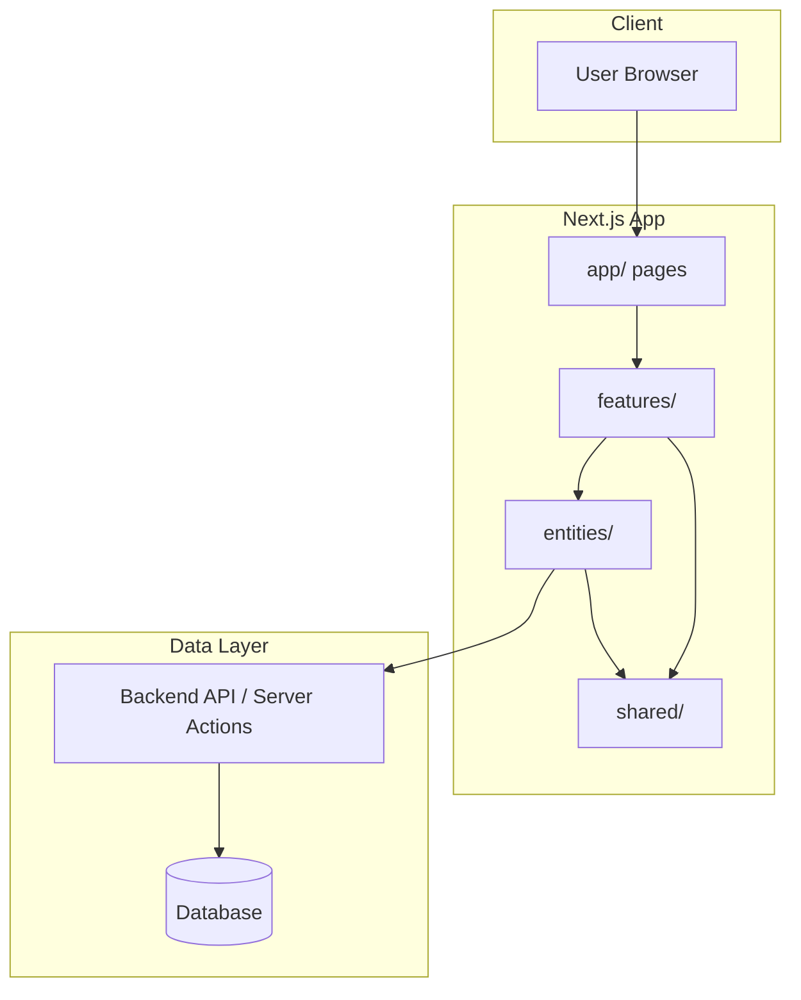
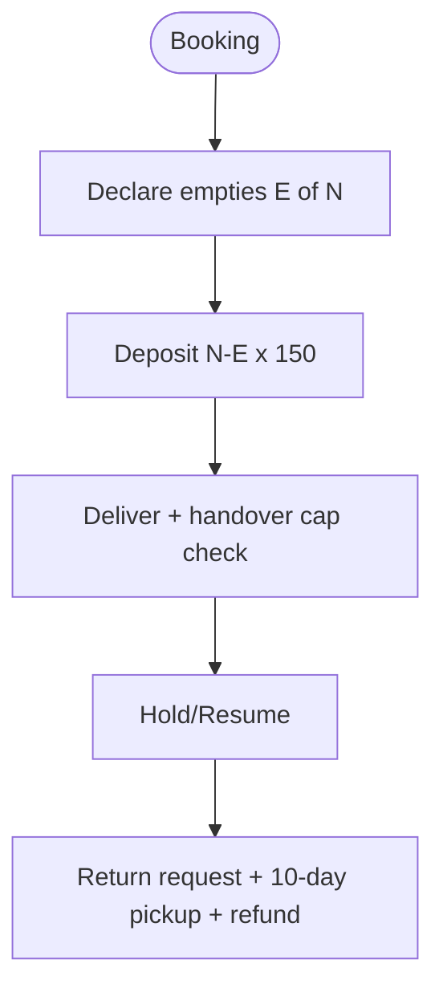
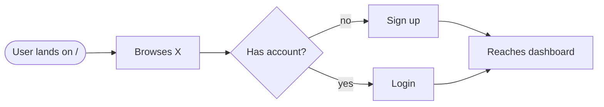
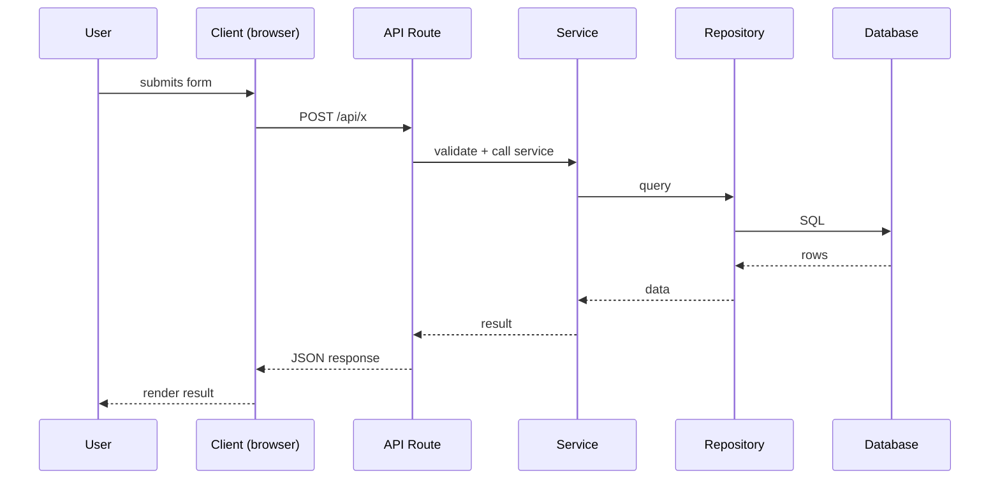
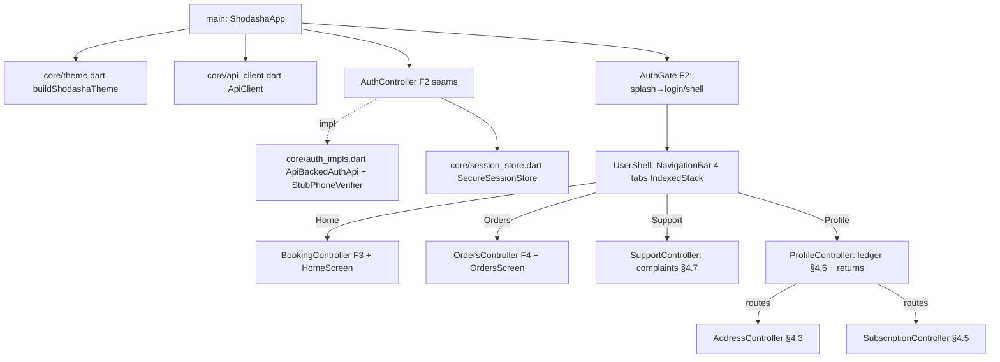

# Flow — Function Call Map & User Flows

> **Purpose**: The "how it works" file. It maps which functions call what, the user
> journeys, request/response sequences, and routes. Reading this file gives you an
> instant mental model of the project structure.
>
> **Update rule (MANDATORY)**: Update this file whenever you add, rename, or remove any
> function, component, hook, route, API endpoint, or user flow. Never let it go stale —
> agents and humans navigate the codebase through this file.

---

## Overview

[2–3 sentences: what the app does, the main loop, the key actors.]

> **Research note (2026-09-29, Group D)**: no app code exists yet — flows below are
> still template placeholders. The proposed order lifecycle from dev-guide research
> (placed→accepted→picked→packed→assigned→dispatched→delivered, PoD = OTP+photo+
> empties+cash) is documented in `Feature_docs/research/D-dev-guides/_group-D-summary.md`
> and will populate this file's User Flows / Request-Response sections at Series-3
> synthesis. Payment is a separate field, not an order state.

---

## Architecture Diagram



---

## User Flows

> Each flow = one user journey. Format: goal → steps → outcome.

### Flow: Vendor doorstep triple → ledger → evening reconcile (SYN-2 synthesis, proposed)
**Goal**: driver executes per-stop triple offline-tolerant; ledger + dues + reconciliation close the day (see Feature_docs/synthesis/vendor-requirements.md VR-01/02/03/09)
**Steps**: admin auto route+loading sheet → stop: fulls/empties/cash-UPI (queued offline, synced) → ledger mutates (held/deposit/dues, never-negative) → WhatsApp bill + own-bank UPI QR → dues carry forward → evening per-route collection vs pending vs jars-out

```mermaid
flowchart LR
    A([Morning: auto route + loading sheet]) --> B[Stop: given + empties + cash/UPI]
    B --> C[Ledger: held/deposit/dues update]
    C --> D[WhatsApp bill + UPI QR, dues carry forward]
    D --> E([Evening: route-wise reconcile])]
```

### Flow: Bisleri reference — booking → deposit → hold → return → refund (Group E research)
**Goal**: industry-standard jar loop documented for Shodasha adoption (see Feature_docs/research/E-bisleri/_group-E-summary.md)
**Steps**: booking → empty-with-cap declaration → (N−E)×150 deposit → delivery (8-8, no Sun, gate/2F if no lift, Rs3 cap-missing) → hold range / resume ≥24h → Return Jar request → pickup ≤10 working days → wallet refund; disputes ≤3 days



### Flow: [User flow name]
**Goal**: [what the user wants]
**Steps**: [brief description]



---

## Request / Response Flows

> One sequence diagram per key request. Use the Client → Route → Service → Repository →
> Database chain that matches the actual code.

### [Flow name]


---

## Function Call Map

> Which function calls what, per feature. Keep this accurate — agents use it to navigate
> the code and find where changes are needed.

### Feature: [feature name]
```
app/page.tsx (route composition)
  └─ <FeatureComponent />        (features/<feature>/components/)
       └─ use<Feature>Hook()     (features/<feature>/hooks/)
            └─ <feature>Service() (features/<feature>/service/)
                 └─ apiClient.get("/api/...")
```

### Feature: user-app auth (F2, 2026-09-29, branch 004-user-app-build)
```
AuthGate (auth_gate.dart: splash → restoreSession → home / login)
  ├─ PhoneScreen (phone field +91, focus-loss errors, disabled-until-valid)
  │    └─ AuthController.sendOtp (normalize 91/0 → AuthApi.startOtp 202 → PhoneVerifier.requestCode)
  └─ OtpScreen (6-box + paste, masked +91 •••••, 60s resend, 5-attempt force-resend)
       └─ AuthController.confirm (PhoneVerifier.confirmCode → AuthApi.verifyOtp → SessionStore.save)
            └─ AuthGate re-routes to home (guest-browse safe; OTP enforced at booking commit/profile by F3)
```
- `normalizeIndianPhone` / `isValidIndianPhone` / `maskPhone` (auth_controller.dart) ← covered by `test/auth_validation_test.dart` (14 tests)
- Backend endpoints touched (already live): `POST /v1/auth/otp/start|verify`, `POST /v1/auth/logout` (refresh rotation + FCM-device scoping land with F1 wiring)

### Feature: [feature name]
- `[Function A]` calls `[Function B]` to [why]
- `[Function B]` calls `[Repository X]` to [why]

---

## Route Map

| Route | Page / Handler | Purpose | Auth Required |
|-------|----------------|---------|---------------|
| `/` | `apps/admin_app/src/app/page.tsx` | Redirect → /admin | Session |
| `/login` | `apps/admin_app/src/app/login/page.tsx` | Admin OTP sign-in (BFF sets HttpOnly cookies) | No |
| `/admin` | `apps/admin_app/src/app/admin/page.tsx` | Overview: KPIs, GMV/orders/on-time/payment-split/state charts, alerts | Admin session (proxy.ts) |
| `/admin/orders` + `/[orderId]` | `apps/admin_app/src/app/admin/orders/**` | All users' orders + detail: tracker, bill, assign/reassign/cancel-override, activity | Admin session |
| `/admin/users` + `/[userId]` | `apps/admin_app/src/app/admin/users/**` | User directory + detail, block/unblock (typed reason) | Admin session |
| `/admin/vendors` + `/[vendorId]` | `apps/admin_app/src/app/admin/vendors/**` | Vendor directory + custody/capacity/strikes/payouts/block/review-hold | Admin session |
| `/admin/payments` | `apps/admin_app/src/app/admin/payments/page.tsx` | Payments + refunds tabs (status/method filters) | Admin session |
| `/admin/ledger` | `apps/admin_app/src/app/admin/ledger/page.tsx` | Jar-ledger page with hold-limit flags | Admin session |
| `/admin/operations` | `apps/admin_app/src/app/admin/operations/page.tsx` | Reconciliation + custody + dues + routes-generate | Admin session |
| `/admin/trust` | `apps/admin_app/src/app/admin/trust/page.tsx` | Quality incidents + strikes + complaints with resolve actions | Admin session |
| `/admin/audit` | `apps/admin_app/src/app/admin/audit/page.tsx` | Audit/server-log viewer (actor_id/action filters) | Admin session |
| `/admin/config` | `apps/admin_app/src/app/admin/config/page.tsx` | Runtime config viewer/editor | Admin session |
| `GET /api/proxy` | `apps/admin_app/src/app/api/proxy/route.ts` | BFF read proxy → Workers `/v1/admin/*` (cookie forwarded, admin paths only) | Admin cookie |
| `POST /api/admin-actions` | `apps/admin_app/src/app/api/admin-actions/route.ts` | BFF write proxy → Workers `/v1/admin/*` | Admin cookie |
| `POST /api/auth/otp` | `apps/admin_app/src/app/api/auth/otp/route.ts` | OTP start\|verify (role=admin gate) → sets `sh_session` 30m + `sh_refresh` 7d | No |
| `POST /api/auth/logout` | `apps/admin_app/src/app/api/auth/logout/route.ts` | Clears cookies + revokes worker session | No |

---

## API Endpoints

| Method | Path | Handler | Purpose |
|--------|------|---------|---------|
| POST | `/api/auth/login` | `authService.login` | Sign in and issue session |
| GET | `/health` | `app/main.py` | Liveness probe |
| GET | `/v1/catalog` | `app/api/v1/catalog.py:get_catalog` | SKUs (2800/3000) + deposit 15000 + cap 300 + hours/holidays from settings |
| GET | `/v1/windows?date=&pincode=` | `app/api/v1/catalog.py:get_windows` | 30-min slots 08:00–20:00 on next serviceable day (ex-Sun); unserviceable pin → lead_capture |
| GET | `/v1/serviceability?pincode=` | `app/api/v1/catalog.py:check_serviceability` | Pincode regex + prefix allowlist (empty=open) |
| POST | `/v1/quotes` | `app/api/v1/quotes.py:create_quote` → `services/pricing.py:compute_quote` | Server-computed quote (paise) + sha256 quote_hash + 15-min TTL; N>10 → 422 OVER_LIMIT |
| POST | `/v1/auth/otp/start|verify` | `app/api/v1/auth.py` → `services/auth_service.py` → `adapters/firebase.py` + `user_repo`/`session_repo` | Firebase OTP → D1 session (30m + rotating 7d, family kill on reuse); suspend → restricted session |
| POST | `/v1/orders` | `app/api/v1/orders.py` → `services/order_service.py` → `order_repo`/`ledger_repo` | Idempotent create (scoped key), quote re-check, OVER_LIMIT/HOLD_BLOCKED, placed + deposit event, one txn |
| POST | `/v1/payments/upi-intent` + `/webhooks/upi` | `payments.py` → `payment_service` → `payment_repo` + `adapters/upi.py` | Fake/real provider; HMAC + replay-cache; payee lock; dues reconcile |
| POST | `/v1/vendor/stops/{id}/triple|pod` | `vendor.py` → `vendor_service.py` | Atomic triple (version fence), PoD OTP + GPS soft-flag, offline sync |
| POST | `/v1/admin/orders/{id}/assign` | `admin.py` → `dispatch_service.py` | Transactional zone assign, reassign with version fence, routes-generate |
| POST | `/v1/auth/otp/start` | `app/api/v1/auth.py:otp_start` → `services/auth_service.py:otp_start` | +91 validate + phone/IP rate-limit → 202 {sent_to_masked, resend_after_s} (Firebase SMS client-side) |
| POST | `/v1/auth/otp/verify` | `auth.py:otp_verify` → `auth_service.otp_verify` → `adapters/firebase.py:RealVerifier.verify_id_token` → `repositories/user_repo.py:upsert_firebase_user` + `session_repo.py:create` | 200 {access_token (30m), refresh_token (7d rotating), role, restrictions?, new_device_alert?, details.integrity}; device-cap → 409 DEVICE_CAP |
| POST | `/v1/auth/refresh` | `auth.py:refresh` → `auth_service.refresh` → `session_repo.rotate` | 200 new pair; burned-token reuse → revoke family + 401 |
| POST | `/v1/auth/logout` | `auth.py:logout` → `auth_service.logout` | 200 {ok}; revoke_all → family revoke; own-device FCM token delete only |
| GET | `/v1/auth/me` | `auth.py:get_me` → `auth_service.me` (via `api/auth_deps.py:get_current_user`) | 200 {user, addresses_count, ledger_summary}; suspended → + restrictions |
| PATCH | `/v1/auth/me` | `auth.py:patch_me` (via `require_active_user`) → `user_repo.update_profile` | 200 {user}; suspended → 403 FORBIDDEN |
| GET | `/v1/admin/metrics/overview?days=` | `admin.py` → `admin_read_repo.daily_series/on_time_series/money_totals` | Panel KPIs: today + per-day orders/gmv/delivered/on_time_pct + money totals (deposits, dues, jars held) — NEW, additive |
| GET | `/v1/admin/users?query=&role=&suspended=&limit=&cursor=` | `admin.py` → `admin_read_repo.users_page` | Directory: search (phone/name/id), role/suspended filters, rowid-cursor paging — NEW |
| GET | `/v1/admin/users/{id}/detail` | `admin.py` → `admin_read_repo.user_detail` | User + recent orders + ledger summary; ghost → 404 — NEW |
| GET | `/v1/admin/vendors/{id}/detail` | `admin.py` → `admin_read_repo.vendor_detail` | Vendor + profile + stops_done/jars_delivered — NEW |
| POST | `/v1/admin/users/{id}/suspend` | `admin.py` (`SuspendIn{reason≥3, level}`) | restrict\|suspend; suspend revokes the user's sessions; admin accounts → 400; audit `user.suspend` — NEW (vendors block via this too) |
| POST | `/v1/admin/users/{id}/unsuspend` | `admin.py` | Clears flag + audit `user.unsuspend`; ghost → 404 — NEW |
| GET | `/v1/admin/payments?status=&method=` | `admin.py` → `admin_read_repo.payments_page` | Payments page + user_phone join + cursor — NEW |
| GET | `/v1/admin/refunds?status=` | `admin.py` → `admin_read_repo.refunds_page` | Refunds page + cursor — NEW |
| GET | `/v1/admin/ledger` | `admin.py` → `admin_read_repo.ledger_page` | Jar ledger page (held/deposit_paid/dues) + cursor — NEW |
| GET | `/v1/admin/orders` | `admin.py` | +additive optional params `payment_status`, `query`, `cursor` — response shape unchanged |
| GET | `/v1/admin/audit` | `admin.py` | +additive optional filters `actor_id`, `action` — shape unchanged |
| auth | `app/api/auth_deps.py:_bearer` | — | Now accepts `sh_session` cookie as Bearer fallback (Bearer still first) for the admin web; mobile Bearer path unchanged |

### Slice-2 auth call map (C1, 2026-09-29)
```
Bearer <access_token>
  └─ api/auth_deps.py:get_current_user (sha256 lookup → revoked/expiry → users re-read per request, C2)
       ├─ require_active_user (suspended user writes → 403)
       └─ require_role(*roles) (wrong role or suspended → 403)
POST /v1/auth/otp/verify
  └─ adapters/firebase.py:RealVerifier.verify_id_token (aud+exp+sig; no project → 502 UPSTREAM_FAIL)
       └─ services/auth_service.py:otp_verify (device-cap ≤3/30d, LOG-ONLY integrity, suspend restrictions)
            └─ repositories/user_repo.py:upsert_firebase_user + session_repo.py:create (family_id)
```

### Slice-1 quote call map (B2, 2026-09-29)
```
POST /v1/quotes
  └─ QuoteIn (schemas/catalog.py: Pydantic boundary — e≤N, N≥1, qty 0..10)
       └─ pricing.compute_quote(items, e, rates, address_id, window, rate_version)
            └─ {water_bill, deposit_due, cap_note, total, quote_hash, n_total}
                 └─ route: n_total>10 → OverLimitError(AppError) → B1 envelope; else QuoteOut + expires_at
```

### Feature: super-admin panel (F-SA, 2026-10-01, branch 005-super-admin-panel, ADR-030/031)
```
Browser (RSC pages + TanStack Query hooks)                       apps/admin_app
  └─ features/*/api.ts hooks → lib/api.ts apiGet(cookie)   GET  /api/proxy?url=/v1/admin/...    (reads only)
  └─ shared/ui/actions.tsx ConfirmAction → lib/api.ts      POST /api/admin-actions {url, body}   (all writes)
       └─ route.ts: session cookie → workerFetch(API_URL + path, {cookie})  (API_URL server-only)
            └─ Workers /v1/admin/*: auth_deps.get_current_user → _bearer() = Bearer header OR sh_session cookie
                 ├─ reads  → repositories/admin_read_repo.py (read-only SQL aggregates, rowid cursor _page())
                 └─ writes → suspend/unsuspend: users.suspended + sessions.revoked_at + audit_log rows
Login: /login → POST /api/auth/otp {action: start|verify, phone, code}
  └─ Workers /v1/auth/otp/* (role=admin gate) → route sets HttpOnly sh_session (30m) + sh_refresh (7d)
proxy.ts (Next 16 gate): matcher /admin/* + /login; missing/expired session → redirect /login
```
- Page → endpoint map: Overview→`/admin/metrics/overview?days=` + orders/audit pages + `/admin/metrics` (sidebar trust badge); Orders list→`/admin/orders`(+filters), Order detail→list `?limit=200` pick + activity from `/admin/audit?entity=orders` + `/admin/vendors` for assign options, actions→`/admin/orders/{id}/assign|reassign|cancel-override`; Users→`/admin/users`(+`/{id}/detail`)+suspend/unsuspend; Vendors→`/admin/vendors`+`/{id}/detail`+`review-hold`/`release`+user-suspend/unsuspend; Payments→`/admin/payments`+`/admin/refunds`; Ledger→`/admin/ledger`; Operations→`/admin/reconciliation`+`/admin/custody`+`/admin/dunning`+`POST /admin/routes/generate`; Trust→`/admin/quality`(+confirm/reject)+`/admin/strikes`(+clear)+`/admin/complaints`(+resolve); Audit→`/admin/audit`(+filters); Config→`GET/POST /admin/config`.
- Money on the wire is integer paise; `lib/format.ts` paise()/num()/pct()/dateTime()/phoneMasked() only format — the server computes all money.
- Dev run: worker first `cd workers/api && SHODASHA_DB_PATH=./data/shodasha.db python -m uvicorn app.main:app --port 8000` (db.py reads SHODASHA_DB_PATH, NOT .env's DATABASE_PATH), then `cd apps/admin_app && npm run dev` (:3100); `NEXT_PUBLIC_API_MODE=mock` renders fixtures with no worker.

---

## State Flow

> How state moves through the app (server → client → store). Describe the data flow,
> not just the components.

1. Server component fetches data in `app/` and passes props down
2. Client components call `<feature>Controller` for mutations
3. `queryClient` caches/invalidates on mutations

---

## User app — F5 wiring (branch 004-user-app-build)

### Local run (Android 36 emulator, 2026-09-30, ADR-028)
```
dev machine → emulator shodasha_api36 (pixel_7, google_apis x86_64, API 36 / Android 16)
  └─ flutter build apk --debug (compileSdk 36, targetSdk 36, minSdk 24)
       └─ adb -s emulator-5554 install -r build/app/outputs/flutter-apk/app-debug.apk
            └─ monkey -p com.shodasha.shodasha_app → MainActivity (resumed, foreground)
```
- Re-run after edits: rebuild debug APK + `adb install -r` (no AVD/SDK reinstall needed). Platform-37 coexists harmlessly.

### Checkout call map (005-home-ux, 2026-10-01, ADR-029)
```
HomeScreen (address bar + search + chips + photo cards)
  └─ showProductDetail (buy-box: qty + deliveryType + related SKU)
       └─ _UserShellState._openCheckout → showCheckoutSheet
            ├─ api.windows(date, pincode) → slot chips (capacity-aware)
            ├─ placeCheckout: once → createQuote → createOrder(+Idempotency-Key)
            │    └─ STALE_QUOTE → one re-quote retry; UPI → upiIntent
            │         ├─ provider_ref order_* → Razorpay gateway → getOrder verify
            │         └─ provider_ref FAKE-* → upi:// external link
            ├─ recurring → createSubscription(schedule_type daily|alternate|weekly)
            └─ showOrderConfirm (server id + Track → Orders tab / subs shortcut)
MapPicker (flutter_map OSM, drag-under-pin + geolocator) → lat/lng → address form
```

Composition root `apps/user_app/lib/main.dart` — one of each, shared:



- Authed calls: `ApiClient.send()` adds `Authorization: Bearer` (live via `accessTokenGetter`) + `X-Device-Id`; `Idempotency-Key` on orders create/cancel/reschedule. Errors throw `ApiException{code}` — screens show offline banner on `NETWORK` (States.md).
- Tab gates: guest browse keeps Home prices visible (flow 1); Profile shows login CTA when un-authed; OTP enforced at booking commit + profile data only.
- Dev OTP: StubPhoneVerifier accepts `123456` until F1's Firebase verifier swap (one file, seams unchanged).

## Update Protocol (MANDATORY)

Update this file when any of the following change:

- [ ] New, renamed, or removed function / component / hook / route
- [ ] Call chain between functions changed
- [ ] New user flow or a change to an existing flow
- [ ] New or removed API endpoint
- [ ] New dependency in a call chain (library, service)
- [ ] State management approach changed

When you update, keep the diagrams in sync with the code — a stale diagram is worse than no diagram.
