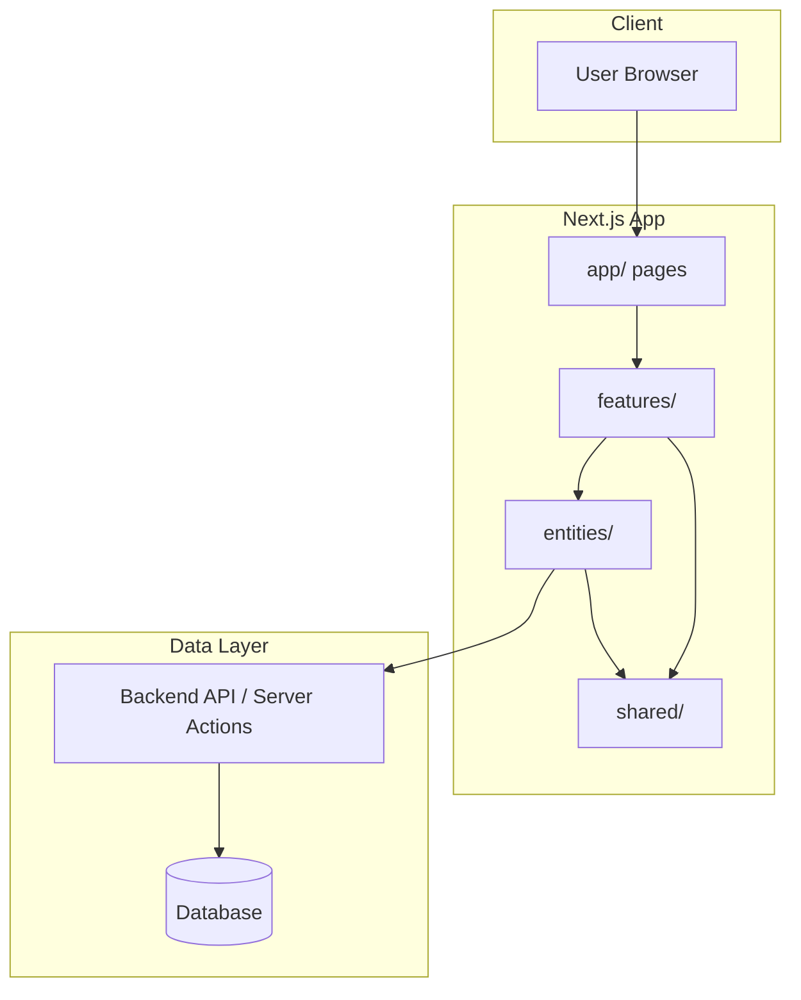
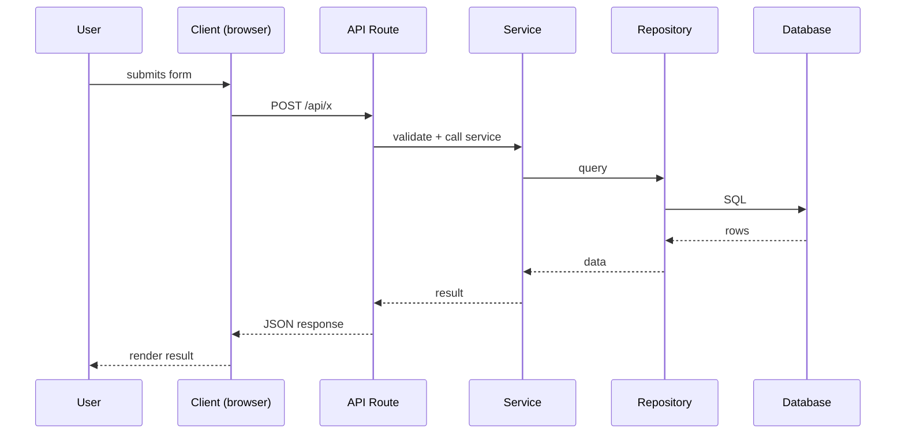
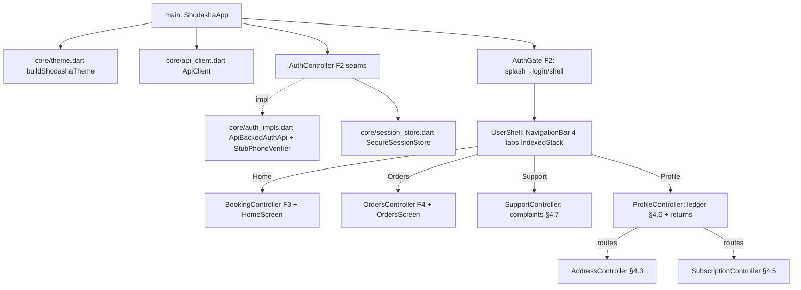

# Flow — Function Call Map & User Flows

> **Purpose**: The "how it works" file. It maps which functions call what, the user
> journeys, request/response sequences, and routes. Reading this file gives you an
> instant mental model of the project structure.
>
> **Update rule (MANDATORY)**: Update this file whenever you add, rename, or remove any
> function, component, hook, route, API endpoint, or user flow. Never let it go stale —
> agents and humans navigate the codebase through this file.

---

## Overview

Shodasha vendor app (007, built 2026-10-02; ADR-055 added Customers + Stock → 7 tabs; ADR-056 consolidated to 4 tabs + More drawer): vendor OTP login → duty (off-guard confirmed) → today route (search→customers, stock header, sync chip) → stop triple (version-fenced) → PoD OTP + GPS soft-flag → offline sync batch (loading branch) → earnings → support queue + verify → drawer (stock log, profile, WhatsApp, logout). See `Feature_docs/vendor-app/spec.md`.
- 016 dashboard (branch 016-vendor-dashboard, ADR-064): Route tab top composes one screen — TodayStrip (`summarizeToday` pure fold over `RouteStop`s: distinct users, jars, UPI/COD collect paid-excluded) + one CTA per state (Sync backlog → Triple first-pending → all-done text) + inline money (`EarningsController` reuse: jama cash/upi + flagged-hold, display-only) + can-ledger rows (`CustomersController`: held/dues nonzero-only). Backend: `placed_pool(vendor_id)` zone-scoped (zones/vendor_zones instr match; unzoned admin-only) + `today_customers` gains `held`/`dues` via `ledger.get`. No new tabs/endpoints/tables/packages.

```
VendorApp (main.dart: liveApi w/ accessTokenGetter → Bearer tracks session)
 └─ AuthGate (restore → login / shell)
 └─ VendorShell (duty gate → 5 tabs: Route·Sync·Earnings·Support·Profile)
     ├─ DutyController.setDuty → POST /vendor/duty (duty-off repools pending stops to failed + audit, same flow)
     ├─ RouteController.load → GET /vendor/routes/today (stops sorted by seq) + Pull → POST /vendor/placed/{id}/accept
     ├─ StopsController.commitTriple → POST triple + Idempotency-Key + version
     │    └─ 409 STALE_STOP → pull-fresh; NETWORK → SyncController.enqueue
     ├─ StopsController.completePod → POST pod (OTP + GPS soft-flag)
     │    └─ Phase 1: OTP = stop's stored random code (015, minted at dispatch;
     │         NULL rows accept the legacy deterministic code); wrong code reads
     │         as not-found (no oracle), 5 fails lock 429; user tracking shows
     │         the same stored code (order detail delivery_otp).
     ├─ SyncController.syncNow → POST /vendor/sync batch (applied/replayed/rejected per-stop)
     ├─ EarningsController.load → GET /vendor/earnings (flagged_hold display-only)
     └─ SupportController.verifyComplaint/vendorCheckQuality
          └─ Phase 1: vendor agree → vendor_confirmed (+≥10-char note), never
               resolved — only the admin release writes resolved.
Outbox persists in SharedPreferences (vendor.outbox.v1); money display-only via rupees() paise→Rs.
- 017 sync (branch 017-flow-sync, ADR-065): `GET /orders/{id}` gains `delivery_otp` (owner + assigned/dispatched; user tracking code row) → PoD closable; `POST /vendor/stops/{id}/cash` (owned-stop, deterministic stop+amount dedupe, 409=already-jama) → `mark_paid_cash` + `in_hand` bump + sync `cash_amount` ride → user badge flips on poll; one-tap cash button (COD unpaid) + outbox now actually wired to TripleSheet; `hold_blocked` computed on route+stop (ledger>3, lights dead UI); duty persisted on vendor_profile (ensure convergence); quality on table; admin payouts gen/approve, custody confirm, reco close, zones list + UI (capacity PATCH via BFF, zone attach/detach, refunds actions, payouts, day-close, custody); user dues pay-link + reschedule key; returns assign (vendor+date→route)/pickup (owned-stop, held−/caps→dues)/refund (picked-only, settings deposit rate) + vendor pickup card + admin buttons.
- Resilience: GET single-flight + replay-safe retry (3, backoff+jitter, Retry-After) + 60s sync flush; 401/403 → forceLogout → login; logout clears outbox.
- Release: push main → version (shared vX.Y.Z) → matrix(user+vendor APKs) → one Release (shodasha-user/shodasha-vendor + SHA256SUMS + file table); CI matrix verifies both apps per PR.
- Addresses: form (home/office + OSM pin, no Google key) → toApi maps line→`formatted` → POST/PATCH /addresses; 409 when an undispatched order uses it.
- Demo: Demo sheet → POST /v1/auth/demo (config flag + code hash → normal session) → demo customer sees Rs-206 dues order; demo vendor sees today route stop → triple → PoD → earnings. D1 prerequisite (ADR-054): config/audit_log come from 010_config_audit.sql (never existed on D1 — init_schema is local-only); pre-010 DB fails closed (401, not 500).
- Port gaps (ADR-055): address form (house/street/area + Use-current-location via LocationService → POST/PATCH /addresses full format) → SelectedAddressStore id → Home bar + checkout resolve() agree; vendor Customers tab → GET /vendor/customers (stops grouped by customer, search) → detail sheet; Stock tab reads RouteController loading sheet (no new endpoint); Profile tab → GET/PATCH /vendor/profile (synced label); Support tab → GET /vendor/complaints queue (tap fills verify-by-id) → existing verify. D1 prerequisite: 011_port.sql applied once (ALTERs are apply-once; CREATEs idempotent).
- 014 simplify (ADR-059): Home `_ScheduleCards(Ek Baar 8-12 once / Roz ka Plan daily)` → controller.deliveryType → `_WalletStrip(safe message)` → grid (no search) → buy-box (qty only) → `placeCheckout(api.createQuote → api.createOrder[quote_total/rate_version/expires_at] → upiIntent/cod)` → `showOrderConfirm(wallet-safe message)` → track. Backend `compute_quote(deposit_already_paid)` container-only once-only; `OrderService.create` waives + accepts pre-waiver quote. Fixed `Subah 8-12` label, slots only mint window_start ISO. All-days `nextServiceableDay` (no Sunday skip).
- 015 sync (ADR-060): User `Order(+paymentMode/Status)` → tracking badge + bill mode; subs Due/Paid via dues; `UserShell._refreshLedger(api.ledgerMe→applyLedger)`. Vendor `today_route/_owned_stop JOIN orders+addresses` → `RouteStop(+payment/total/status)` → stop badge; `GET /vendor/placed` pool for Pull button; `GET /ledger/me` wallet truth. Android `POST_NOTIFICATIONS` + `backup_rules/data_extraction` (no backup of tokens).
- 015 finish (ADR-062): User orders LIVE `ApiBackedOrdersRepository(_api)` over `GET /orders?cursor` → `data/next_cursor` (base64url created_at|id), detail `tracker/rider/bill/events`, cancel `reason+Idempotency-Key`, reschedule ISO, rating stars; `UserShell._registerDevice(getToken→POST /devices)`; vendor brilliance (48dp/ellipsis/honest states, no new deps).
```

[2–3 sentences: what the app does, the main loop, the key actors.]

> **Research note (2026-09-29, Group D)**: no app code exists yet — flows below are
> still template placeholders. The proposed order lifecycle from dev-guide research
> (placed→accepted→picked→packed→assigned→dispatched→delivered, PoD = OTP+photo+
> empties+cash) is documented in `Feature_docs/research/D-dev-guides/_group-D-summary.md`
> and will populate this file's User Flows / Request-Response sections at Series-3
> synthesis. Payment is a separate field, not an order state.

---

## Architecture Diagram



---

## User Flows

> Each flow = one user journey. Format: goal → steps → outcome.

### Flow: Vendor doorstep triple → ledger → evening reconcile (SYN-2 synthesis, proposed)
**Goal**: driver executes per-stop triple offline-tolerant; ledger + dues + reconciliation close the day (see Feature_docs/synthesis/vendor-requirements.md VR-01/02/03/09)
**Steps**: admin auto route+loading sheet → stop: fulls/empties/cash-UPI (queued offline, synced) → ledger mutates (held/deposit/dues, never-negative) → WhatsApp bill + own-bank UPI QR → dues carry forward → evening per-route collection vs pending vs jars-out

```mermaid
flowchart LR
    A([Morning: auto route + loading sheet]) --> B[Stop: given + empties + cash/UPI]
    B --> C[Ledger: held/deposit/dues update]
    C --> D[WhatsApp bill + UPI QR, dues carry forward]
    D --> E([Evening: route-wise reconcile])]
```

### Flow: Bisleri reference — booking → deposit → hold → return → refund (Group E research)
**Goal**: industry-standard jar loop documented for Shodasha adoption (see Feature_docs/research/E-bisleri/_group-E-summary.md)
**Steps**: booking → empty-with-cap declaration → (N−E)×150 deposit → delivery (8-8, no Sun, gate/2F if no lift, Rs3 cap-missing) → hold range / resume ≥24h → Return Jar request → pickup ≤10 working days → wallet refund; disputes ≤3 days


### Flow: [User flow name]
**Goal**: [what the user wants]
**Steps**: [brief description]


---

## Request / Response Flows

> One sequence diagram per key request. Use the Client → Route → Service → Repository →
> Database chain that matches the actual code.

### [Flow name]


---

## Function Call Map

> Which function calls what, per feature. Keep this accurate — agents use it to navigate
> the code and find where changes are needed.

### Feature: [feature name]
```
app/page.tsx (route composition)
  └─ <FeatureComponent />        (features/<feature>/components/)
       └─ use<Feature>Hook()     (features/<feature>/hooks/)
            └─ <feature>Service() (features/<feature>/service/)
                 └─ apiClient.get("/api/...")
```

### Feature: user-app auth (F2, 2026-09-29, branch 004-user-app-build)
```
AuthGate (auth_gate.dart: splash → restoreSession → home / login)
  ├─ PhoneScreen (phone field +91, focus-loss errors, disabled-until-valid)
  │    └─ AuthController.sendOtp (normalize 91/0 → AuthApi.startOtp 202 → PhoneVerifier.requestCode)
  └─ OtpScreen (6-box + paste, masked +91 •••••, 60s resend, 5-attempt force-resend)
       └─ AuthController.confirm (PhoneVerifier.confirmCode → AuthApi.verifyOtp → SessionStore.save)
            └─ AuthGate re-routes to home (guest-browse safe; OTP enforced at booking commit/profile by F3)
```
- `normalizeIndianPhone` / `isValidIndianPhone` / `maskPhone` (auth_controller.dart) ← covered by `test/auth_validation_test.dart` (14 tests)
- Backend endpoints touched (already live): `POST /v1/auth/otp/start|verify`, `POST /v1/auth/logout` (refresh rotation + FCM-device scoping land with F1 wiring)

### Feature: premium admin dashboard v2 (013, 2026-10-03, ADR-061)
```
Browser (TanStack Start SSR + client components)                    apps/admin_app (:3200) — renamed from admin_app_v2 in round 2; legacy Next.js admin removed, branch 005-super-admin-panel deleted (Cloudflare deploy path unchanged)
  └─ useAdminQuery(path) (hooks/use-admin-api.ts, TanStack Query)
       └─ adminGetServer/adminPostServer (server/server/admin-api.ts)  GET|POST /v1/admin/*
            ├─ API_MODE=mock → data/admin/mock-resolver.ts (fixtures, same shapes)
            └─ API_MODE=live → fetch(API_URL) Bearer sh_session (cookie read server-side)
                 ├─ 401 → refreshSessionServer (/v1/auth/refresh) → retry once → else redirect /auth/v1/login?next=
                 └─ Workers /v1/admin/* (require_role('admin')) → D1
Login: /auth/v1/login → admin-login-form.tsx → loginCodeServer (028 ADR-076: phone+code → POST /v1/auth/admin/login; OTP/dev/demo doors deleted)
  └─ Workers /v1/auth/admin/login (role=admin gate) → HttpOnly sh_session(30m)+sh_refresh(7d) set in server fn
Guard: dashboard/route.tsx loader → hasSessionServer → redirect /auth/v1/login?next=…
Surfaces (sidebar-items.ts = nav source of truth; 4 nav groups Monitor/Money/People/Operate):
  Monitor: overview /dashboard, analytics (FR-33 KPI matrix, payment-mix, on-time, leaderboards), orders(+/$orderId, CSV export);
  Money: finance (FR-30/31 cards + day-close leak watch + dunning wa.me reminders + audited write-off), payments(+refunds), ledger (per-row POST …/ledger/{id}/adjust, deltas + mandatory reason);
  People: users(+$userId, block/unblock), vendors(+$vendorId, review-hold), trust(quality/strikes/complaints/returns);
  Operate: dispatch (FR-26 funnel/pool/custody/route-board + routes-generate), operations(reco/custody/dues/routes-generate), audit, config.
Dunning enrichment: GET /v1/admin/dunning returns bare {customer_id, dues}; names/phones joined client-side from GET /v1/admin/ledger (users LEFT JOIN) for WhatsApp addressing.
Money: integer paise on wire → lib/money.ts rupees() for display; server computes all money.
```

### Feature: 027 vendor RBAC admin-app frontend (2026-10-04, ADR-073, branch 027-vendor-rbac)
```
Browser (same TanStack Start app, separate /vendor/* subtree)        apps/admin_app
  └─ useVendorQuery(path) (hooks/use-vendor-api.ts, key ["vendor", path], 15s stale, retry 1)
       └─ vendorGetServer (GET, path must start /v1/vendor/ else 400) /
           vendorPostServer (method POST|PATCH|PUT, closed write allowlist:
             /v1/vendor/stops/*/triple|pod|cash, /v1/vendor/sync, /v1/vendor/duty,
             /complaints/*/verify, /quality/*/vendor-check, /v1/vendor/profile, /v1/vendor/slots)
           (server/vendor-api.ts) — cookie Bearer server-side, mock via mock-resolver,
           401 → refreshSessionServer once → retry → else VendorApiError (401/403 → /vendor/login link)
           Idempotency-Key forwarded on triple (crypto.randomUUID in client effect, fresh key per submit)
Login: /vendor/login (public, outside guard) → vendor-login-form.tsx → loginVendorVerifyServer
  └─ POST /v1/auth/vendor/login {phone, code, device:{id:"vendor-web"}} → role==="vendor" assert
     → HttpOnly sh_session(30m)+sh_refresh(7d), same flags as admin (server/vendor-session.ts)
Guard: vendor/(guard)/route.tsx loader → hasVendorSessionServer → refresh once via
  refreshVendorSessionServer (device vendor-web, §1.8 — admin-web id 401s here) → redirect /vendor/login
  (pathless group so login never guards itself; vendor header nav, NOT the admin sidebar)
Vendor proxy refresh (server/vendor-api.ts): 401 → refreshVendorSessionServer once → retry
  → else VendorApiError (401/403 → /vendor/login link)
Admin guard: dashboard/route.tsx loader → hasSessionServer → refresh once → adminRoleServer
  (GET /v1/auth/me role probe, server/admin-api.ts) → role!=="admin" bounces to
  /auth/v1/login?reason=denied with access-denied notice, zero admin chrome (§1.4)
Admin logout: account-switcher Log out item → logoutServer (worker revoke + clear cookies)
  → /auth/v1/login. Cookies: COOKIE_FLAGS now httpOnly (§1.3; browser document.cookie
  holders are theme/sidebar prefs only — never sh_session).
Screens (each: index.tsx thin + -components/, skeleton + honest empty + error+retry, no delete affordance):
  /vendor/ overview (today-strip fold + money jama/baaki/hold + ledger held/dues),
  /vendor/route (stop list + SKIP + one CTA per state + placed-pool read-only refresh),
  /vendor/stops/$stopId (triple steppers paise=Rs×100 + COD-unpaid cash + PoD OTP dialog),
  /vendor/collections (dues>0 + wa.me Hindi reminders, no write-off),
  /vendor/payouts (read-only table + in_hand, no approve), /vendor/deposits (held/dues rows only),
  /vendor/support (complaint verify agree/disagree + quality vendor-check), /vendor/profile (PATCH+PUT slots+logout)
Admin: /dashboard/vendors/$vendorId → Outlet layout (index holds VendorDetail + View-as-vendor/Access-codes links);
  /preview (vendor-preview.tsx: preview endpoint + audit?actor_id=, adminGetServer ONLY, read-only);
  /access (access-codes-table masked+revoke two-step + issue-code-dialog plaintext-once + never-again warning).
Config screen unchanged (generic flag list) — vendor_access_enabled rides free; mock fixture row added.
```

### 028 admin access-code auth (2026-10-04, ADR-076, branch 028-access-code-auth)
```
AdminLoginForm (phone + access-code, copyError bundle with `auth: access-code`)
  └─ loginCodeServer (server/admin-session.ts)
       └─ POST /v1/auth/admin/login {phone:+91d, code, device:{id:"admin-web"}}
            ├─ 200 role==admin → HttpOnly sh_session(30m)+sh_refresh(7d) → /dashboard
            ├─ 401 → "Invalid phone or code." (generic, no oracle)
            ├─ 429 → rate-limit line · 409 → device-limit line · fetch-fail → NETWORK line
            └─ role!=admin → 403 FORBIDDEN (second gate; worker enforces per request)
Guard unchanged: dashboard/route.tsx loader → hasSessionServer → refresh once → redirect /auth/v1/login?next=…
Deleted: loginStartServer/loginVerifyServer/loginDemoServer, OTP/Firebase branches, orphan auth/-components/login-form.tsx.
Docs: .env.example + wrangler.jsonc describe the access-code door (`access_code_login_enabled=1`, backend 014 owns final name).
```
- `normalizePhone` (admin-login-form.tsx) — same +91 last-10 [6-9] rule as vendor form.

### 028 user name+number register (2026-10-04, ADR-077, branch 028-access-code-auth)
```
NameNumberScreen (naam + number, demo sheet + guest browse kept)
  └─ AuthController.registerNameNumber → AuthApi.register
       └─ POST /v1/auth/user/register {name, phone:+91d, device:{id}}
            ├─ 200 role==user → SessionStore.save → shell (role!=user → wipe + notUser)
            ├─ 422 → staff-number line (ROLE_RESERVED) · 429 → rate-limit line
            ├─ 400 → server message passthrough · NETWORK/other → network/server lines
            └─ verified:false carried in-memory (flips on first PoD, later slice)
AuthGate: splash → restoreSession → shell / NameNumberScreen (no OTP branch)
First-run: locate → address (notify step deleted); shell FCM register deleted (ApiClient.registerDevice kept unused)
```
- `normalizeIndianPhone` / `isValidIndianPhone` / `isValidUserName` / `maskPhone` (auth_controller.dart) ← `test/auth_validation_test.dart`; register/demo matrix ← `test/auth_validation_test.dart` + `test/demo_login_test.dart`; hero ← `test/wave1_ux_test.dart` (NameNumberScreen)

### 028 vendor access-code auth (2026-10-04, ADR-074, branch 028-access-code-auth)
```
VendorCodeScreen (phone + access-code, demo sheet QA fallback)
  └─ AuthController.codeLogin → AuthApi.vendorCodeLogin
       └─ POST /v1/auth/vendor/login {phone:+91d, code, device:{id}}
            ├─ 200 role==vendor → SessionStore.save → shell (role!=vendor → wipe + notVendor)
            ├─ 401 → "Galat phone ya code" (generic, no oracle)
            ├─ 429 → rate-limit line (10/device/hr) · 409 → device-limit line
            └─ NETWORK/other → network/server lines
AuthGate: splash → restoreSession → shell / VendorCodeScreen (no codeSent branch)
```
- `normalizeIndianPhone` / `isValidIndianPhone` / `isValidAccessCode` / `maskPhone` (auth_controller.dart) ← `test/auth_validation_test.dart`; code+demo matrix ← `test/demo_login_test.dart`

### Feature: [feature name]
- `[Function A]` calls `[Function B]` to [why]
- `[Function B]` calls `[Repository X]` to [why]

---

## Route Map

| Route | Page / Handler | Purpose | Auth Required |
|-------|----------------|---------|---------------|
| `/` | `apps/admin_app/src/app/page.tsx` | Redirect → /admin | Session |
| `/login` | `apps/admin_app/src/app/login/page.tsx` | Admin OTP sign-in (BFF sets HttpOnly cookies) | No |
| `/admin` | `apps/admin_app/src/app/admin/page.tsx` | Overview: KPIs, GMV/orders/on-time/payment-split/state charts, alerts | Admin session (proxy.ts) |
| `/admin/orders` + `/[orderId]` | `apps/admin_app/src/app/admin/orders/**` | All users' orders + detail: tracker, bill, assign/reassign/cancel-override, activity | Admin session |
| `/admin/users` + `/[userId]` | `apps/admin_app/src/app/admin/users/**` | User directory + detail, block/unblock (typed reason) | Admin session |
| `/admin/vendors` + `/[vendorId]` | `apps/admin_app/src/app/admin/vendors/**` | Vendor directory + custody/capacity/strikes/payouts/block/review-hold | Admin session |
| `/admin/payments` | `apps/admin_app/src/app/admin/payments/page.tsx` | Payments + refunds tabs (status/method filters) | Admin session |
| `/admin/ledger` | `apps/admin_app/src/app/admin/ledger/page.tsx` | Jar-ledger page with hold-limit flags | Admin session |
| `/admin/operations` | `apps/admin_app/src/app/admin/operations/page.tsx` | Reconciliation + custody + dues + routes-generate | Admin session |
| `/admin/trust` | `apps/admin_app/src/app/admin/trust/page.tsx` | Quality incidents + strikes + complaints with resolve actions | Admin session |
| `/admin/audit` | `apps/admin_app/src/app/admin/audit/page.tsx` | Audit/server-log viewer (actor_id/action filters) | Admin session |
| `/admin/config` | `apps/admin_app/src/app/admin/config/page.tsx` | Runtime config viewer/editor | Admin session |
| `/vendor/login` | `apps/admin_app/src/routes/(main)/vendor/login/**` | Vendor phone + access-code sign-in (public) | No |
| `/vendor/` + `/route` + `/stops/$stopId` + `/collections` + `/payouts` + `/deposits` + `/support` + `/profile` | `apps/admin_app/src/routes/(main)/vendor/(guard)/**` | Vendor subtree (guard loader + header nav): overview, route, stop actions, dues, payouts, deposits, support, profile | Vendor session |
| `/dashboard/vendors/$vendorId/preview` | `.../vendors/$vendorId/preview/**` | Read-only view-as-vendor + audit trail | Admin session |
| `/dashboard/vendors/$vendorId/access` | `.../vendors/$vendorId/access/**` | Masked codes + issue-once + revoke | Admin session |
| `GET /api/proxy` | `apps/admin_app/src/app/api/proxy/route.ts` | BFF read proxy → Workers `/v1/admin/*` (cookie forwarded, admin paths only) | Admin cookie |
| `POST /api/admin-actions` | `apps/admin_app/src/app/api/admin-actions/route.ts` | BFF write proxy → Workers `/v1/admin/*` | Admin cookie |
| `POST /api/auth/otp` | `apps/admin_app/src/app/api/auth/otp/route.ts` | OTP start\|verify (role=admin gate) → sets `sh_session` 30m + `sh_refresh` 7d | No |
| `POST /api/auth/logout` | `apps/admin_app/src/app/api/auth/logout/route.ts` | Clears cookies + revokes worker session | No |

---

## API Endpoints

| Method | Path | Handler | Purpose |
|--------|------|---------|---------|
| POST | `/v1/auth/vendor/login` | `auth.py:vendor_login` → `auth_service.code_login(expected_role='vendor')` → `AccessCodeRepo.find_valid` (+legacy 027 fallback) + `_issue_session` | Generalized vendor access-code login (028): flag + valid/unexpired/unrevoked code + role=vendor → 200 session; else generic 401; 10/device/hr; absolute 30d cap |
| POST | `/v1/auth/admin/login` | `auth.py:admin_login` → `auth_service.code_login(expected_role='admin')` | Admin access-code login (028, NEW): same shape, role=admin assert, generic 401 |
| POST | `/v1/auth/user/register` | `auth.py:user_register` → `auth_service.user_register` | Name+number onboarding (028, NEW): upsert role=user unverified + capped session + verified:false; staff → 422; 5/phone/hr + 20/IP/hr |
| GET/POST | `/v1/admin/users/{id}/access-codes`, `.../{code_id}/revoke` | `admin.py` (Admin + `_audit`) → `AccessCodeRepo` | Generalized codes (028, NEW): masked list / issue plaintext-once (1h–180d, default 90d) / timestamp-revoke; user role → 422, ghost → 404 |
| POST | `/v1/auth/vendor/login` | `auth.py:vendor_login` → `auth_service.vendor_login` → `VendorAccessRepo.find_valid` + `_issue_session` | Vendor access-code login (027): flag + valid/unexpired/unrevoked code + role=vendor → 200 session; else generic 401; 10/device/hr |
| GET | `/v1/vendor/payouts` | `vendor.py` → `VendorService.payouts_for_vendor` | Own payouts + in_hand (read-only; approve stays admin) |
| GET/POST | `/v1/admin/vendors/{id}/access-codes`, `.../{code_id}/revoke` | `admin.py` (Admin + `_audit`) → `VendorAccessRepo` | Masked list / issue (plaintext once, 201) / timestamp-revoke; non-vendor → 422, ghost → 404 |
| GET | `/v1/admin/vendors/{id}/preview` | `admin.py` (Admin) → `AdminReadRepo.vendor_detail` + `VendorService.today_route/earnings/today_customers/vendor_complaints` | Read-only view-as-vendor, no writes |
| POST | `/api/auth/login` | `authService.login` | Sign in and issue session |
| GET | `/health` | `app/main.py` | Liveness probe |
| GET | `/v1/catalog` | `app/api/v1/catalog.py:get_catalog` | SKUs (2800/3000) + deposit 15000 + cap 300 + hours/holidays from settings |
| GET | `/v1/windows?date=&pincode=` | `app/api/v1/catalog.py:get_windows` | 30-min slots 08:00–20:00 on next serviceable day (ex-Sun); unserviceable pin → lead_capture |
| GET | `/v1/serviceability?pincode=` | `app/api/v1/catalog.py:check_serviceability` | Pincode regex + prefix allowlist (empty=open) |
| POST | `/v1/quotes` | `app/api/v1/quotes.py:create_quote` → `services/pricing.py:compute_quote` | Server-computed quote (paise) + sha256 quote_hash + 15-min TTL; N>10 → 422 OVER_LIMIT |
| POST | `/v1/auth/otp/start|verify` | `app/api/v1/auth.py` → `services/auth_service.py` → `adapters/firebase.py` + `user_repo`/`session_repo` | Firebase OTP → D1 session (30m + rotating 7d, family kill on reuse); suspend → restricted session |
| POST | `/v1/orders` | `app/api/v1/orders.py` → `services/order_service.py` → `order_repo`/`ledger_repo` | Idempotent create (scoped key), quote re-check, OVER_LIMIT/HOLD_BLOCKED, placed + deposit event, one txn |
| POST | `/v1/payments/upi-intent` + `/webhooks/upi` | `payments.py` → `payment_service` → `payment_repo` + `adapters/upi.py` | Fake/real provider; HMAC + replay-cache; payee lock; dues reconcile |
| POST | `/v1/vendor/stops/{id}/triple|pod` | `vendor.py` → `vendor_service.py` | Atomic triple (version fence), PoD OTP + GPS soft-flag, offline sync (pod items ride sync with done-check-first replay) |
| GET | `/v1/vendor/placed` | `vendor.py` → `VendorService.placed_pool(vendor_id, limit)` | Zone-scoped placed pool (016: vendor's zones only via zones/vendor_zones pincode match; unzoned admin-only) |
| POST | `/v1/vendor/placed/{order_id}/accept` | `vendor.py` → `dispatch_service.vendor_accept_order` | Pull made real: placed→accepted→picked→packed→assigned + route/stop + OTP mint; zone/capacity pre-checked (fail-cheap); replay returns existing stop |
| POST | `/v1/admin/orders/{id}/accept|reject|pack` | `admin.py` → `OrderRepo.transition` + `_audit` | Dispatcher pipeline: accept (placed→accepted), reject (→rejected terminal), pack (accepted→picked→packed one action) |
| POST | `/v1/admin/routes/{id}/dispatch` | `admin.py` → per-stop `transition` to dispatched + per-stop audit | All pending assigned stops dispatched; non-assigned honestly skipped |
| POST | `/v1/vendor/stops/{id}/cash` | `vendor.py` → `VendorService.cash_post` → `PaymentRepo.mark_paid_cash` | Doorstep cash → payment row + paid_cash/partial_dues + dues reconcile + in_hand (017; deterministic stop+amount dedupe, 409=already-jama) |
| POST | `/v1/returns/{id}/pickup` | `returns.py` (role=vendor, owned-stop join) | Empty-jar pickup: held−, caps×Rs3→dues, stop done, return picked (017) |
| POST | `/v1/admin/returns/{id}/assign` | `admin.py` → `route_for_vendor` | Pickup stop queued on vendor's route (017; dup → 409) |
| POST | `/v1/admin/returns/{id}/refund` | `admin.py` → `LedgerRepo` (settings deposit rate) | picked-only deposit refund + audit (017) |
| GET/POST | `/v1/admin/payouts`, `/generate`, `/{id}/approve` | `admin.py` (per_stop_fee accrual) | Payout lifecycle: pending → approved (017) |
| POST | `/v1/admin/custody/confirm` | `admin.py` (in_hand decrement + audit) | Cash handover receipt (017) |
| POST | `/v1/admin/reconciliation/close` | `admin.py` (snapshot + audit row) | Day-close marker, no new table (017) |
| GET | `/v1/admin/zones` | `admin.py` | Zone list for attach UI (017) |
| PATCH | `/v1/admin/vendors/{id}/capacity` | `admin.py` (BFF PATCH helper) | Capacity + per-stop-fee edit (017 UI wired) |
| GET/PATCH | `/v1/vendor/profile` | `vendor.py` → `VendorService.profile_get/save` → `vendor_profile` (011) | Server vendor profile (partial merge, ≤500/field); blank until first save — NEW (ADR-055) |
| GET/PUT | `/v1/vendor/slots` | `vendor.py` → `VendorService.slots_get/set` → `vendor_slots` (011) | Slot toggles, 50-key cap — NEW (ADR-055) |
| GET | `/v1/vendor/customers` | `vendor.py` → `VendorService.today_customers` (stops ⋈ users) | Today route grouped by customer + totals + held/dues ledger fields (016 additive) — NEW (ADR-055) |
| GET | `/v1/vendor/complaints` | `vendor.py` → `VendorService.vendor_complaints` (complaints ⋈ stops) | Vendor ticket queue (reads; verify writes) — NEW (ADR-055) |
| POST | `/v1/admin/orders/{id}/assign` | `admin.py` → `dispatch_service.py` | Transactional zone assign, reassign with version fence, routes-generate |
| POST | `/v1/auth/otp/start` | `app/api/v1/auth.py:otp_start` → `services/auth_service.py:otp_start` | +91 validate + phone/IP rate-limit → 202 {sent_to_masked, resend_after_s} (Firebase SMS client-side) |
| POST | `/v1/auth/otp/verify` | `auth.py:otp_verify` → `auth_service.otp_verify` → `adapters/firebase.py:RealVerifier.verify_id_token` → `repositories/user_repo.py:upsert_firebase_user` + `session_repo.py:create` | 200 {access_token (30m), refresh_token (7d rotating), role, restrictions?, new_device_alert?, details.integrity}; device-cap → 409 DEVICE_CAP |
| POST | `/v1/auth/otp/verify` (DEV_AUTH=1 only) | `auth_service.otp_verify` dev branch → `find_by_phone` → `_issue_session` (shared with Firebase path) | Raw code `dev\|<phone>\|<any>` logs in the EXISTING account for that phone — no Firebase round-trip; never enable in prod; admin panel dev login uses it when `NEXT_PUBLIC_FIREBASE_API_KEY` is unset |
| POST | `/v1/auth/refresh` | `auth.py:refresh` → `auth_service.refresh` → `session_repo.rotate` | 200 new pair; burned-token reuse → revoke family + 401 |
| POST | `/v1/auth/logout` | `auth.py:logout` → `auth_service.logout` | 200 {ok}; revoke_all → family revoke; own-device FCM token delete only |
| GET | `/v1/auth/me` | `auth.py:get_me` → `auth_service.me` (via `api/auth_deps.py:get_current_user`) | 200 {user, addresses_count, ledger_summary}; suspended → + restrictions |
| PATCH | `/v1/auth/me` | `auth.py:patch_me` (via `require_active_user`) → `user_repo.update_profile` | 200 {user}; suspended → 403 FORBIDDEN |
| GET | `/v1/admin/metrics/overview?days=` | `admin.py` → `admin_read_repo.daily_series/on_time_series/money_totals` | Panel KPIs: today + per-day orders/gmv/delivered/on_time_pct + money totals (deposits, dues, jars held) — NEW, additive |
| GET | `/v1/admin/users?query=&role=&suspended=&limit=&cursor=` | `admin.py` → `admin_read_repo.users_page` | Directory: search (phone/name/id), role/suspended filters, rowid-cursor paging — NEW |
| GET | `/v1/admin/users/{id}/detail` | `admin.py` → `admin_read_repo.user_detail` | User + recent orders + ledger summary; ghost → 404 — NEW |
| GET | `/v1/admin/vendors/{id}/detail` | `admin.py` → `admin_read_repo.vendor_detail` | Vendor + profile + stops_done/jars_delivered — NEW |
| POST | `/v1/admin/users/{id}/suspend` | `admin.py` (`SuspendIn{reason≥3, level}`) | restrict\|suspend; suspend revokes the user's sessions; admin accounts → 400; audit `user.suspend` — NEW (vendors block via this too) |
| POST | `/v1/admin/users/{id}/unsuspend` | `admin.py` | Clears flag + audit `user.unsuspend`; ghost → 404 — NEW |
| GET | `/v1/admin/payments?status=&method=` | `admin.py` → `admin_read_repo.payments_page` | Payments page + user_phone join + cursor — NEW |
| GET | `/v1/admin/refunds?status=` | `admin.py` → `admin_read_repo.refunds_page` | Refunds page + cursor — NEW |
| GET | `/v1/admin/ledger` | `admin.py` → `admin_read_repo.ledger_page` | Jar ledger page (held/deposit_paid/dues) + cursor — NEW |
| GET | `/v1/admin/orders` | `admin.py` | +additive optional params `payment_status`, `query`, `cursor` — response shape unchanged |
| GET | `/v1/admin/audit` | `admin.py` | +additive optional filters `actor_id`, `action` — shape unchanged |
| auth | `app/api/auth_deps.py:_bearer` | — | Now accepts `sh_session` cookie as Bearer fallback (Bearer still first) for the admin web; mobile Bearer path unchanged |

### 028 access-code auth backend (2026-10-04, ADR-075, branch 028-access-code-auth)
```
POST /v1/auth/vendor/login {phone, code, device} → code_login(expected_role='vendor')
POST /v1/auth/admin/login {phone, code, device} → code_login(expected_role='admin')
  └─ AuthService.code_login: flag access_code_login_enabled==1? (vendor also honors
     legacy vendor_access_enabled + vendor_access_codes read-fallback) → rate-limit
     10/device/hr → normalize → find_by_phone → role==expected? → AccessCodeRepo
     .find_valid + hmac.compare_digest (generic 401, no oracle) → _issue_session
     (30m/7d + absolute session_expires_at=now+30d) → touch_last_used
     → best-effort write_audit access.use (never breaks login)
POST /v1/auth/user/register {name, phone, device} (+IP from request.client.host)
  └─ AuthService.user_register: rate-limit 5/phone/hr + 20/IP/hr → normalize →
     find_by_phone? exists+user → set_name_if_blank (never overwrite) |
     exists+staff → 422 ROLE_RESERVED | new → create role=user kyc=unverified
     → _issue_session + verified:false
POST /v1/auth/refresh → refresh(): burned?→burn family 401; revoked/refresh-exp/device
  mismatch→401; absolute cap expired?→401 SESSION_EXPIRED (family intact, no burn);
  NULL cap→backfill min(refresh_expires_at, created+30d) + persist; else rotate
  (burn old, mint pair, keep original absolute cap — UPDATE never touches it)
Admin codes (all require_role('admin') + _audit access.issue/revoke on access_codes):
  ├─ GET /v1/admin/users/{id}/access-codes → AccessCodeRepo.list_masked (no hashes)
  ├─ POST /v1/admin/users/{id}/access-codes {expires_at?} → secrets.token_urlsafe(12)
  │    → sha256 store, expected_role:=target role (vendor|admin; user→422, ghost→404),
  │    expiry now+1h..now+180d else 400, blank→90d → plaintext ONCE
  └─ POST .../{code_id}/revoke → timestamp (never DELETE); ghost→404
Legacy 027 doors kept read-only for transition: POST /v1/auth/vendor/login legacy
  vendor_login + GET/POST /v1/admin/vendors/{id}/access-codes (VendorAccessRepo).
```
New table: access_codes(id, user_id→users, code_hash, masked_hint, expected_role
default 'vendor', expires_at, revoked_at, last_used_at, created_by, created_at)
+ idx_access_codes_user + config access_code_login_enabled='0' (014) + sessions
.session_expires_at absolute cap (014 ALTER apply-once; repo tolerates absence).

### 027 vendor RBAC backend (2026-10-04, ADR-072, branch 027-vendor-rbac)
```
POST /v1/auth/vendor/login {phone, code, device}
  └─ AuthService.vendor_login: flag==1? → rate-limit → normalize → find_by_phone
       → role=='vendor'? → find_valid + hmac.compare_digest (generic 401, no oracle)
       → _issue_session (30m/7d, family, device-cap 409) → touch_last_used
       → best-effort write_audit vendor.access.use (never breaks login)
GET /v1/vendor/payouts → VendorService.payouts_for_vendor (WHERE vendor_id=? + in_hand)
Admin codes (all require_role('admin') + _audit vendor.access.issue/revoke)
  ├─ GET .../access-codes → VendorAccessRepo.list_for_vendor (masked, no hashes)
  ├─ POST .../access-codes → secrets.token_urlsafe(12) → sha256 store → plaintext ONCE
  └─ POST .../access-codes/{id}/revoke → timestamp (never DELETE)
GET /v1/admin/vendors/{id}/preview → vendor_detail + today_route/earnings/customers/complaints
Vendor writes now audit inside their txns (caller holds WRITE_LOCK, dispatch pattern):
  triple→vendor.triple, pod→vendor.pod, cash→vendor.cash (+in_hand txn),
  verify→vendor.complaint_verify, quality→vendor.quality_check
```

### Phase-B repo conversion (T2, 2026-10-01, ADR-044; completed ADR-047, 163 green)
```
Services/routers (converted — same async shape, ADR-045/046)
   └─ repositories/*.py: every conn-touching method is now `async def` over
      Conn = D1Conn | AsyncSqliteConn (await execute; commit/rollback sync)
        ├─ address_repo: _table_exists async ← _blocked_by_order/_sub ← update/delete_owned
        ├─ order_repo ──await──▶ ledger_repo.apply_event(commit=False) (insert/cancel_settle)
        └─ payment_repo ──await──▶ ledger_repo.get/apply_event + self._order/_dues_posted
      config.all_rates seeds via awaited execute loop (facade has no executemany)
      seed_admin.py: raw sqlite3 only, untouched
```

### Slice-2 auth call map (C1, 2026-09-29)```
POST /v1/auth/otp/start
  └─ get_db_conn (app/api/deps.py: sync selector — _TEST_CONNECTION, else D1Conn over env.DB via request.scope["env"] or worker_env.current_env() (ADR-043 hotfix: accessor was missing at HEAD 027c34b), else AsyncSqliteConn over sqlite)
       └─ services/auth_service.py:otp_start (+91 validate + phone/IP rate-limit → 202)
```
```
Bearer <access_token>
  └─ api/auth_deps.py:get_current_user (sha256 lookup → revoked/expiry → users re-read per request, C2)
       ├─ require_active_user (suspended user writes → 403)
       └─ require_role(*roles) (wrong role or suspended → 403)
POST /v1/auth/otp/verify
   └─ adapters/firebase.py:RealVerifier.verify_id_token (aud+exp+sig; no project → 502 UPSTREAM_FAIL)
        └─ services/auth_service.py:otp_verify (device-cap ≤3/30d, LOG-ONLY integrity, suspend restrictions)
             └─ repositories/user_repo.py:upsert_firebase_user + session_repo.py:create (family_id)
```

### Phase-B services async (2026-10-01, ADR-045)
```
order_service.OrderService: create/detail/list/cancel/reschedule (+_idem_get/_idem_put/_cancelled_outcome) — all async
  └─ order_repo.* + ledger_repo.get (awaited; repos land async via parallel worker)
payment_service.PaymentService: intent/webhook_ingest/cod_confirm/mark_cash/claim_refund/complete_refund/get_dues/get_invoice/_bill — all async
  └─ payment_repo.* + order_repo.find_owned + ledger_repo.* (awaited); provider create_intent/verify_webhook stay sync (adapter, like auth verifier)
dispatch_service: _cols/write_audit/ensure_profile/order_zone/_load/_check_capacity/_check_zone/_route_for/_event/least_loaded_vendor/assign_order/reassign_order/check_stop_fresh/generate_routes/_addr_in_zone/auto_repool — all async (_now/_today/_role/_actor_id sync)
subscription_service.SubscriptionService: create/list/get_owned/pause/resume/skip/process_due (+_advance_past/_skipped/_owned_address) — all async (_parse_* /_advance/_row/_default_next_run sync)
vendor_service.VendorService: today_route/get_stop/triple_commit/pod_complete/sync_batch/earnings/verify_complaint (+_owned_stop/_stop_pin/_idem_get/_idem_put) — async; duty/is_on_duty/vendor_check_quality/_stop_out/seed_quality stay sync (in-memory/pure)
jobs/scheduler.py: run_due_subscriptions/collect_reminders/purge_expired/run_all async; main() sync CLI via asyncio.run over AsyncSqliteConn
address_service.py: unchanged — pure helpers only (serviceability/needs_pin_confirm/lookup_zone/verify_place_id_stub), no repo/conn use
```

### Phase-B routers async (2026-10-01, ADR-046)
```
All 10 routers: conn=Depends(get_db_conn) (orders.py keeps get_settings); every
conn-touching handler async def + await (commit/rollback/WRITE_LOCK sync)
  ├─ addresses (4): await AddressRepo.* (serviceability/lookup/verify/pin-confirm sync pure)
  ├─ admin (42): await assign/reassign/generate/repool + ensure_profile + Order/Ledger/AdminRead repos + _audit(await write_audit) + (await conn.execute).fetchone()/fetchall()
  ├─ complaints (2): await _delivered_at + conn.execute (photos/window logic sync)
  ├─ devices (2): await conn.execute upsert/delete
  ├─ orders (5): await OrderService.create/list/detail/cancel/reschedule (_service/_uid/_require_idem sync)
  ├─ payments (8): await PaymentService.intent/webhook_ingest/cod_confirm/get_dues/get_invoice/claim/complete (+refund_done extra-paren fix)
  ├─ ratings (1): await conn.execute select/insert
  ├─ returns (2): await _owned_address + conn.execute (SLA math sync)
  ├─ subscriptions (5): await SubscriptionService.create/list/pause/resume/skip
  └─ vendor (9): await VendorService.today_route/get_stop/triple/pod/sync/earnings/verify (duty/vendor_check_quality stay sync in-memory — ADR-047 correction)
get_current_user try/except fallbacks untouched; routes/models/codes/params/noqa identical
```

### Phase-B completion (2026-10-01, ADR-047 — 163 green, pushed)
```
All routers/services/repos/scheduler-jobs async over Conn = D1Conn | AsyncSqliteConn.
Prod: every route uses get_db_conn → D1Conn(env.DB); local/pytest: AsyncSqliteConn(sqlite).
Tests: 7 files await-ified (vendor/aftermath/payments/dispatch_admin/admin_panel/scheduler/e2e);
TestClient HTTP tests unchanged; direct calls wrapped + awaited (asyncio_mode=auto).
Cron entry (src/entry.py scheduled): still logged no-op; jobs are async-ready, D1 wiring deferred.
```

### OTP channels (2026-10-01, ADR-048 — firebase default, sms behind OTP_PROVIDER)
```
POST /v1/auth/otp/start → 202 {sent_to_masked, resend_after_s, channel}
  ├─ channel=firebase: app runs Firebase requestCode (SMS client-side; needs Blaze for real SMS)
  └─ channel=sms: AuthService mints 6-digit secrets code → OtpRepo.issue(hash, 5-min TTL)
       → sms provider (Fake log-only | Fast2Sms DLT route | TextBee phone-gateway, ADR-049)
       → app posts typed code
POST /v1/auth/otp/verify {firebase_id_token?, phone?, otp_code?, device:{id}}
  ├─ otp_code: OtpRepo.consume (ok→session via upsert_phone_user; expired→400; 5 strikes→429 locked)
  └─ firebase_id_token: RealVerifier path unchanged (+ DEV_AUTH dev| branch)
App: AuthApi.startOtp returns channel; sms skips Firebase; smsError/serverError/networkError distinct
```

### Slice-1 quote call map (B2, 2026-09-29)
```
POST /v1/quotes
  └─ QuoteIn (schemas/catalog.py: Pydantic boundary — e≤N, N≥1, qty 0..10)
       └─ pricing.compute_quote(items, e, rates, address_id, window, rate_version)
            └─ {water_bill, deposit_due, cap_note, total, quote_hash, n_total}
                 └─ route: n_total>10 → OverLimitError(AppError) → B1 envelope; else QuoteOut + expires_at
```

### Feature: super-admin panel (F-SA, 2026-10-01, branch 005-super-admin-panel, ADR-030/031)
```
Browser (RSC pages + TanStack Query hooks)                       apps/admin_app
  └─ features/*/api.ts hooks → lib/api.ts apiGet(cookie)   GET  /api/proxy?url=/v1/admin/...    (reads only)
  └─ shared/ui/actions.tsx ConfirmAction → lib/api.ts      POST /api/admin-actions {url, body}   (all writes)
       └─ route.ts: session cookie → workerFetch(API_URL + path, {cookie})  (API_URL server-only)
            └─ Workers /v1/admin/*: auth_deps.get_current_user → _bearer() = Bearer header OR sh_session cookie
                 ├─ reads  → repositories/admin_read_repo.py (read-only SQL aggregates, rowid cursor _page())
                 └─ writes → suspend/unsuspend: users.suspended + sessions.revoked_at + audit_log rows
Login: /login → POST /api/auth/otp {action: start|verify, phone, code}
  └─ Workers /v1/auth/otp/* (role=admin gate) → route sets HttpOnly sh_session (30m) + sh_refresh (7d)
proxy.ts (Next 16 gate): matcher /admin/* + /login; missing/expired session → redirect /login
```
- Page → endpoint map: Overview→`/admin/metrics/overview?days=` + orders/audit pages + `/admin/metrics` (sidebar trust badge); Orders list→`/admin/orders`(+filters), Order detail→list `?limit=200` pick + activity from `/admin/audit?entity=orders` + `/admin/vendors` for assign options, actions→`/admin/orders/{id}/assign|reassign|cancel-override`; Users→`/admin/users`(+`/{id}/detail`)+suspend/unsuspend; Vendors→`/admin/vendors`+`/{id}/detail`+`review-hold`/`release`+user-suspend/unsuspend; Payments→`/admin/payments`+`/admin/refunds`; Ledger→`/admin/ledger`; Operations→`/admin/reconciliation`+`/admin/custody`+`/admin/dunning`+`POST /admin/routes/generate`; Trust→`/admin/quality`(+confirm/reject)+`/admin/strikes`(+clear)+`/admin/complaints`(+resolve); Audit→`/admin/audit`(+filters); Config→`GET/POST /admin/config`.
- Money on the wire is integer paise; `lib/format.ts` paise()/num()/pct()/dateTime()/phoneMasked() only format — the server computes all money.
- Dev run: worker first `cd workers/api && SHODASHA_DB_PATH=./data/shodasha.db python -m uvicorn app.main:app --port 8000` (db.py reads SHODASHA_DB_PATH, NOT .env's DATABASE_PATH), then `cd apps/admin_app && npm run dev` (:3100); `NEXT_PUBLIC_API_MODE=mock` renders fixtures with no worker.

---

## State Flow

> How state moves through the app (server → client → store). Describe the data flow,
> not just the components.

1. Server component fetches data in `app/` and passes props down
2. Client components call `<feature>Controller` for mutations
3. `queryClient` caches/invalidates on mutations

---

## User app — F5 wiring (branch 004-user-app-build)

### Local run (Android 36 emulator, 2026-09-30, ADR-028)
```
dev machine → emulator shodasha_api36 (pixel_7, google_apis x86_64, API 36 / Android 16)
  └─ flutter build apk --debug (compileSdk 36, targetSdk 36, minSdk 24)
       └─ adb -s emulator-5554 install -r build/app/outputs/flutter-apk/app-debug.apk
            └─ monkey -p com.shodasha.shodasha_app → MainActivity (resumed, foreground)
```
- Re-run after edits: rebuild debug APK + `adb install -r` (no AVD/SDK reinstall needed). Platform-37 coexists harmlessly.

### CI/CD — GitHub Actions (ADR-035, `.github/workflows/`, live on main)```
push to PR / non-main branch ──▶ ci.yml ──▶ analyze + test + debug APK (artifact, no release)
push to main ──▶ release.yml ──▶ analyze + test ──▶ next patch from latest v* tag (none → v1.0.1)
  ──▶ flutter build apk --release --build-name=X.Y.Z --build-number=run_number
  ──▶ tag vX.Y.Z + GitHub Release (auto changelog via generate_release_notes)
       + assets: shodasha-vX.Y.Z.apk + SHA256SUMS.txt
```
- Pins mirror the release-verified local machine: Flutter 3.44.9 (flutter-action v2), JDK 17 Temurin (AGP 9.0.1's documented JDK; bytecode target is 17 so the APK matches local JBR-25 builds), Gradle 9.1.0 wrapper + SDK/build-tools 36.0.0 from the repo.
- No push-loop: version passed via --build-name/--build-number (pubspec untouched); tag pushes can't retrigger (branches:main filter); release writes via API. Signing is debug keys (direct-install OK; real keystore = pre-Play TODO).

### Backend deploy — Cloudflare Python Worker (ADR-036, `workers/api/`, project `water`)
```
dashboard (root workers/api, deploy `npm run deploy`) or `uv run pywrangler deploy`
  └─ src/entry.py:Default.fetch → asgi.fetch(app, request, env.DB/vars/secrets)
  └─ scheduled (cron */15) → logged no-op until async-D1 conversion (T2)
local/pytest: app.main:create_app() + sqlite unchanged (153 green)
```
- T1 only: D1 id placeholder + secrets + async repo conversion + pure-Python Firebase RS256 still open (T2).

### Checkout call map (005-home-ux, 2026-10-01, ADR-029)
```
HomeScreen (address bar + search + chips + photo cards)
  └─ showProductDetail (buy-box: qty + deliveryType + related SKU)
       └─ _UserShellState._openCheckout → showCheckoutSheet
            ├─ api.windows(date, pincode) → slot chips (capacity-aware)
            ├─ placeCheckout: once → createQuote → createOrder(+Idempotency-Key)
            │    └─ STALE_QUOTE → one re-quote retry; UPI → upiIntent
            │         ├─ provider_ref order_* → Razorpay gateway → getOrder verify
            │         └─ provider_ref FAKE-* → upi:// external link
            ├─ recurring → createSubscription(schedule_type daily|alternate|weekly)
            └─ showOrderConfirm (server id + Track → Orders tab / subs shortcut)
MapPicker (flutter_map OSM, drag-under-pin + geolocator) → lat/lng → address form

### Auth-first-run + stepper checkout (006-auth-flow, 2026-10-01, ADR-032)
```
SplashScreen (logo + trust, animate entry) → AuthGate → PhoneScreen / guest
  └─ OtpScreen (MaterialPinField 6-digit, autofill, paste, error-shake)
       └─ UserShell init → maybeOfferFirstRun (0 addresses + flag unset)
            └─ location (geolocator) → notify (FCM requestPermission) → address-pin
Checkout sheet steps: 0 Address → 1 Schedule → 2 Pay (state preserved, Back kept)
  └─ Schedule: once → windows slots; daily/alternate/weekly → rhythm note;
       custom → table_calendar multi-dates (≤6) → recurrence ISO list
OrdersScreen: Bulk badge (N≥6) + First/Repeat tags (timestamps else untagged)
  └─ Order again → booking qtys refilled → home tab → _openCheckout
```
```

Composition root `apps/user_app/lib/main.dart` — one of each, shared:



- Authed calls: `ApiClient.send()` adds `Authorization: Bearer` (live via `accessTokenGetter`) + `X-Device-Id`; `Idempotency-Key` on orders create/cancel/reschedule. Errors throw `ApiException{code}` — screens show offline banner on `NETWORK` (States.md).
- Tab gates: guest browse keeps Home prices visible (flow 1); Profile shows login CTA when un-authed; OTP enforced at booking commit + profile data only.
- Dev OTP: StubPhoneVerifier accepts `123456` until F1's Firebase verifier swap (one file, seams unchanged).

## UI lift — ADR-057 (010-grocery-ui, layout shapes only, zero logic change)
```
HomeScreen (home_screen.dart: greeting header → address bar → pill search + clear
  → chips → section header (filter-aware title + honest count) → GridView 2-col
  (_GridCard: photo + name + price + corner 48dp add; tap opens buy-box;
   flutter_animate fade+slideY stagger, reduced-motion static)
  └─ showProductDetail (_DetailSheet: close-over-photo + fade/scale photo,
       title+price row, Kitne-jar↔stepper single row, bordered fact rows,
       delivery chips, related link, BUY → checkout — controller API unchanged)
PhoneScreen (phone_screen.dart: 48px top space → _rise stagger hero/chips/CTA;
  inputs un-animated; first_run sheet flow untouched)
RouteScreen (route_screen.dart: bordered loading-sheet header row + SKIP header
  row with counts; bordered stop cards, 48dp seq avatars)
  └─ CascadeScope(itemCount) + CascadeItem(index) (core/cascade.dart: one
     AnimationController, per-item Intervals, fade+rise, zero Timers,
     reduced-motion static) — also wraps customers tiles + support queue tiles
StopDetailScreen: ledger block → bordered icon-lead fact rows (values read-only)
CustomersScreen: leading-mark + facts + chevron tile rows + detail sheet unchanged
SupportScreen: 'Vivaad queue (n)' header + bordered queue tiles (tap fills
  verify-by-id); verify form untouched
EarningsScreen / InventoryScreen: section-header rows (label + live count),
  bordered summaries (Card shadows removed)
```

## Address entry fix — ADR-058 (012-address-auth, root cause + dead-ends)

```
main.dart: ApiClient(deviceId, accessTokenGetter: () => _auth.session?.accessToken)
  └─ every authed call (addresses/orders/profile/subs) now carries the live
     Bearer; pre-fix all went bearer-less → server 401 → list/save dead
_ShellPage._openAddresses → openAddressesGated (main.dart: authed → push
  AddressScreen; guest → _LoginGatePage (PhoneScreen, no guest hatch) →
  OTP success self-pops to first → re-check isAuthenticated → AddressScreen;
  demo path closes via isCurrent listener rule; back cancels)
_MapPickerState.initState → post-frame _locate() (pin-first, Delhi fallback)
AddressController.load() → re-adopts store.selectedId when still unresolved
```

## Update Protocol (MANDATORY)

Update this file when any of the following change:

- [ ] New, renamed, or removed function / component / hook / route
- [ ] Call chain between functions changed
- [ ] New user flow or a change to an existing flow
- [ ] New or removed API endpoint
- [ ] New dependency in a call chain (library, service)
- [ ] State management approach changed

When you update, keep the diagrams in sync with the code — a stale diagram is worse than no diagram.
